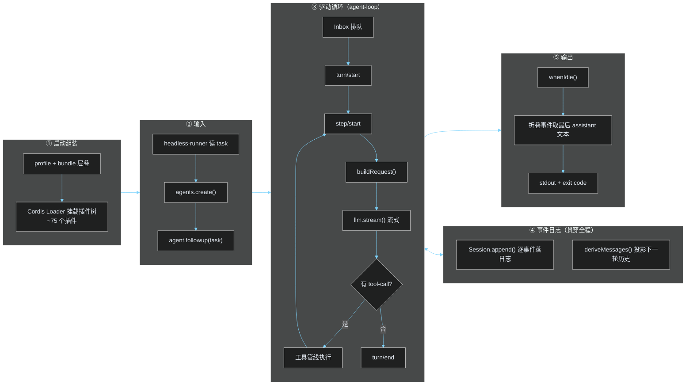
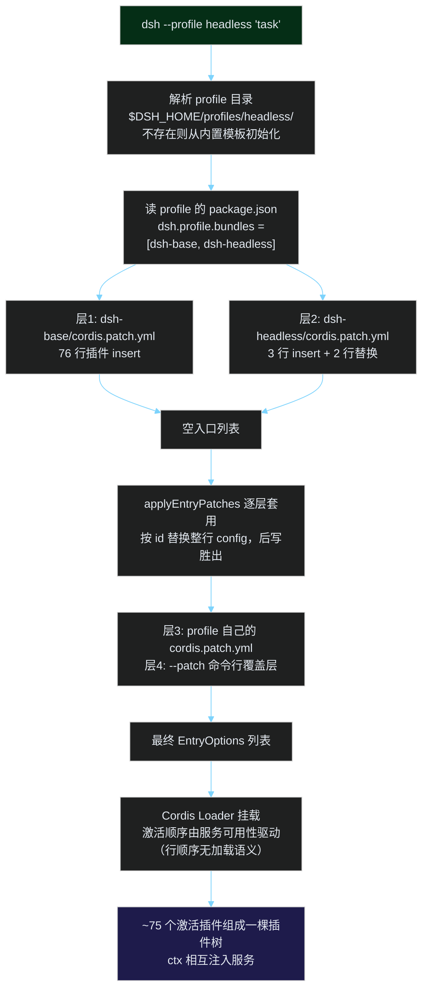
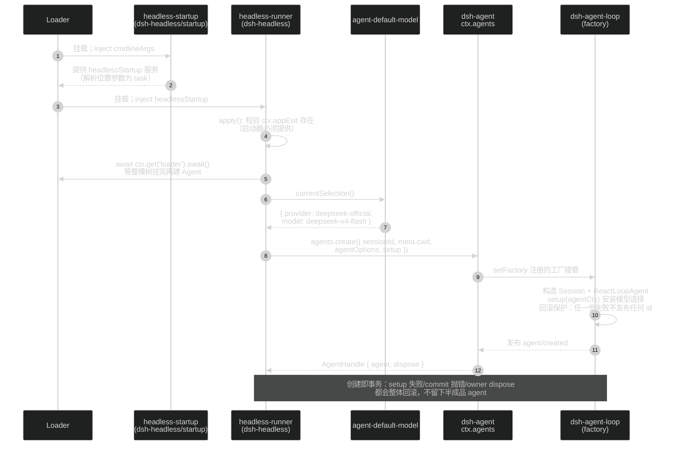
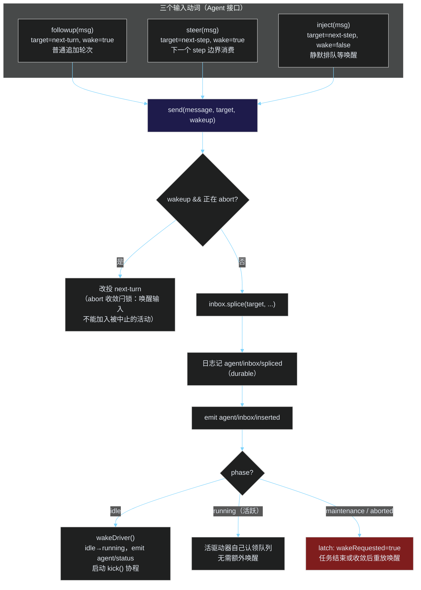
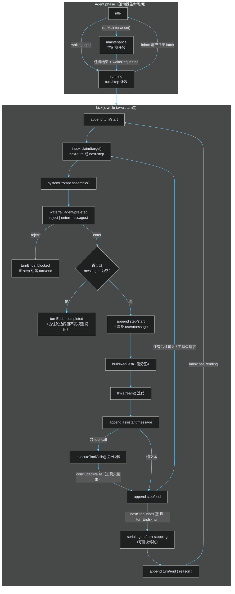
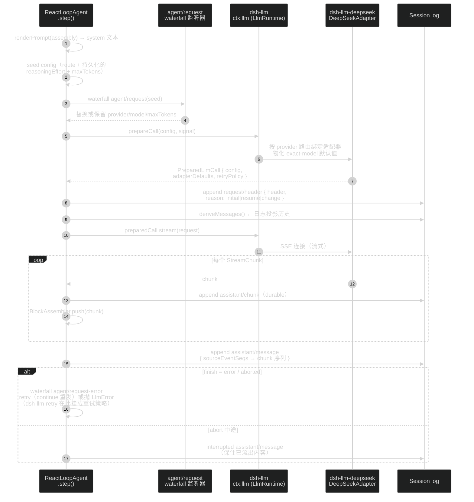
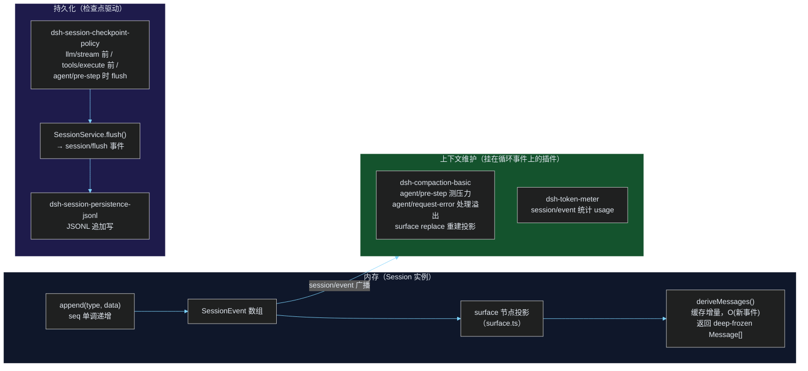

# DeepSeek Harness 核心逻辑：从输入到输出（新手 Debug 指南）

> 面向新手的源码导读：全流程「总-分」拆解 + 黑色背景流程图 + 源码锚点 + 插件协作全景。
> 权威文档见 [docs/architecture.md](docs/architecture.md)、[docs/agent-lifecycle.md](docs/agent-lifecycle.md)、[docs/tool-execution-pipeline.md](docs/tool-execution-pipeline.md)。

## 0. 一句话心智模型

> **一切皆插件，一切皆事件流。** 输入进入 Agent 的 inbox 唤醒驱动器；驱动器循环执行「turn → step」；每个 step 把模型可见的每件事**追加**到 append-only 的 session 日志；下一轮请求的消息历史**从日志投影派生**（`deriveMessages()`），而不是独立存储。

两个最重要的不变量（debug 时永远先检查）：

1. **Model-visible ⟺ logged**：任何到达模型请求的内容都必须能从 session 日志重建，运行时有不变量断言在检查。
2. **扩展靠插件，不改循环**：新行为挂在 `agent/*`、`tools/*`、`session/*` 事件上；`agent-loop` 是默认驱动器，可整体替换，扩展插件不直接依赖它。

---

## 1.【总图】从输入到输出：全流程鸟瞰

以最短入口 headless（`pnpm dsh --profile headless "任务文本"`）为例。其余入口（ACP / JSON-RPC / Web）只是换了输入面，进入 Agent 之后完全一致。



**关键源码说明**：

| 环节 | 源码位置 | 一句话职责 |
|---|---|---|
| ① 启动组装 | `packages/boot/app-boot/src/profile.ts` → `loadProfile()` / `composeEntries()` | 把 profile 声明的 bundle 层叠成插件入口列表 |
| ② 输入 | `packages/bundle/headless/src/index.ts` → `run()` | 读 task → `agents.create` → `followup` → `whenIdle` |
| ③ 驱动循环 | `packages/core/agent-loop/src/agent.ts`（`ReactLoopAgent`，约 515 行，**全项目最值得精读的文件**） | turn/step 状态机：claim → pre-step → 请求 → 流式 → 工具 → 收尾 |
| ④ 事件日志 | `packages/core/session/src/index.ts`（`Session`） | append-only 真相源；`deriveMessages()` 增量投影 |
| ⑤ 输出 | `packages/bundle/headless/src/index.ts` → `summarize()` | 折叠本区间事件，最后一段 assistant 文本写 stdout，`turn/end completed` → exit 0 |

后续章节按「分」逐段展开：§2 组装、§3 创建与唤醒、§4 主循环、§5 请求与流式、§6 工具管线、§7 日志与持久化。

---

## 2. 插件树组装：profile、bundle、patch

### 2.1 关键术语

| 术语 | 定义 | 示例 |
|---|---|---|
| **plugin（插件）** | Cordis 的最小组成单元：一个带 `name`、可选 `inject`（依赖的服务键）、`Config` schema、`apply(ctx, config)` 的模块。注册即 effect，卸载时自动回滚 | `packages/core/agent-loop/src/index.ts` 导出 `name: 'agent-loop'`、`inject: ['agents','llm','systemPrompt','tools']` |
| **row（配置行）** | cordis.yml 里的一条插件挂载声明：`{ id, name, config?, inject?, disabled? }`。`id` 是后续 patch 的寻址句柄；`name` 是插件包名 | `- id: tool-bash`<br/>`  name: '@deepseek-ai/dsh-tool-bash'` |
| **patch（补丁层）** | 一个 `cordis.patch.yml` 文件：可按 `id` **整行替换**某行的 config（不合并），或 `insert` 新行。层层叠加，后写胜出 | `packages/bundle/headless/cordis.patch.yml` 把 `system-prompt` 行的 persona 换成 coding agent 文案 |
| **bundle（捆层）** | 可安装的发行格式 = 若干 patch 行 + 它们引用的代码。在 `package.json` 的 `dsh.bundle.patch` 字段声明自己的 patch 文件 | `@deepseek-ai/dsh-base`（`dsh.bundle.patch: cordis.patch.yml`，76 行） |
| **profile（配置档案）** | 存在 Harness home（`$DSH_HOME/profiles/<name>/`）里的命名组合：声明叠加哪些 bundle、持有用户自己的 `cordis.patch.yml`。`web` / `headless` 随产品作为模板 | headless 的 profile 声明 `bundles: ['@deepseek-ai/dsh-base', '@deepseek-ai/dsh-headless']` |

### 2.2 组装流程



**关键源码说明**：

- **`loadProfile()`**（`packages/boot/app-boot/src/profile.ts:361`）：逐个解析 `dsh.profile.bundles` 条目到其 patch 文件；列出的包没有 `dsh.bundle` 声明会**响亮失败**（misconfiguration，不是「无补丁」）。
- **`composeEntries()`**：把多层 patch 在**空根**上用 `applyEntryPatches` 叠成最终入口列表 —— 与真实 boot 走同一条路径，所以 `--dump-config` 看到的就是实际挂载的树。
- **dsh-base 的 76 行**（`packages/bundle/base/cordis.patch.yml`）：每个 mode 共享的核心全在这 —— LLM seam、session、tools、agent、agent-loop、sandbox/审批/权限、持久化、全部 model-facing 工具。设计规则：**随 mode 变化的值不进 base**，由各 mode bundle 重述完整配置，保证一行 config 只属于「一个 bundle 层 + 用户层」。
- **headless 层**（`packages/bundle/headless/cordis.patch.yml`）：替换 `system-prompt` 行（coding persona）、禁用 `hmr`、insert 三个新行 —— `code-runtime`（Code Mode worker）、`headless-startup`（task 提供者）、`headless-runner`（驱动器，`inject: [headlessStartup]`，task 通过 `!!js ctx.headlessStartup.task` 惰性解析）。
- **`!!js` 限制**：patch 里 `!!js`（注意双感叹号）只允许出现在插件 `config` 和行 `disabled` 字段，其余元数据保持字面量（见 `docs/cordis-primer.md`）。

🔍 **debug 技巧**：`dsh --profile web --dump-config` 打印实际插件树；任何一行可被你自己的 patch 替换。怀疑插件没挂上 / 配置没生效，先看这个输出。

---

## 3.【分图 1】启动与 Agent 创建



**关键源码说明**：

- `packages/bundle/headless/src/index.ts` → `run()`：`await ctx.get('loader')?.await()` 是关键 —— Loader 兄弟插件**并发挂载**，不等整棵树完成就建 Agent，可能拿到半组装的 scoped 工具和适配器。
- `packages/core/agent/src/index.ts` → `AgentRegistry.create()`：通过 `setFactory()` 注册的工厂（`dsh-agent-loop` 构造时注册）创建，所以消费者只依赖 `ctx.agents`，不依赖具体循环包 —— 循环保持可替换。
- 创建事务性：`setup` 回调在**两个 id 都未发布前**组装 agent 的 scoped 世界，失败即回滚（`docs/subsystems/core.md` "Creation and ownership"）。
- 默认模型来自 `dsh-agent-default-model` 组合行（base patch 中默认 `deepseek-official` / `deepseek-v4-flash`）；挂了 settings provider 时用户层可覆盖。

---

## 4.【分图 2】输入进入 inbox 与驱动器唤醒



**关键源码说明**：

- `packages/core/agent-loop/src/agent.ts` → `send()`（约 L110）：`wakingAfterAbort` 在 splice **之前**捕获，防止重入 cancel 把它重新分类。
- **Inbox 是 durable projection**：两个有序待处理列表（`next-turn` / `next-step`），每次变更都记 `agent/inbox/spliced` 会话事件，UI 重启后可重建队列；`claim()` 是纯删除 splice（不产生 discarded 通知），循环再逐条 emit `agent/inbox/claimed`。
- **inject 不唤醒**是新手最常踩的坑：注入的上下文静静躺在 inbox，直到 followup/steer 来叫醒驱动器。排查「注入没生效」先看驱动器当时是否 idle。
- `wakeDriver()` 的 latch：maintenance 或 abort 中的活动无法投递唤醒，先记 `wakeRequested`，收敛后重放；但队列里若已没有唤醒消息则抑制重放。

---

## 5.【分图 3】turn / step 主循环（状态机）



**关键源码说明**：

- **step = 一次模型请求 + 其工具调用；turn = 0..n 个 step**。turn 在第一个输入被 claim 前打开，「不再欠任何东西」（无工具后续、无 steering、next-step 空）时关闭。源码：`agent.ts` → `turn()`（约 L242）。
- `preStep()`（约 L217）：`claim → systemPrompt.assemble → agent/pre-step waterfall`。runtime context 投影（`RuntimeContextProjection`，`runtime-context.ts`）在这里以 user 消息形式附加。
- **`agent/pre-step` 被拒绝**：turn 仍写 `turn/end {kind:'blocked'}`，零 step 也留日志痕迹 —— 日志里的「空 turn」不是 bug。
- **max-tokens 粘性**：一旦某 step 顶到上限，后续 completed step 不会降级 turn 结果（`turn()` 中 `if (turnEnds === null || turnEnds.kind !== 'max-tokens')`）。
- 取消：`cancel(cause)` → `AbortController.abort`；turn 结束记 `{kind:'aborted'}`。中断时已流出的部分内容仍写成 `assistant/message`（`interrupted: true`）保住 replay。
- 错误结构化：`LlmError` 保留 failure 事实，其余错误经 `errorChain` 压平为 `UNKNOWN` code 的 durable 记录。
- `agent/turn-stopping` 是 serial 事件（无 `next()`），监听器可通过抛错或注入新工作否决停轮。

---

## 6.【分图 4】请求构建与流式响应



**关键源码说明**：

- `agent.ts` → `buildRequest()`（约 L440）：请求配置的三段流 —— seed（route + 日志持久化的 effort/maxTokens）→ `agent/request` waterfall（插件可换配置）→ `llm.prepareCall()`（适配器物化 exact-model 默认值，如 DeepSeek 的 256K maxTokens / 1M contextWindow）。
- **`request/header` 增量落日志**：仅三种 reason —— `initial`（首请求）/ `resume`（恢复）/ `change`（配置变化）。日志是请求前缀（system + tools）的 durable 记录，这是「Model-visible ⟺ logged」的落点之一。
- 适配器路由：`packages/llm/llm/src/index.ts` → `LlmRuntime.registerAdapter(providers, adapter)`；`packages/llm/llm-deepseek/src/adapter.ts` → `DeepSeekAdapter.stream()` 走 `streamWithConnection`（SSE，含 `streamIdleTimeoutMs` 空闲超时）。
- 密钥不在配置里内联：`llm-deepseek` 每次请求从 `settings.yaml`（`dsh-settings-file` 热加载）+ credential store（`dsh-credentials-local`）解析引用。
- 重试由 `dsh-llm-retry` 挂在 `agent/request-error` waterfall；`dsh-session-checkpoint-policy` 挂 `llm/stream` 前置 flush（见 §8）。
- `assistant/chunk` 原始落日志（保流式 replay 与 UI 保真）；`assistant/message` 通过 `sourceEventSeqs` 引用那些 chunk，空内容不进派生历史但 durable 事件保留 usage。

---

## 7.【分图 5】工具执行管线

```mermaid
---
config:
  theme: dark
  themeVariables:
    background: "#000000"
    primaryColor: "#0f172a"
    primaryTextColor: "#e2e8f0"
    primaryBorderColor: "#38bdf8"
    lineColor: "#7dd3fc"
    secondaryColor: "#1e1b4b"
    tertiaryColor: "#14532d"
    textColor: "#e2e8f0"
---
flowchart TD
  subgraph SCHED["调度器：tool-calls.ts executeToolCalls()"]
    cls["executionMode 分类每个调用"] --> grp["exclusive → 栅栏（串行屏障）<br/>parallel → 有界滚动池<br/>（maxParallelToolCalls）"]
    grp --> overlap["可重叠：dispatch 执行体<br/>不可重叠：pre/post 策略与结果提交"]
    overlap --> order["结果严格按 model-order 提交<br/>commitReady 只推进连续槽位<br/>启动前重分类（注册表变更可造栅栏）"]
  end

  subgraph PIPE["注册表管线：ctx.tools 单次调用"]
    direction TB
    tc["append tool/call（执行前落日志）"] --> pre["tools/pre-execute waterfall<br/>dsh-user-approval 挂此：allow/deny/ask"]
    pre --> appr["ask → ctx.approval 一次性询问<br/>无应答方或被拒 → deny"]
    appr --> guard["注册的单调守卫<br/>（dsh-permission-presets 等）"]
    guard --> exe["tools/execute waterfall<br/>dsh-timeout-policy 挂此：超时包裹"]
    exe --> body["工具 execute() 本体<br/>（bash → dsh-bash-sandbox →<br/>dsh-sandbox-local → dsh-subprocess-local）"]
    body --> owned["工具自有会话事件<br/>todo/write、fs/observed、hook/*…"]
    owned --> post["tools/post-execute waterfall<br/>dsh-repeat-tool-reminder 挂此"]
    post --> pruner["dsh-compaction-tool-result-pruner<br/>超大结果先修剪（8192 阈值）"]
    pruner --> spill["dsh-spill-policy<br/>超 50KB 落盘 spill-local<br/>留引用进上下文"]
    spill --> fin["finalizeContent → tools/result 通知"]
  end

  order --> PIPE
  fin --> tr["append tool/result<br/>（sourceEventSeqs 引用 tool/call）"]
  tr --> ctx2["result.additionalContexts<br/>→ 塞入 next-step inbox<br/>（下个 step 作为 user/message）"]

  style SCHED fill:#1e1b4b,color:#e2e8f0
  style PIPE fill:#0f172a,color:#e2e8f0
```



**关键源码说明**：

- **调度器**（`packages/core/agent-loop/src/tool-calls.ts`，289 行）：`executeToolCalls()` 是循环与工具世界的唯一桥。exclusive 调用是栅栏（前后不重叠）；parallel 池有界滚动；**abort 后未启动的调用补写合成错误结果**（`appendSkippedToolCall`）保证 replay 有效 —— 日志里 "aborted before dispatch" 不是异常。
- **管线**（`packages/core/tools/src/index.ts` 的 `ToolRuntime`）：三次 waterfall（pre/execute/post）+ 守卫 + 归一化。完整官方图见 `docs/tool-execution-pipeline.md`。
- 工具结果没进模型上下文 → 查两处：`appendToolResult` 是否落了 `tool/result`；`acceptContext` 是否把 `additionalContexts` 塞进 inbox。
- 工具没并发起来 → 看 `executionMode` 是否 exclusive，或池被 `maxParallelToolCalls`（agent-loop config）限住。
- `tools/result` 的 `concludesTurn: true` 可让工具直接结束 turn（跳过下一次模型请求）。

---

## 8.【分图 6】日志投影、上下文维护与持久化



**关键源码说明**：

- `packages/core/session/src/index.ts` → `Session.append()`：追加即广播 `session/event`（唯一 replay 面）；`deriveMessages()`（L726）从 surface 节点投影，**缓存增量**（surface replaceGeneration 变化时重建），消息对象与日志共享冻结数据。
- **压缩不删日志**：`dsh-compaction-basic` 通过 surface 的 replace 机制重建投影（模型看到摘要），原始事件保留可 replay。
- **flush 是唯一检查点**：`SessionService.flush()`（L1022）分发 `session/flush`；`dsh-session-checkpoint-policy` 决定何时调它 —— 每次模型请求前、顶层工具分发前。崩溃恢复从 JSONL/SQLite 重放。
- 事件类型全集：`turn/start|end`、`step/start|end`、`user/message`、`assistant/chunk`、`assistant/message`、`tool/call`、`tool/result`、`steering/message`、`todo/write`、`request/header`（+ `request/context`）等 —— 类型在 `SessionEventMap`（声明合并可扩展，`packages/core/session/src/types.ts`）。
- **事件三域**（选断点先选对域）：durable session 事件（可 replay，UI/SDK 只订这个）｜`agent/*` 活体协调（不可 replay）｜capability 事件（`fs/*`、`tools/*`，挂策略不改循环）。
- **waterfall 监听器必须调用 `next()`** 委托；不调用即短路整条链（Cordis 语义，见 `docs/cordis-primer.md`）。

---

## 9. 从输入到输出：插件协作全景

### 9.1 一次 headless 运行涉及多少插件

以「`dsh --profile headless "读 README 并总结"`（含一次 bash 调用）」为例：

- **整棵树**：dsh-base 76 行 + headless 4 行 ≈ **80 行声明，约 75 个激活插件**（扣除平台条件禁用的 pwsh/bash 对、显式 disabled 的 hmr/skill-badge）。
- **关键路径直接参与者：约 30 个**（下表）；其余（web、workflow、subagent、jobs、plan-mode、ACP…）已挂载但本任务不触发。

### 9.2 关键路径插件清单（按阶段）

| 阶段 | 插件（包名省略 `@deepseek-ai/`） | 角色 | 协作机制 |
|---|---|---|---|
| **启动** | `dsh-headless/startup`（headless-startup） | 解析命令行 task，提供 `headlessStartup` 服务 | 服务提供者（inject cmdlineArgs） |
| | `dsh-headless`（headless-runner） | 建 Agent、提交 task、收尾输出 | 服务消费者（inject headlessStartup） |
| | `dsh-agent-default-model` | 默认 provider/model 选择 | 服务（`ctx.agentDefaultModel`） |
| | `cordis-plugin-timer` | Cordis 定时器基础设施 | 框架服务 |
| **创建** | `dsh-agent` | Agent 注册表 + initiator scope + `agent/*` 事件 | 服务（`ctx.agents`） |
| | `dsh-agent-loop` | 工厂 + 驱动器（`ReactLoopAgent`） | `setFactory` 注册；驱动 turn/step |
| | `dsh-session` | 会话日志 + 内存 store | 服务（`ctx.sessions`） |
| **输入→inbox** | `dsh-agent-loop`（Inbox） | durable 投影，claim/splice | 会话事件（`agent/inbox/spliced`） |
| **提示词组装** | `dsh-system-prompt` | 分段 + 工具 schema 组装 | 服务（`ctx.systemPrompt`）+ `system-prompt/assemble` waterfall |
| | `dsh-agent-instructions` | AGENTS.md/CLAUDE.md 工作区上下文 | prompt section/context 提供者 |
| | `dsh-plan-mode` | plan 模式提示段 | prompt section 提供者 |
| | `dsh-skill` + `dsh-skill-filesystem` + `dsh-tool-skill` | 技能目录前缀 + 加载工具 | Service/Provider/Consumer 三角色 |
| **请求构建** | `dsh-llm` | 适配器注册表 + 流词汇表 | 服务（`ctx.llm`） |
| | `dsh-llm-deepseek` | DeepSeek 适配器（SSE 流式） | `registerAdapter` 注册 |
| | `dsh-settings-file` | settings.yaml 热加载 | 服务（key/endpoint 解析） |
| | `dsh-credentials-local` | 凭据存储（env 优先于 .env） | 服务（`ctx.credentials`） |
| | `dsh-llm-retry` | 请求重试策略 | `agent/request-error` waterfall |
| **流式** | `dsh-session-checkpoint-policy` | 请求前 flush 检查点 | `llm/stream` / `tools/execute` / `agent/pre-step` 监听 |
| | `dsh-session-persistence-jsonl` | JSONL 持久化 | 服务（`ctx.sessionPersistence`）+ `session/flush` |
| | `dsh-token-meter` | token 用量统计 | `session/event` 监听 |
| | `dsh-session-title` + `first-prompt-llm` | 会话标题生成 | 服务 + LLM 辅助请求 |
| **工具（bash 一例）** | `dsh-tools` | 注册表 + 守卫管线 | 服务（`ctx.tools`） |
| | `dsh-tool-bash` | model-facing bash schema | `ctx.tools.register` |
| | `dsh-bash-sandbox` | shell 执行器（穿 sandbox） | `ctx.shell` provider |
| | `dsh-sandbox-local` + `dsh-sandbox-policy` | 进程约束后端 + 模式 | `ctx.sandbox` + 策略配置 |
| | `dsh-subprocess-local` | 本地进程树 | `ctx.subprocess` |
| | `dsh-shell-env` | bash 环境上下文 | shell 环境服务 |
| | `dsh-user-approval` | 审批（allow/deny/ask） | `tools/pre-execute` waterfall |
| | `dsh-permission-presets` | 权限预设（read-only 等） | 单调守卫注册 |
| | `dsh-timeout-policy` | 工具超时 | `tools/execute` waterfall |
| | `dsh-repeat-tool-reminder` | 连续重复调用提醒 | `tools/post-execute` + `agent/pre-step` |
| | `dsh-compaction-tool-result-pruner` | 超大结果修剪（8192 字符） | post 阶段结果处理 |
| | `dsh-spill-policy` + `dsh-spill-local` | 超大结果落盘留引用 | 结果策略 |
| **上下文维护** | `dsh-compaction-basic` | 上下文压力压缩 | `agent/pre-step` + `agent/request-error` |
| **输出** | `dsh-headless`（summarize） | 折叠事件取最后 assistant 文本 | 读 session.events |

### 9.3 插件间协作的五种机制

插件之间**不互相 import**，全部通过 Cordis `ctx` 上的五种机制协作 —— 这是「换一个 provider 就换掉整个产品执行面」的根基：

| 机制 | 语义 | 典型例子 |
|---|---|---|
| **服务注入**（Service Definition / Provider / Consumer） | 插件声明接口（`ctx.llm`）、实现方注册（`dsh-llm-deepseek`）、使用方消费（agent-loop）。消费方只依赖定义，不依赖实现 | `ctx.tools` / `ctx.shell` / `ctx.fs` / `ctx.subprocess` / `ctx.sandbox` —— fs 与 subprocess 共享同一执行世界，指向远程沙箱时 bash/PTY/LSP 一起搬家 |
| **waterfall 事件** | 串行链，每个监听器可改写并**必须调用 `next()`** 委托；不调用即短路 | `agent/pre-step`、`agent/request`、`tools/pre-execute`、`tools/execute`、`tools/post-execute` |
| **emit / serial 事件** | 广播通知（emit）或串行无 `next()` 检查点（serial） | `agent/status`、`session/event`（emit）；`agent/turn-stopping`（serial） |
| **会话事件日志** | durable 事实落日志，重建一切模型可见输入的真相源 | `assistant/chunk`、`tool/call`、`request/header` |
| **scope 作用域** | 注册挂在某个 agent 的 scoped ctx 上，agent 销毁自动回滚 | `agent.ctx`；preset 通过 standing scope 让子 agent 继承父的插件组合 |

**协作实例串讲**（对应分图 4-5）：agent-loop 构建请求时，`dsh-agent-instructions` 早已通过 system-prompt 注册了 AGENTS.md 段；`dsh-llm-deepseek` 在 `ctx.llm` 注册了适配器；`dsh-settings-file` + `dsh-credentials-local` 在适配器内部解析密钥。请求发出前 `dsh-session-checkpoint-policy` flush 日志；失败时 `dsh-llm-retry` 在 `agent/request-error` 决定重试。工具调用时 `dsh-user-approval` 在 pre-execute 审批，`dsh-timeout-policy` 在 execute 包超时，`dsh-bash-sandbox` 穿过 `dsh-sandbox-local` 落到 `dsh-subprocess-local` 起真进程，结果过大时 pruner 修剪、spill 落盘 —— **循环一行代码都不知道这些插件存在**。

---

## 10. 新手 debug 断点地图

按「症状 → 断点位置」组织，全部为真实文件路径：

| 症状 | 先在这里下断点 |
|---|---|
| 输入没有被模型看到 | `packages/core/agent-loop/src/agent.ts` → `send()` → `inbox.splice` → `preStep()` 的 `claim()`；再查 `agent/pre-step` 监听器是否 reject 或改写了 messages |
| 系统提示词不对 | `packages/core/system-prompt/src/index.ts` → `assemble()`；`renderPrompt`/`renderContextSections`（agent.ts 调用处）；`system-prompt/assemble` waterfall 监听器 |
| 请求参数错 | `agent.ts` → `buildRequest()`（seed → `agent/request` waterfall → `llm.prepareCall`）；`request/header` 的 append 分支（initial/resume/change） |
| 模型流中断 / 报错 | `packages/llm/llm/src/index.ts` → `LlmRuntime.stream()`；`packages/llm/llm-deepseek/src/adapter.ts` → `streamWithConnection`；`agent.ts` `step()` 的 catch 与 `agent/request-error` waterfall |
| 工具不执行 / 结果异常 | `packages/core/agent-loop/src/tool-calls.ts` → `runGroup()` 的 `startCall` / `commitReady`；`packages/core/tools/src/index.ts` 的 pre/execute/post 分发 |
| 上下文越聊越不对 | `packages/core/session/src/index.ts` → `deriveMessages()`；`surface.ts`（replaceGeneration —— 压缩靠它重建投影）；`dsh-compaction-basic` 的 pre-step 监听 |
| 持久化 / resume 问题 | `packages/session/session-persistence-jsonl`；`SessionService.flush()`（`session/flush` 是唯一检查点入口） |
| 插件没生效 / 组合错 | `dsh --dump-config`；对照 `packages/bundle/base/cordis.patch.yml`；`!!js` 只允许在 `config` 与 `disabled` 字段 |
| 断言炸了（invariant） | 各包 `src/invariant.ts` —— 校验**关系型运行时不变量**（查事件流/可变数据），炸了基本是真 bug |
| 取消后行为怪异 | `agent.ts` → `cancel()` / `wakeDriver()` 的 latch；`send()` 中 `wakingAfterAbort` 分类 |

**三个最实用的观测面**：

1. `session/event` 是唯一 replay 面 —— 想知道「模型到底看到了什么」，别猜，投影 `deriveMessages()` + 读日志。
2. `agent/status` + `agent/inbox/*` 是活体面 —— 排查「卡住不动」看这里（常见：inject 没 wake、maintenance latch、abort 收敛等待）。
3. `pnpm run test:snapshot`（无 key 可跑）—— 真实组装示例回放预期输出，改循环相关代码后跑它最直观。

---

## 11. VS Code 断点调试详解

### 11.1 前置条件

- **调试器**：VS Code 内置的 JavaScript 调试器（js-debug），无需额外扩展。
- **Node**：`^22.19 || >=24`（与 `engines` 一致即可）；tsx 由根 `node_modules` 解析。
- **依赖**：仓库根目录执行过 `pnpm install`（tsx、vitest 均为根 devDependency）。
- **launch.json**：仓库不含 `.vscode/launch.json`，需要自建（个人开发环境，**不要把密钥写进去**，见 11.5）。

关键契约（来自 [AGENTS.md](AGENTS.md)）：`dsh` 的源码启动固定走 **tsx 的 ESM-only hook**：

```sh
node --import tsx/esm apps/cli/src/bin.ts   # = pnpm dsh
```

所以 launch.json 用「`node` + `--import tsx/esm` + bin 路径」精确复刻，断点直接落在 `packages/*/src` 的 `.ts` 源文件上（tsx 注入 source map）。

### 11.2 创建 `.vscode/launch.json`（五个配置）

```jsonc
{
  "version": "0.2.0",
  "configurations": [
    {
      "type": "node",
      "request": "launch",
      "name": "dsh headless（一次性任务）",
      "runtimeExecutable": "node",
      "args": [
        "--import", "tsx/esm",
        "apps/cli/src/bin.ts",
        "--profile", "headless",
        "总结 README.md 的核心内容"
      ],
      "cwd": "${workspaceFolder}",
      "console": "integratedTerminal",
      "skipFiles": ["<node_internals>/**", "${workspaceFolder}/node_modules/**"],
      "autoAttachChildProcesses": true
    },
    {
      "type": "node",
      "request": "launch",
      "name": "dsh --dump-config（组合诊断）",
      "runtimeExecutable": "node",
      "args": [
        "--import", "tsx/esm",
        "apps/cli/src/bin.ts",
        "--profile", "headless",
        "--dump-config"
      ],
      "cwd": "${workspaceFolder}",
      "console": "integratedTerminal",
      "skipFiles": ["<node_internals>/**"]
    },
    {
      "type": "node",
      "request": "attach",
      "name": "附加到运行中的 dsh（--inspect）",
      "port": 9229,
      "skipFiles": ["<node_internals>/**", "${workspaceFolder}/node_modules/**"]
    },
    {
      "type": "node",
      "request": "launch",
      "name": "vitest: 当前打开的测试文件",
      "runtimeExecutable": "node",
      "args": [
        "node_modules/vitest/vitest.mjs",
        "run", "${file}"
      ],
      "cwd": "${workspaceFolder}",
      "console": "integratedTerminal",
      "skipFiles": ["<node_internals>/**", "${workspaceFolder}/node_modules/**"],
      "autoAttachChildProcesses": true
    },
    {
      "type": "node",
      "request": "launch",
      "name": "vitest: snapshot 单场景（无 Key，tool-call-turn）",
      "runtimeExecutable": "node",
      "args": [
        "node_modules/vitest/vitest.mjs",
        "run", "--config", "vitest.snapshot.config.ts",
        "-t", "tool-call-turn"
      ],
      "cwd": "${workspaceFolder}",
      "console": "integratedTerminal",
      "skipFiles": ["<node_internals>/**", "${workspaceFolder}/node_modules/**"],
      "autoAttachChildProcesses": true
    }
  ]
}
```

逐字段说明：

| 字段 | 为什么这样写 |
|---|---|
| `runtimeExecutable: "node"` + `--import tsx/esm` | 复刻 `pnpm dsh` 脚本的启动链。**Windows 下不要**用 `tsx.CMD`/`vitest.CMD` shim 做 runtimeExecutable（路径与引号问题），直接 node + 包入口 |
| `apps/cli/src/bin.ts` | 源码入口（`parseDshArgs` 分发 profile/plugin/… 模式） |
| `console: "integratedTerminal"` | 流式 stdout / 工具终端输出最接近真实行为；Debug Console 也能看输出 |
| `skipFiles` | 单步时跳过 Node 内部与依赖包。**要单步进 vendored Cordis 时**删掉 `${workspaceFolder}/node_modules/**` 一行 |
| `autoAttachChildProcesses`（默认开） | js-debug 会给 node 子进程注入调试器：snapshot 测试拉起的示例 bin、subagent 子进程自动跟随断点 |

### 11.3 首次调试：一条完整断点链路

按本指南 §1 总图的顺序，第一遍走位建议只下这 6 个断点（F5 启动「dsh headless」配置）：

| # | 文件:位置 | 观察什么 |
|---|---|---|
| 1 | `packages/core/agent-loop/src/agent.ts` → `send()` | Watch：`this.phase`（idle→？）、`resolvedTarget`、`wakingAfterAbort` |
| 2 | 同文件 `preStep()` → `claim()` 返回后 | `claimed` 数组内容 —— 进入本 step 的消息批次 |
| 3 | 同文件 `buildRequest()` → waterfall 之后 | `proposedConfig`（provider/model）、`header.system` 是否含 persona |
| 4 | 同文件 `step()` → `for await (const chunk of stream)` 循环体 | 每 chunk 断一次；Watch：`assembler.blocks()` 逐步成形、`chunkSeqs.length` |
| 5 | `packages/core/agent-loop/src/tool-calls.ts` → `startCall()` 的 `switch (prepared.kind)` | `prepared.kind`（dispatch / post-result / final-result）；调用被拒时看 pre-execute 路径 |
| 6 | `packages/bundle/headless/src/index.ts` → `summarize()` 循环体 | `event.type` 逐事件过一遍 —— 亲眼看到「日志即真相源」 |

### 11.4 断点技巧（条件断点 / Logpoint / Watch）

- **条件断点**：右键断点 → Edit Breakpoint → Expression。例：在 `tool-calls.ts` 的 `appendToolResult()` 上加 `block.name === 'bash'`，只停 bash 调用；在 `agent.ts` `send()` 上加 `wakeup === false`，专抓 inject 静默排队。
- **Logpoint（不暂停只打日志）**：适合观察循环节奏而不打断执行。例：
  - `agent.ts` `turn()` 的 finally 前一行：`` `turn=${turn} end=${JSON.stringify(turnEnds)}` ``
  - `send()` 首行：`` `send target=${target} wakeup=${wakeup}` ``
  - `step()` 流式循环内：`` `chunk#${chunkSeqs.length} ${chunk.kind}` ``
- **Watch 表达式**（调试侧栏 → Watch）：
  - `this.phase` —— 驱动器生命周期（running 时含 turn/step 计数）
  - `this.inbox.nextTurn` / `this.inbox.nextStep` —— 两条待处理队列
  - `this.session.seq` —— 日志水位；`this.session.deriveMessages().length` —— 模型即将看到的消息数
  - `this.session.requestHeader()` —— 当前请求前缀（system + tools）

### 11.5 有 Key / 无 Key 两种调试方式

**方式 A：真 API（需要 Key）**

在**仓库根 `.env`** 写 `DEEPSEEK_API_KEY=sk-...`（可从模板 `cp .env.example .env` 开始）。启动链里的 `loadLayeredEnv('dsh')`（`apps/cli/src/bin.ts`）会自动加载分层环境，**无需写进 launch.json** —— launch.json 常被误提交，密钥永远留在 `.env`（已在 .gitignore 范围）。然后直接 F5「dsh headless」配置。

**方式 B：无 Key 回放（replay）**

CI 的 `test:snapshot` 机制可以直接复用：示例目录（如 `examples/acp-agent/`）里每个 `cordis.yml` 旁边都有一个 `cordis.snapshot.yml` 覆盖层 —— 禁用 `llm-deepseek`、挂载 `@deepseek-ai/dsh-llm-replay`，用**已提交的录制脚本**应答模型请求。设置环境变量 `DSH_SNAPSHOT=replay` 后，bin 会自动把配置路径换成这个覆盖层（`packages/examples/acp-demo/src/bin.ts` 与 `dsh-app-boot` 的 `resolveConfigPath` 实现该切换）：

```sh
# 终端手动跑（等价于 demo:acp 脚本 + replay）。DSH_SNAPSHOT_FILE 指向录制
# 的会话日志（llm-replay 的 fixture，缺了会响亮报错）；stdin 关闭时 ACP
# 服务器自动收尾退出，手动观测启动链是否干净即可。
DSH_SNAPSHOT=replay \
DSH_SNAPSHOT_FILE=examples/acp-agent/tests/snapshots/text-turn/session.jsonl \
node --import tsx/esm packages/examples/acp-demo/src/bin.ts --config examples/acp-agent/cordis.yml
```

在 launch.json 的任意配置里加 `"env": { "DSH_SNAPSHOT": "replay", "DSH_SNAPSHOT_FILE": "${workspaceFolder}/examples/acp-agent/tests/snapshots/text-turn/session.jsonl" }` 即可 F5 调试（回放配置建议复制一份 ACP 示例 bin 的配置，见 `pnpm run demo:acp` 脚本）。更省事的路径是用「vitest: snapshot 单场景」配置：vitest 会拉起真实示例 bin 子进程，`autoAttachChildProcesses` 自动把断点带进去，全程零 Key。

单元层还有两个无 Key 工具：`packages/test-support/agent-loop-testkit`（循环测试套件）和 `llm-mock-server`（本地 mock 模型服务），其测试文件本身就是可断点的可运行样例。

### 11.6 常见坑速查

| 症状 | 原因与解法 |
|---|---|
| 断点是灰圈（unbound） | 模块还没被 import 是**正常现象**（源码启动按需加载）；命中路径已执行过仍不绑定 → 检查是否断在 `lib/` 构建产物上（源码启动全程走 `src/` 的 `.ts`），或被 skipFiles 覆盖 |
| Windows 报找不到 tsx | 不要用 `tsx.CMD` shim；保持 `node --import tsx/esm …` 形式，tsx 从根 node_modules 解析 |
| headless 进程秒退 | 这是预期行为（one-shot：`turn/end completed` → exit 0）。想停在结尾：在 `summarize()` 或 `io.exit` 前下断点；exit code 1 对应 error 结局的 turn，不是调试器故障 |
| bash/pwsh 工具里断点不生效 | bash 子进程不是 Node。断点应下在 TS 层：`dsh-bash-sandbox`（shell 执行器）→ `dsh-subprocess-local`（进程树） |
| workflow / Code Mode 的 worker 代码断点不进 | worker 线程 js-debug 原生支持，直接在 worker 源文件下断点即可；确认该文件确实被当前 composition 挂载（`--dump-config`） |
| 单步进不了 Cordis 内部 | 从 `skipFiles` 移除 `${workspaceFolder}/node_modules/**`；vendored 源码在 `vendor/`，按 [vendor/README.md](vendor/README.md) 定位 |
| 改了 `.env` 不生效 | launch 配置默认不重启终端；重启调试会话（Shift+F5 → F5）。真实 e2e 才需要 Key，单测/snapshot 不需要 |

---

## 12. 建议的精读顺序

1. `docs/architecture.md` + `docs/cordis-primer.md` —— 框架语义：waterfall 必须 `next()`、注册即 effect。
2. `packages/bundle/base/cordis.patch.yml` —— 通读 76 行，建立「产品由哪些插件组成」的全景。
3. `packages/core/agent-loop/src/agent.ts` —— 515 行驱动器，全流程心脏。
4. `packages/core/session/src/index.ts` —— 日志 + `deriveMessages()` 投影。
5. `packages/core/agent-loop/src/tool-calls.ts` —— 工具调度器（289 行）。
6. `packages/core/tools/src/index.ts` —— 守卫管线（选读）。
7. `packages/bundle/headless/src/index.ts` + `cordis.patch.yml` —— 最短完整入口 + 最小 patch 示例。
8. 对照 `docs/agent-lifecycle.md`（官方时序图）与 `docs/tool-execution-pipeline.md` 验证理解。
