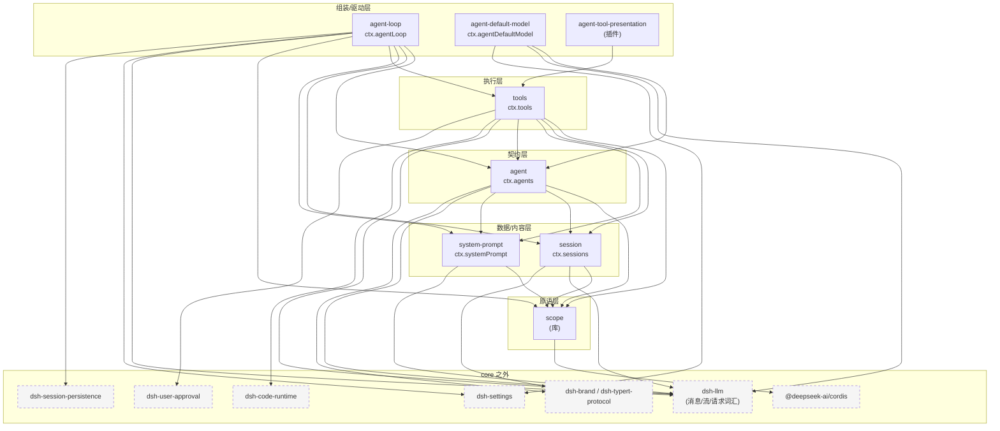
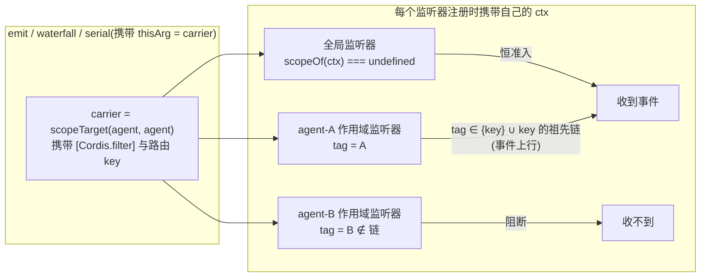
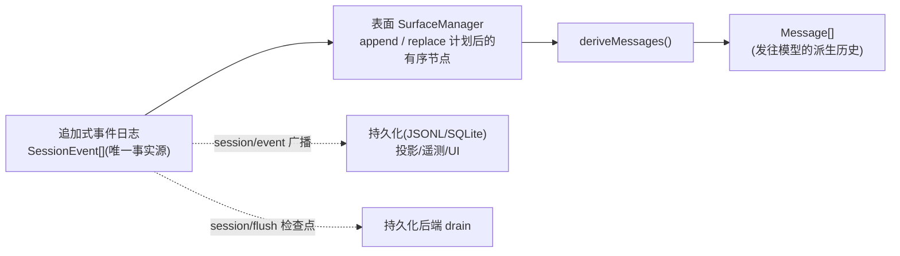
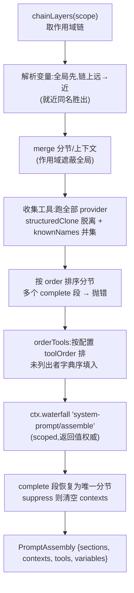
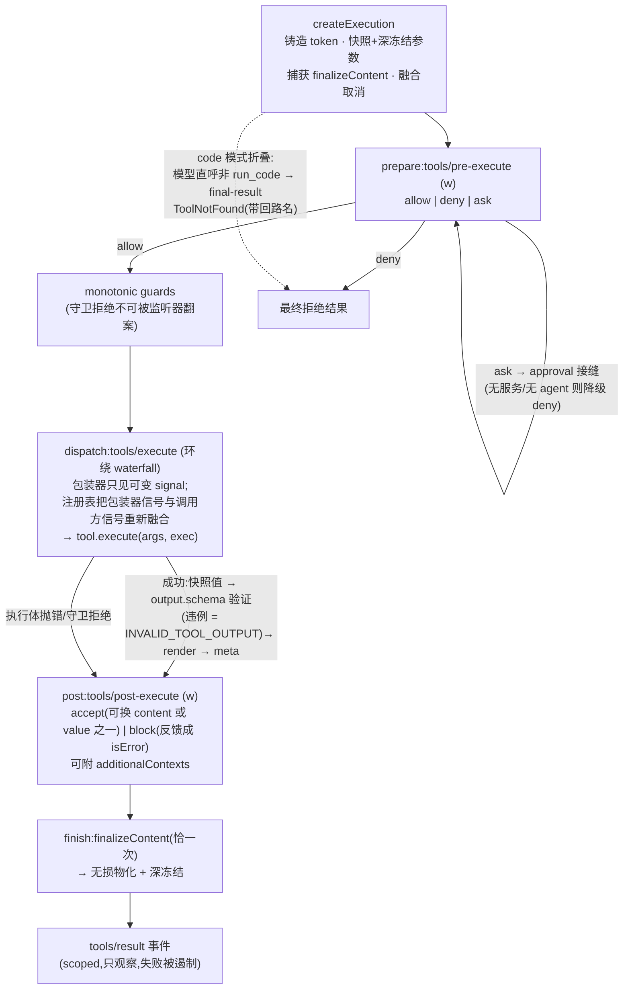
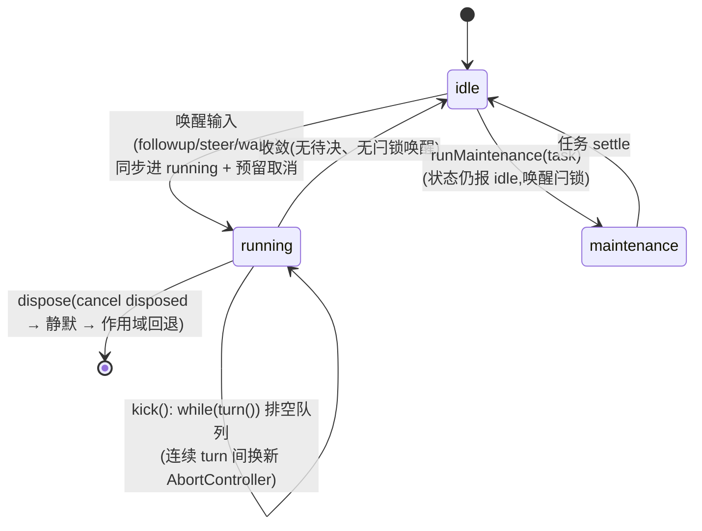
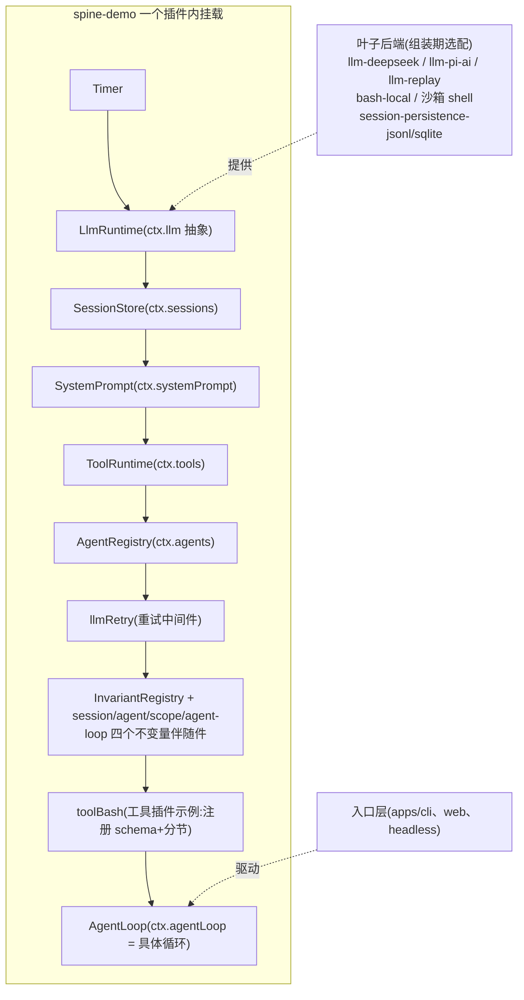

# core 子包深入：架构、关系与关键流程

> 独立梳理导读；权威来源:[packages/core/README.md](../packages/core/README.md)、[docs/subsystems/core.md](../docs/subsystems/core.md) 及各子包 README 与源码。本文深入 `packages/core` 的 8 个子包,梳理包间依赖、运行时交互与关键流程。以 `docs/` 原文与源码为准。

## 1. 定位:产品 API 主干(product API spine)

`packages/core` 是 harness 的**默认控制脊柱**——会话日志、系统提示词组装、工具注册表、agent 公共词汇表、部署默认模型选择,以及驱动这一切的具体循环。它们是**产品包**:插件与消费方编程所依赖的稳定表面;可运行的组装(把脊柱拼成能跑的 agent)属于 `examples/agent-spine-demo`,core 只拥有可替换的脊柱部件。

8 个子包一句话:

| 包 | npm 名 | ctx key | 一句话职责 |
|---|---|---|---|
| `scope/` | dsh-scope | (库,无 key) | 作用域化注册原语:全局层 + 每 agent 覆盖层,及按作用域过滤的事件派发 |
| `session/` | dsh-session | `ctx.sessions` | 追加式事件溯源会话日志(唯一事实源)与内存 store |
| `system-prompt/` | dsh-system-prompt | `ctx.systemPrompt` | 提示词分节/动态上下文/变量/工具 schema 的组装注册表 |
| `tools/` | dsh-tools | `ctx.tools` | 作用域化工具注册表与五阶段守卫执行管线 |
| `agent/` | dsh-agent | `ctx.agents` | `Agent` 公共接口、live 注册表、initiator 作用域、`agent/*` 事件词汇 |
| `agent-default-model/` | dsh-agent-default-model | `ctx.agentDefaultModel` | 部署级默认模型选择(组合项 + settings 用户层) |
| `agent-loop/` | dsh-agent-loop | `ctx.agentLoop` | 默认具体驱动器:`ReactLoopAgent`,实现 `Agent` 契约 |
| `agent-tool-presentation/` | dsh-agent-tool-presentation | (插件,无服务) | 按 agent preset 声明工具目录呈现模式(native/code/both) |

关键设计决策:`agent` 拥有**公共契约**,`agent-loop` 是其**默认实现**——扩展插件只依赖 `agent`(包括需要发起方 Agent 时),绝不直接依赖 `agent-loop`,因此驱动器保持可整体替换。`scope` 是唯一的非服务包:零依赖的库原语,位于模块图最底层,`session`/`system-prompt` 因此能在无环的前提下消费它。

## 2. 包依赖关系图

实线箭头 = peer 依赖(来自各 package.json)。`dsh-llm`、`dsh-invariants`、`cordis` 在 core 之外(llm 声明 `Message`/`ContentBlock`/`StreamChunk`/模型请求词汇;dsh-brand 的 branded id 亦在 core 外)。



分层含义(自底向上):

- **L0 `scope`**:无任何 dsh 依赖。提供 `createScope`/`scopeOf`/`scopeTarget` 与 `ScopedLayers` 存储原语,供上层注册表(session、system-prompt、tools、commands、skills、jobs…)做"全局层 + 作用域覆盖层"的聚合。
- **L1 `session` + `system-prompt`**:数据与内容。session 持有唯一事实源日志;system-prompt 持有模型可见前缀的组装。二者只依赖 scope 与 llm 词汇,不知道 agent 的存在。
- **L2 `agent`**:公共契约。定义 `Agent` 接口、Inbox、注册表与 `agent/*` 事件;依赖 L1 提供 `assembleContextFor`(把 agent 注入组装上下文)。
- **L3 `tools`**:执行管线。依赖 agent(`Scoped<Agent>` 事件类型)、system-prompt(把自己注册为工具 schema provider)、session(工具结果落盘的词汇)。
- **L4 驱动与组装**:`agent-loop` 依赖除 agent-tool-presentation 之外的一切(`inject = ['agents','sessions','llm','tools','systemPrompt']`,可选 `sessionPersistence`);`agent-default-model`、`agent-tool-presentation` 是窄用途挂件。

注意唯一的"分层倒挂":L3 的 tools 依赖 L2 的 agent(事件类型与组装上下文),而 agent 不依赖 tools——工具调用由 loop 调度、经 `ctx.tools` 执行,agent 契约本身对工具无感知。

## 3. scope:作用域原语(一切 agent 局部性的根)

源码:`scope/src/index.ts`(API)、`store.ts`(存储)、`scoped-events.generated.ts`(生成的作用域事件目录)、`invariant.ts`。

### 3.1 数据模型

- **`ScopeKey = object`**:不透明对象身份。**活 agent 对象本身就是它自己的作用域 key**(零分配路由)。
- **`kScope` symbol 标签**:`createScope(ctx, key)` 挂载一个空插件 fiber,并 `fiber.ctx.extend({ [kScope]: key })` 打标签。标签随派生 context 继承、最近者遮蔽——`scopeOf(ctx)` 读任意 context 得到最近作用域。
- **`scopeParents: WeakMap<ScopeKey, ScopeKey>`**:唯一父子关系。向下驱动注册继承(链上覆盖),向上驱动事件准入(事件只沿链上行,永不下行)。`bindScopeParent` 一次性绑定,只有返回的 `ScopeParentBinding.rebind` 能重链(preset 的 `recompose` 用它),二者都拒绝环。

### 3.2 ScopedLayers:全局层 + 作用域覆盖层

```text
ScopedLayers<L>
  global: L                      ← 普通插件 context 注册(无标签)
  scoped: Map<ScopeKey, L>       ← 经 agent.ctx 注册,惰性创建,整层清空时回收
  merge(scope):先 global 插入序,再 scopeChainOf(scope) 自远祖到最近覆盖同名项
```

每个注册表(system-prompt 的分节、tools 的 ToolLayer、commands、skills、jobs)都建立在这套结构上。注册通过 `ScopedLayers.effect(ctx, action)`:在 Cordis generator effect 内创建层 → 执行 `action(layer)` 得到同步撤销器 → 卸载时撤销并按需回收空层,返回**精确的** `ctx.effect` 清理器(函数身份承载 Cordis 嵌套拆卸顺序)。

### 3.3 scopeTarget:作用域过滤的事件派发载体



要点(`scope/src/index.ts:170-185`):

- 载体先保留 base 对象的 Cordis filter,再叠加作用域判定:监听器注册 ctx **无标签 → 准入**(全局监听器);有标签 → 仅当标签等于派发 key 或其祖先(沿 `scopeParents` 上行)才准入。`{ global: true }` 监听器绕过一切 filter。
- 这使 `ctx` 贡献天然 agent 局部:经 `agent.ctx` 注册的分节/工具/监听器只对该 agent 可见,随作用域 fiber 卸载而回退。
- 伴随不变量插件(`scope/invariant`):每个声明为 scoped 的事件必须以 `scopeTarget` 载体派发,且载体的 key 必须等于载荷中指名的主体对象(防"路由键与主体分叉")。`agent/src/dispatch.ts` 的 `agentEvents()` 更进一步:**融合派发器**把 agent 主体强制注入载荷首位,调用方无法覆盖——作用域键与载荷主体在类型与运行时双重不可分。

### 3.4 生命周期

`Scope.dispose()` 幂等且记忆化:await fiber 拆卸后循环排空 `fiber.inertia` 直到静默。`rawDispose` 是 Cordis 原始清理器——组合 generator effect 必须 yield **这个函数本身**(函数身份即拆卸嵌套位置;包一层会让拆卸变成并发兄弟,在 agent 最后一轮还在排空时就注销它)。

## 4. session:事件溯源日志(唯一事实源)

源码:`session/src/{types,index,surface,repair,preparation,chunk-rows,request-header,known-event-types}.ts`。

### 4.1 事件信封与词汇

每条 `SessionEvent`:`{ type, seq, time, data }`,seq 为**从 0 连续**的单调序号(seq ≡ log.length),time 为追加时刻 epoch ms(容忍时钟回拨)。`ignorable?: true` 允许旧读者跳过不认识的新事件类型;缺省即必需——读者必须拒绝重建而非静默丢弃。`SessionEventMap` 是 merge-可扩展的(插件 declaration merging 增族,如 `compaction/*`、`hook/*`、`approval/*`、`agent/inbox/spliced`)。

核心变体(`session/src/types.ts:236-337`):

| 事件 | 载荷 | 语义 |
|---|---|---|
| `turn/start` / `turn/end` | `{turn}` / `{turn, reason: TurnEndReason}` | 回合边界。reason:`completed`、`aborted{reason}`、`blocked`(pre-step 拒绝)、`error{failure}`、`max-tokens`、`interrupted`(仅崩溃恢复合成) |
| `step/start` / `step/end` | `{turn, step}` | 一次模型请求 + 其工具执行的围栏 |
| `user/message` | 整条 `UserMessage` | 人类输入 / inject 的合成上下文 / goal 续跑轮,`source` 区分;可出现在 turn 之外 |
| `assistant/chunk` | `{turn, step, chunk: StreamChunk}` | 原始流块,**仅用于重放**,永不派生 |
| `assistant/message` | `{turn, step, message, usage?, interrupted?}` | 组装完成的整条助手消息(携带用量);空内容不进派生历史;中断轮以 `interrupted: true` 落盘已交付前缀 |
| `tool/call` / `tool/result` | `{callId, name, arguments}` / `{message, error?, meta?}` | 以 `CallId` 配对;`meta` 是工具私有呈现载荷;`arguments` 为原始 JSON 串 |
| `todo/write` | `{todos}` | 整表快照,latest-wins,仅日志 |
| `request/header` | `{header: EpochHeader, reason}` | 下次请求的完整快照(config/system/tools),步内派发前落盘,仅日志、最新快照可重建 |
| `request/context` | `{provider, model, contextWindow?}` | 路由元数据,仅变更时落盘 |
| `session/end-seed` | `{}` | 种子前缀与活事件的边界(仅构造器可写) |

### 4.2 表面(surface)与投影:deriveMessages

**模型历史不存储,只投影。**三类"表面事件"(`user/message`、`assistant/message`、`tool/result`)携带 `surfaceOp`:

- `append`:加入表面尾;
- `{op:'replace', start, end}`:替换表面上的连续区段——compaction 摘要与工具结果剪枝用它改写历史,`sourceEventSeqs` 必须引用每个被遮蔽节点的 seq。

`deriveMessages()`(`session/src/index.ts:726-747`)沿 `SurfaceManager` 维护的有序表面节点逐条投影,增量缓存(replace 代数变更时失效重建),返回深冻结的新数组:



关系型不变量(伴随 `session/invariant` 插件)保证:turn/step 事件必须落在开放围栏内、无嵌套跳号、`tool/result` 必须匹配待决 `tool/call`(或为崩溃恢复合成件)、`todo/write`/`request/*` 必须 turn 围栏内、`user/message` 可独立存在。

### 4.3 SessionStore 与检查点

`ctx.sessions`:`create/prepare/enter/announce`(先 setup 后发布的有序生命周期)、`flush`(唯一的 durability 入口——派发 `session/flush` 并行等待监听器,**循环不在 turn 边界 flush**,按请求的检查点策略归 `dsh-session-checkpoint-policy` 所有)、`fork`(从源会话/边界派生子会话,拒绝切在开放 turn 内的前缀)。

`repair.ts` 的 `interruptedTurnClosers`:崩溃恢复扫描持久前缀,若日志终止在开放 turn 内,确定性合成收尾——每个未配对调用补错误 `tool/result`(`TOOL_NOT_STARTED` 或 `TOOL_OUTCOME_UNKNOWN`,后者提示"仅只读/幂等才重试")、补 `step/end`、补 `turn/end{kind:'interrupted'}`。

## 5. system-prompt:请求前缀的组装注册表

源码:`system-prompt/src/index.ts`。三类可注册物 + 组装:

| 注册 API | 内容 | 作用域语义 |
|---|---|---|
| `section({name, order, text, complete?})` | 静态提示词分节,按 `order` 升序拼接 | 作用域同名遮蔽全局(persona、subagent 分节即此) |
| `context({name, order, text})` | 动态模型上下文 → 落盘为 user-role 快照(仅变更时) | 同上;可被 `suppressRuntimeContext()` 整体关闭 |
| `tools(provider)` | 工具 schema provider(返回 `ToolSchema[]`) | **全局与作用域 provider 都贡献**(并集) |
| `variable(name, provider)` | `{{name}}` 变量(provider/model/cwd) | 就近作用域胜出 |

`order` 约定带:`-100` harness 身份(构造器注册的固定分节)、`0` 部署 persona、`100–199` 各工具的用法指引(由各工具包注册,如 read/edit/bash/grep…)。

组装流程 `assemble(context)`(`index.ts:467-542`):



渲染独立于组装:`renderPrompt` 严格插值 `{{name}}`(未知引用抛错,不二次扫描替换值),丢弃空分节,以 `\n\n` 连接。消费方:`agent-loop` 每 step 前调 `assemble(assembleContextFor(agent, signal))`;`tools` 包把自己注册为 provider(`wireSchemas`)+ `tools:sdk`/`tools:code-only` 分节。

## 6. tools:注册表与五阶段执行管线

源码:`tools/src/{index,types,schema,json-schema,code-mode,presentation}.ts`。

### 6.1 ToolDefinition

模型面向的 `ToolSchema`(`{name, description, parameters}` — 声明于 dsh-llm)加上:

- **`output`(必填)**——规范化输出契约:`schema`(约束每次成功值)+ `render(args, value) → ContentBlock[]`(纯投影)+ 可选 `presentationMeta`(顶层调用才计算,随 `tool/result` 持久化供重放重建卡片);
- **`execute(args, exec)`**——返回值必须是经 `output.schema` 验证的无损 JSON;`exec` 携带 `signal`/`deferContext`/`concludeTurn`;
- **`finalizeContent`**——同步最后一英里内容变换,**每个规范化结局(含绕过 post 的管线失败)恰执行一次**;
- `timeoutMs`(声明式,由 `dsh-tool-call-timeout-policy` 包装执行)、`isConcurrencySafe(args)`(仅精确 `true` 才允许并行)、`presentCall/presentResult`(纯 UI 呈现,重放容错)。

`defineTool` DSL(`schema.ts`):`ValueSchemaSpec`/`ParameterSchemaSpec` 类型化 schema(迭代编译器拒绝未知键/环/错位 required,字面量类型经 `InferValue`/`InferArgs` 保留 16 层容器深度),预编译并在 execute 入口硬验证参数。

### 6.2 作用域可见性(view)

一次遍历构建 `{visible, knownNames, restrictableNames}`:继承面 = 全局层 + 祖先作用域层(就近遮蔽);链上每层的 `restrict` 掩码**相交**;本作用域自注册的工具不受掩码限制;code 模式下保留名 `run_code` 在一切过滤之外注入。`presentAs(mode)` 是每作用域一次的呈现声明(native/code/both)——`agent-tool-presentation` 包就是它在 preset 里的声明行。

### 6.3 执行管线(execute 的五阶段)



取消语义:进入前已取消 → `ABORTED_BEFORE_DISPATCH`;执行体启动后取消只把**成功**结局替换为 `ABORTED`(已启动的 promise 永不弃置,必排空到静默)。

并发分类 fail-closed:只有 `isConcurrencySafe(args) === true` 才 `parallel`,否则 `exclusive`。**调度在消费方**(agent-loop 的 tool-calls.ts),注册表暴露分阶段 `TOOL_RUNTIME_SCHEDULER` 接口(`prepare/dispatch/finalize/finish`),使只有 dispatch/执行体重叠、策略与结果保持模型序。

持久 `tool/call`/`tool/result` 会话事件由 **agent-loop** 落盘(注册表不写日志);`tool/code-dispatch*` 由 Code Mode 桥落盘。

## 7. agent:公共契约(零 loop 依赖)

源码:`agent/src/{runtime-types,types,inbox,index,dispatch,model-selection,consumed-work}.ts`。durable 会话事实在 dsh-session,实时协调事件在这里——`Agent` 对 loop 零依赖,所以 loop 可换。

### 7.1 Agent 接口(`runtime-types.ts:64-144`)

- `id: SessionId`(与 session 共享的唯一身份)、`options: AgentOptions`(provider/model/maxTokens,persona 故意属 system-prompt)、`session`(活会话,日志是事实源)、`inbox`、`status: 'idle'|'running'`、`ctx`(作用域 context:贡献 agent 局部、随拆卸回退、拆卸后拒绝注册);
- `send(message, target, wakeup)` —— 统一原语;三个固定预设:`followup`(next-turn+唤醒,自成单独 turn)、`steer`(next-step+唤醒,运行中驱动器在下一 step 边界消费)、`inject`(next-step+不唤醒,等待下次唤醒);
- `cancel(cause, {keepInbox})` —— 清队列(除非保留)并中止当前活动,首因胜出,空闲时是 no-op;`AgentCancelCause = user | parent | hook{reason} | disposed`(TypeScript 强制的同进程输入,存活于运行时 `AbortSignal.reason`,durable `turn/end` 只保留粗粒度 `{kind:'aborted'}`);
- `whenIdle()` —— 整 agent 静默(跟随替换驱动器);`runMaintenance(task)` —— 真空闲段的独占非 turn 维护任务(如 compaction),状态保持 `idle`,期间唤醒输入留箱。

### 7.2 Inbox:两个有序表 + durable 投影(`inbox.ts`)

`next-turn`(各自等待独立 turn 的排队提示)与 `next-step`(等待下一 step 边界的转向/注入)。**重放一次的投影**:构造时折叠 seed 之后的全部 `agent/inbox/spliced` 持久事件;每次变更先 `session.append('agent/inbox/spliced', splice)` **再**变活投影(同步观察者可读前置状态)。`claim(target, turn)` 是 loop 专用步边界操作:移走**全部 next-step** + turn 首步时**恰一条** next-turn;持久拼接是纯删除,不产生 canceled 结局。

### 7.3 AgentRegistry(`index.ts`)

`store: Map<SessionId, AgentEntry>` + 两个 `AsyncLocalStorage`(initiator 作用域)。核心方法:

- `setFactory(factory)`——loop 构造时注册自身(effect 域、二注册即抛);`create/resume` 经 caller-traced 接收者委托给工厂——**消费方用 `ctx.agents` 而不 import loop 包**;
- `register/enter/announce`——有序生命周期:先 setup(未发布域)后发布;`agent/created` 同步监听器抛错**否决发布并回滚**;拆卸请求在派发中会被闩锁延迟;
- `currentInitiator/requireInitiator/withInitiator/withoutInitiator`——进程内因果归属(AsyncLocalStorage 驱动链),仅归因不授权;`withoutInitiator` 用于惰性共享定时器/泵不误继承首个 agent;
- `get/isOwnedBy/list/roots`——运行时归属查询(与 durable 血缘无关:resume 的 fork 仍可是运行时根)。

`AgentHandle = {agent, dispose()}`——dispose 是**能力**:停 loop → await 退出 → 注销 → 移除会话 → 回退作用域世界;只有创建它的消费者 owner 拿得到(`ctx.agents.get(id)` 只给裸 `Agent`)。

### 7.4 agent/* 事件词汇(全部 scoped)

| 事件 | 模式 | 用途 |
|---|---|---|
| `agent/created` / `agent/disposed` | emit | 发布/移除(disposed 在驱动器静默+作用域回退之后、会话脱钩之前) |
| `agent/status` | emit | `idle ⇄ running` 迁移(no-op 迁移被不变量拒绝) |
| `agent/inbox/inserted · claimed · discarded` | emit | 每消息通知(claimed 带 turn;被拒 step 的消息止于此,不再生 user/message) |
| `agent/session-start` | emit | 会话生命周期开始(startup/resume),`agent.inject()` 播种的扩展点 |
| `agent/error` | emit | step/turn 失败(含无 turn 内位置的失败) |
| `agent/pre-step` | waterfall | 拒绝提议 step 或替换进入消息(`PreStepDecision`) |
| `agent/request` | waterfall | 替换冻结的调用配置(不能改消息) |
| `agent/request-error` | waterfall | 拥有失败恢复:返回 `{kind:'retry'}` 不调 `next()` |
| `agent/turn-stopping` | serial | turn 将闭、模型不再亏欠:反对者 `agent.steer(...)` 使机器重读 inbox |

`model-selection.ts`:`installModelSelection` 在 agent 作用域装两个瀑布监听——`system-prompt/assemble` 时快照当前选择并盖印 provider/model 变量,`agent/request` 时应用已组装选择(无 effort 则清空继承值)——效果是**并发的模型切换在下一 step 生效,绝不割裂同一步的提示词与请求两面**。

## 8. agent-default-model 与 agent-tool-presentation(两个窄挂件)

**agent-default-model**(`ctx.agentDefaultModel`):部署默认模型选择的唯一 owner,独立于 Host/传输。组合项(config `{provider, model}`)为底;settings provider 挂载后其用户层(`settingsNamespace('agent-default-model')`,含 `reasoningEffort`)成为活源,`currentSelection()` 每次活读、`saveSelection()` 无 settings 时保组合项不动。消费者:`bundle/headless` 的 `run()`(注入 `agents.create` 的 agentOptions)、`host/apiproxy`(向 Host 传输暴露读写)。`reasoningEffort` 故意不在组合项里,让已保存选择能清空它。

**agent-tool-presentation**(插件 `tool-presentation`,无服务):声明 preset 内 agent 的工具目录**呈现模式**——`native`(全量 schema)/`code`(只 `run_code` + 生成的 TS SDK,"Code Mode")/`both`。工具注册表是 host 面服务无法搬进 preset,但呈现行可以:`ctx.tools.presentAs(config.mode)` 在挂载作用域声明一次,code 模式需等 `codeRuntime` 注入(无运行时的部署保持 pending,`dsh-agent-presets` 拒绝挂载并点名此 id,而非首提示词才炸)。与 `presentCall/presentResult` 的 UI 呈现无关。

## 9. agent-loop:默认具体驱动器(核心)

源码:`agent-loop/src/{index,agent,tool-calls,runtime-context,constants}.ts`。`class AgentLoop extends Service implements AgentFactory`,`inject = ['agents','sessions','llm','tools','systemPrompt']`(sessionPersistence 可选)。

### 9.1 装配与发布

构造时:`ctx.agents.setFactory(this)`;注册 system-prompt 变量 `provider`/`model`/`cwd`;安装 settings 节 `agent-loop`(`maxParallelToolCalls` 活读,下一次工具组生效);处理 config 声明式 agent(`agents[]`:id/sessionId/resumeSessionId/provider/model/maxTokens/cwd——`restoreOrCreateConfigured` 先等同 id 拆卸排空、试 resume,仅当持久列表确实无此 id 才回落 create;启动失败发 `agent-loop/config-start-failed`)。

`createAgent/resume → prepare(...)`:构造 `ReactLoopAgent`,绑定融合取消(调用方 signal ⊕ owner fiber 卸载 ⊕ 工厂拆卸),记录反向拆卸链(dispose → `cancel({kind:'disposed'})` → `whenIdle()` → `scope.dispose()` → 注册表 detach);`publish`:`sessions.enter` + `agents.enter`(皆未发布插入)→ announce 二者 → 发 `agent/session-start{source}`。setup 在插入/发布**之前**跑完,任何失败整体回滚、双 id 都不发布。

### 9.2 驱动器状态机与调度



- **无后台轮询**:一次唤醒 = 一个驱动器运行至收敛;`kick()` 的 finally 回到 idle 并在"闩锁了唤醒且 inbox 非空"时重放。整个驱动器跑在 `ctx.agents.withInitiator(this, ...)` 内。
- **取消收敛唤醒闩锁**:活动取消信号已中止时到达的唤醒输入重定向 next-turn 并闩锁——中止活动收敛到 idle 后下一轮才跑;`disposed` 取消则永久停泊。
- **max-tokens 粘性**:后续 `completed` 不能降级已置的 `max-tokens` turn 结局。

### 9.3 一次 turn 的完整时序(核心流程图)

```mermaid
sequenceDiagram
    autonumber
    participant P as 插件/用户
    participant A as Agent(send/inbox)
    participant D as 驱动器 ReactLoopAgent
    participant S as Session 日志
    participant SP as systemPrompt
    participant L as llm(ctx.llm)
    participant TC as 工具调度器 tool-calls
    participant TR as ctx.tools 管线

    P->>A: followup(msg)
    A->>S: append agent/inbox/spliced
    A->>A: wakeDriver → running(withInitiator)

    rect rgb(240,240,240)
    note over D,S: turn()(可连续多轮,排空队列)
    D->>S: turn/start {turn}
    loop 每个 step
        D->>A: inbox.claim(target, turn)<br/>首步=next-turn(全部 next-step+1条next-turn)<br/>后续步=next-step
        D->>SP: assemble(assembleContextFor(agent, signal))
        SP-->>D: PromptAssembly(sections/contexts/tools/vars)
        D->>S: user/message ×n(进入消息, surfaceOp=append)<br/>(+ 变化时的 runtime-context 快照)
        D->>D: waterfall agent/pre-step<br/>reject → turn/end{blocked} 无 step
        D->>S: step/start {turn, step}
        D->>SP: renderPrompt(assembly) → system
        D->>D: buildRequest: waterfall agent/request<br/>(种子=agentOptions 或持久 header)
        D->>L: prepareCall(config) → adapterDefaults
        D->>S: request/header(首次/变更时)+ request/context
        D->>L: preparedCall.stream(request)<br/>messages = deriveMessages()
        loop 每个流块
            L-->>D: StreamChunk
            D->>S: assistant/chunk
        end
        alt 流错误/中止
            D->>D: waterfall agent/request-error<br/>retry → 重建请求重试;否则 LlmError
        else 成功
            D->>S: assistant/message{message, usage, sourceEventSeqs}
        end
        D->>S: step/end
        opt 存在 tool-call 块
            D->>TC: executeToolCalls(见 9.4)
            TC->>S: tool/call(启动前落盘)
            TC->>TR: prepare→(approval)→guards→execute→post→finish
            TR-->>TC: ToolExecutionResult(content/meta/concludesTurn/additionalContexts)
            TC->>S: tool/result(按模型序提交, sourceEventSeqs=[callSeq])
            TC->>A: additionalContexts → 前插 next-step inbox
        end
        note over D: 无工具延续 且 next-step 空?<br/>serial agent/turn-stopping → 重读 inbox<br/>反对者 steer → 再来一步
    end
    D->>S: turn/end {turn, reason}
    end

    D->>A: 收敛 → idle;闩锁唤醒且 inbox 非空 → 再来一轮
```

要点:

- **每个 step 独立组装**:prompt assemble 与 `deriveMessages()` 都在 step 边界重做——上一步的 tool/result 落盘后,下一步自然从日志派生出含结果的新历史。这是"模型可见 ⟺ 已记录"不变量的结构性保证(伴随 `agent-loop/invariant` 监听 `llm/stream`:标记的冻结请求的 messages 必须 JSON-等于 `session.deriveMessages()`,config/system/tools 必须等于折叠 header)。
- **中断前缀保留**:流中止但已有交付块时,以 `interrupted: true` 落盘 `assistant/message`(`sourceEventSeqs` 引用块 seq),下一请求含用户可见前缀。
- **steer 的实现**:转向消息留在 next-step,turn 的停车门看到非空 next-step 就继续下一 step 并认领之。

### 9.4 工具调度(tool-calls.ts)

`executeToolCalls`:按 `ctx.tools.executionMode` 分组——exclusive 调用独自成屏障组,parallel 模式取余下全部后缀为组;每组一个**有界滚动池**:

1. 上限活读 `ctx.agentLoop.config.maxParallelToolCalls`(settings 支撑);
2. `startCall`:先落 `tool/call`(执行前持久)→ `prepare(exec)` 三分支:`dispatch`(入池)/`post-result`(已有终态)/`final-result`(如 code 折叠的 ToolNotFound);
3. `fillPool`:`inFlight < cap` 持续启动;启动前对每个后续调用**重分类**——模式翻转为 exclusive 的调用打断池;
4. 排空:`Promise.race(inFlight)` → `commitReady` 只提交**模型序上连续**的槽位:`finalize`(需 post)或 `finish`,落 `tool/result`,`additionalContexts` 经回调前插 next-step inbox,OR 累计 `concludesTurn`;
5. 中止:全部未启动的模型调用补合成 `tool/call+tool/result` 对(`TOOL_ABORTED_BEFORE_DISPATCH`)保重放有效;调度器失败:停止新派发、allsettled 在飞、原样重抛首个失败,不伪造结果。

### 9.5 runtime-context.ts

`RuntimeContextProjection`:跟踪"最后保留的动态运行时上下文快照"而不拥有其提交。构造时回放日志找最后一条 system-prompt 拥有的表面 user/message;跟随活 `session/event`——替换事件遮蔽了保留 seq 则清空。`project(current)`:仅当文本与保留不同才产出**未提交**的快照消息(空 current 发清除标记),交由 turn 流程作为进入消息落盘。

## 10. 运行时接线全景:脊柱如何被组装

`examples/agent-spine-demo`(默认无执行器、无 UI 的脊柱 bundle)的挂载序列展示了 8 包与外部接缝的真实接线(顺序仅为可读性,Cordis 按 `inject` 决定真实激活序):



刻意留白(README):LLM 适配器、bash 执行器、非本地 skill provider、入口/传输都不在脊柱内——"Service 定义 / Provider / 消费方"三层分离在组装层的体现。

## 11. 关键流程对照表(事件 × 生产者 × 消费者)

| 持久事件/实时事件 | 生产者 | 主要消费者 |
|---|---|---|
| `turn/* · step/* · user/message · assistant/* · request/*` | agent-loop(agent.ts) | 持久化后端、投影/UI、resume 重建 |
| `tool/call · tool/result` | agent-loop(tool-calls.ts) | 持久化、UI 呈现(meta)、重放 |
| `agent/inbox/spliced` | agent(Inbox) | Inbox 重放、UI 队列投影 |
| `todo/write` | tool-todo 插件 | 投影折叠 |
| `session/event · session/flush` | Session.append / SessionStore | 持久化 write-behind、检查点策略 |
| `agent/*` 实时事件 | registry/loop(dispatch.ts 融合派发) | UI、hooks、orchestrator(经 `agent` 包) |
| `system-prompt/assemble · system-prompt/change` | systemPrompt | 模型选择盖印、不变量校验 |
| `tools/pre-execute · execute · post-execute · result` | ToolRuntime | 审批接缝、超时/重试/指标包装、提醒插件 |

## 12. 设计原则小结(core 内反复出现的模式)

1. **`…Map → derived-union`**:所有可扩展和类型(`SessionEventMap`、`TurnEndReasonMap`、`ContentBlockMap`…)都是接口键控 + `keyof` 派生,插件 declaration merging 增变体,不动拥有包。
2. **Branded ID**:`SessionId`/`CallId` 等跨包 ID 均为编译期品牌字符串,构造过工厂、比较按普通串——类型层不可互换。
3. **契约/实现分离**:`agent`(契约,零 loop 依赖)与 `agent-loop`(默认实现)成对;工厂经 `ctx.agents.setFactory` 注入,消费方永不 import 实现。
4. **注册即效应**:一切注册(工具、分节、监听器)返回可逆清理器,经 Cordis effect 嵌套拆卸;作用域化注册随 agent 作用域整体回退。
5. **模型可见 ⟺ 已记录**:凡到模型的内容必先落日志,历史只从日志投影(`deriveMessages`),并有运行时不变量持续断言请求可从日志重建。
6. **先落盘后执行/先落盘后生效**:`tool/call` 在启动前持久;inbox 拼接先持久再变活投影;`request/header` 在派发前落盘。
7. **数据决定、监听器序无关**:pre-step 改消息、turn-stopping 反对靠 steer(数据)、`concludesTurn` 是结果上的数据——控制流决策全部表达为可持久化的数据。
8. **fail-closed 的并发与取消**:并发分类只有精确 `true` 才并行;取消融合永不脱离调用方;已启动的执行必排空。

## 附:与既有梳理的关系

- 本文与 [05-agent-loop-and-session.md](05-agent-loop-and-session.md)(循环与会话主线)、[06-tool-pipeline-and-capability-seams.md](06-tool-pipeline-and-capability-seams.md)(工具管线)互补:05/06 按运行时行为主线,本文按 **core 包结构**逐包展开并给出包级依赖图。
- 权威包级参考:[docs/subsystems/core.md](../docs/subsystems/core.md)(含生成的 API 目录)、[session.md](../docs/subsystems/session.md)、[tools.md](../docs/subsystems/tools.md)、[system-prompt.md](../docs/subsystems/system-prompt.md)、[scope.md](../docs/subsystems/scope.md)、[persistence.md](../docs/subsystems/persistence.md)。
