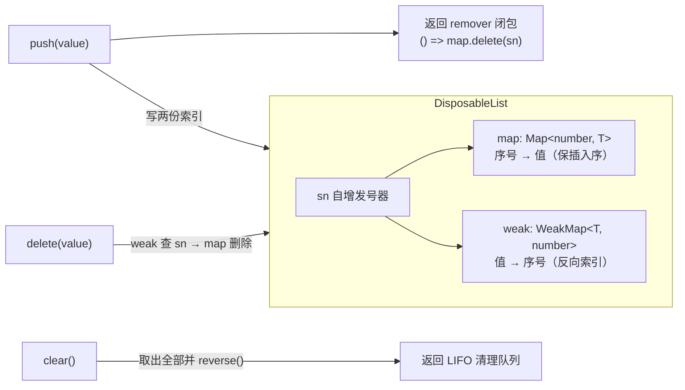
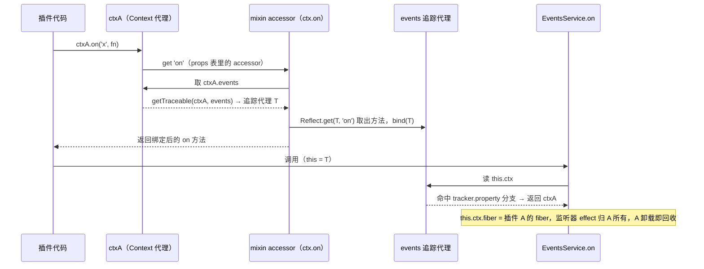
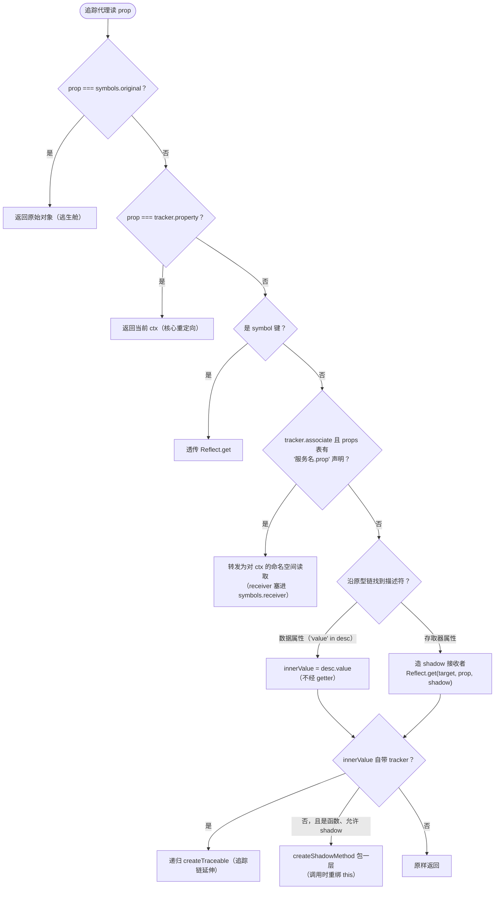
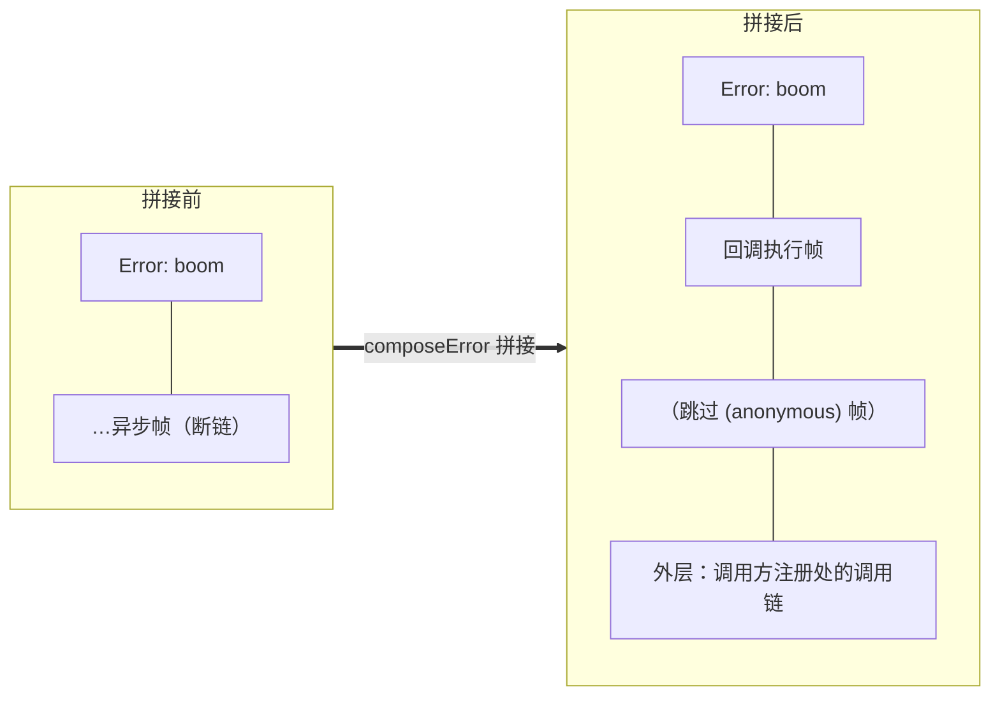

# 01 · `utils.ts` 精读 —— 共享基础设施（287 行）

| | |
|---|---|
| 职责 | symbol 常量表、DisposableList、traceable 追踪代理族、异步长堆栈 |
| 被依赖 | 所有模块（唯一零环依赖：仅 cosmokit + index 的 type-only import） |
| 前置阅读 | 无 |
| 本册 TS 知识点 | 泛型约束 `extends WeakKey`、类型谓词、non-null 断言、type-only import、`ProxyHandler` 类型、闭包状态机、ASI 分号陷阱 |

本文件四块内容：**DisposableList**（§1）、**Tracker/symbols**（§2）、**traceable 代理族**（§3）、**异步长堆栈**（§4），最后是 TypeScript 进阶（§5）。

## 0. 导入（L1–3）

```ts
import { defineProperty } from '@deepseek-ai/cosmokit'
import type { Context, Service } from './index.ts'
```

- `defineProperty`（cosmokit）等价于 `Object.defineProperty(object, key, { writable: true, value, enumerable: false })`——定义**不可枚举、可写**的属性。Cordis 用它挂 tracker 元数据、函数 `name` 等"不希望被枚举/序列化看见"的内部字段（属性描述符完整说明见原语法补课，已并入本目录 README 的 TS 索引）。
- **第三参是值，不是描述符对象**（§3.7 实测踩坑）：`defineProperty(svc, symbols.tracker, tracker)` 才是正确用法。传 `{ value: tracker }` 会静默多包一层，`tracker.property` 读出来是 `undefined`，代理的分支②/⑥/⑧全部失灵且不报错——因为字段名恰好也叫 `value`，类型检查拦不住。
- 第二行是 **type-only import**：编译后完全擦除、不产生运行时导入。这里从桶文件 `./index.ts` 导类型而非具体模块，是为了避免运行时循环依赖——`utils.ts` 被所有模块引用，若它运行时依赖 `context.ts` 就成死环了。

## 1. `DisposableList`：保序 + 按值 O(1) 删除（L5–40）

### 1.1 为什么需要它

Cordis 到处是"登记一项、之后可能按值撤销、最后按注册逆序全量清理"的需求（fiber 的 effect 清单、runtime 的 fibers 清单、`internal/update` 钩子）。数组做不到 O(1) 按值删除；`Set` 保插入序但 `reverse()` 昂贵且删除后序号语义弱。`DisposableList` 用**双索引**兼得：



### 1.2 逐行精读

```ts
export class DisposableList<T extends WeakKey> {
  private sn = 0
  private map = new Map<number, T>()
  private weak = new WeakMap<T, number>()

  get length() {
    return this.map.size
  }
```

- 泛型约束 `T extends WeakKey`：`WeakKey = object | symbol`（非注册 symbol）。约束的**必要性**来自下面的 `WeakMap<T, number>`——WeakMap 的键类型就是 `WeakKey`，不约束则类型报错。这是"约束表达数据结构的物理限制"的典型案例。
- `map` 保插入序（Map 迭代按插入序）；`weak` 反查序号。`sn` 从 0 起、`++` 先加后用，所以**第一个序号是 1**（`if (!sn)` 因此能同时表达"不存在"，见 delete）。
- `get length()` 存取器转发 `map.size`。

```ts
  push(value: T) {
    const sn = ++this.sn
    this.map.set(sn, value)
    this.weak.set(value, sn)
    return () => this.map.delete(sn)
  }
```
- `push` 非数组语义：写入双索引后返回 **remover 闭包**。闭包捕获 `sn`，调用即撤销本次登记。Cordis "注册即返回销毁器"惯用法的数据结构基础（`Fiber.dispose`、`RegistryService.plugin` 的 runtime 登记都用它）。
- remover 只删 `map` 不删 `weak`：弱引用不阻止 GC，值被回收后条目自动消失。

```ts
  delete(value: T) {
    const sn = this.weak.get(value)
    if (!sn) return false
    return this.map.delete(sn)
  }
```
- 按值删除：反查序号再删。`if (!sn)` 覆盖"不在集合中"（`undefined`）；序号 0 不可能出现。返回 `boolean`。

```ts
  clear() {
    const values = [...this.map.values()]
    this.map.clear()
    return values.reverse()
  }
```
- `clear()` **取走并返回**全部值（注册**逆序**），同时清空。返回值即"待清理队列"——fiber 卸载时按此顺序执行清理（LIFO：后注册的先清，依赖关系正确）。`[...map.values()]` 迭代器展开是浅拷贝，之后 `map.clear()` 不影响已取出的数组。

```ts
  [Symbol.iterator]() {
    return this.map.values()
  }

  [Symbol.for('nodejs.util.inspect.custom')]() {
    return [...this]
  }
}
```
- `[Symbol.iterator]()` 直接复用 `map.values()` 迭代器 → 实例可 `for...of`、展开、解构。
- `[Symbol.for('nodejs.util.inspect.custom')]()`：Node `util.inspect`（`console.log` 底层）识别该方法并用其返回值代替默认展示——打印出来就是普通数组。

## 2. `Tracker` 与 `symbols`（L43–73）

### 2.1 `Tracker`：追踪元数据接口

```ts
export interface Tracker {
  associate?: string
  property?: string
  noShadow?: boolean
}
```

traceable 代理（§3）靠这三字段决定"如何重绑上下文"：

- **`property`**：该服务对象上**代表 ctx 的属性名**（几乎总是 `'ctx'`）。traceable 代理 get 陷阱的分支 `if (prop === tracker.property) return ctx` 把它重定向为**调用方的 ctx**；set 陷阱对称返回 `false`。它解决"**单例服务 vs 多上下文**"：核心服务只 new 一次，原始实例的 `ctx` 永远是根；不重定向则一切资源都会错误归属到根 fiber。
- **`associate`**：关联服务名，激活"`服务名.属性`"二级命名空间转发（配合 `reflect.ts` 的 `props` 表）。
- **`noShadow`**：`true` 时不剥离 shadow 层（身份敏感的服务如 logger 需要回溯 origin）。

### 2.2 `symbols`：全局 symbol 常量表

```ts
export const symbols = {
  // internal symbols
  shadow: Symbol.for('cordis.shadow'),
  receiver: Symbol.for('cordis.receiver'),
  original: Symbol.for('cordis.original'),
  metadata: Symbol.for('cordis.metadata'),
  initHooks: Symbol.for('cordis.initHooks'),
  checkProto: Symbol.for('cordis.checkProto'),

  // context symbols
  effect: Symbol.for('cordis.effect') as typeof Context.effect,
  filter: Symbol.for('cordis.filter') as typeof Context.filter,
  isolate: Symbol.for('cordis.isolate') as typeof Context.isolate,
  intercept: Symbol.for('cordis.intercept') as typeof Context.intercept,

  // service symbols
  init: Symbol.for('cordis.init') as typeof Service.init,
  check: Symbol.for('cordis.check') as typeof Service.check,
  config: Symbol.for('cordis.config') as typeof Service.config,
  invoke: Symbol.for('cordis.invoke') as typeof Service.invoke,
  extend: Symbol.for('cordis.extend') as typeof Service.extend,
  tracker: Symbol.for('cordis.tracker') as typeof Service.tracker,
  resolveConfig: Symbol.for('cordis.resolveConfig') as typeof Service.resolveConfig,
}
```

- 全部 `Symbol.for('cordis.xxx')`（**全局注册表 symbol**）：按 description 全局去重，跨 realm（iframe/worker）、跨同进程多份 cordis 拷贝**同一**。`Symbol()` 每次新造、跨拷贝不同——这里必须用 `for`。
- 分三组：internal（shadow/receiver/original/metadata/initHooks/checkProto）、context 类静态键、service 类静态键。
- 尾部 `as typeof Context.effect` 断言：`Symbol.for` 返回宽泛的 `symbol`，而 `Context` 类静态属性声明为 `unique symbol`（每个都是互不相同的具体类型）。断言把表里的键"钉"到类静态键的精确类型上，使 `symbols.effect` 与 `Context.effect` 类型同一、可互换。没有断言，用 `symbols.effect` 做键的索引操作会类型报错。
- 用 symbol 而非字符串：不与用户属性冲突、不被 `for...in`/`JSON.stringify` 触碰。

## 3. traceable 代理族：让服务"知道自己在哪个 ctx 里被用"（L75–265 前后）

### 3.0 问题与解法概览

核心服务（events/logger/registry/reflect）是**单例**，被所有上下文共享；但服务方法内部要访问 `this.ctx`——它必须指向**使用服务的那个 ctx**（监听器归属正确的 fiber、日志取正确的插件名）。解法：凡带 `Tracker` 的对象，从 ctx 读出时都被包成**代理**，代理劫持 `tracker.property` 的读取。



若没有这层重定向，`on()` 里的 `this.ctx` 就是根上下文，监听器落到根 fiber 永不回收——追踪机制的全部意义就在 get 陷阱的一行分支上。

### 3.1 判定工具：`isConstructor` 等（L75–114）

```ts
const GeneratorFunction = function* () {}.constructor
const AsyncGeneratorFunction = async function* () {}.constructor
```
- 从字面量取**构造器本身**：这两个构造器不是全局变量，唯一获取方式就是 `某生成器函数.constructor`。

```ts
export function isConstructor(func: any): func is new (...args: any) => any {
  // async function or arrow function
  if (!func.prototype) return false
  // generator function or malformed definition
  // we cannot use below check because `mock.fn()` is proxied
  // if (func.prototype.constructor !== func) return false
  if (func instanceof GeneratorFunction) return false
  // polyfilled AsyncGeneratorFunction === Function
  if (AsyncGeneratorFunction !== Function && func instanceof AsyncGeneratorFunction) return false
  return true
}
```
- 判断插件回调能否用 `new` 调用（[06-fiber.md](06-fiber.md) 的 `_runner.execute` 依赖它）。三条判据逐条：
  1. **无 `prototype`** → 箭头函数、`async` 函数、`bind` 过的函数（都不能 `new`）。
  2. **生成器函数** → 排除。注释解释弃用更严的 `prototype.constructor !== func` 判据：`mock.fn()` 返回的 Proxy 会破坏该恒等式。
  3. **异步生成器**：仅当 `AsyncGeneratorFunction !== Function`（拿到真身）才检查——若被 polyfill 成 `Function`，`instanceof Function` 对一切函数为真，会把所有函数误杀。
- 签名 `func is new (...args: any) => any` 是**类型谓词**：返回 true 时调用方把参数窄化为构造器类型。

```ts
export function joinPrototype(proto1: {}, proto2: {}) {
  if (proto1 === Object.prototype) return proto2
  const result = Object.create(joinPrototype(Object.getPrototypeOf(proto1), proto2))
  for (const key of Reflect.ownKeys(proto1)) {
    Object.defineProperty(result, key, Reflect.getOwnPropertyDescriptor(proto1, key)!)
  }
  return result
}
```
- **合并两条原型链**（`proto1` 在上、描述符优先）。递归三步：为 `proto1` 的父层递归建基座（以 `proto2` 为底）→ `Object.create(基座)` 建本层节点 → 把本层**全部自有键**（`Reflect.ownKeys` 含 symbol）按**原始描述符**复制。终止条件 `proto1 === Object.prototype`。
- `!` non-null 断言：`ownKeys` 枚举出的键必有描述符（TS 的类型签名不知道这一点）。
- 用途：制造**可调用服务**——function 要同时继承 `Function.prototype`（可调用）与服务类原型链（有方法），JS 单继承模型下只能手工拼链（[08-service.md](08-service.md)、[09-logger.md](09-logger.md)）。
- 代价：**`instanceof` 断裂**（§3.7 实测）。新链由描述符拷贝拼成，原链节点不在其中——`callable instanceof Greeter` 为 `false`，但方法本体是同引用（`getPrototypeOf(callable).greet === Greeter.prototype.greet`）。因此 Cordis 不用 `instanceof` 认服务：`reflect.provide(name, self, this[symbols.check])` 显式传校验函数，身份走 `symbols.check`/tracker 元数据（[08-service.md](08-service.md)）。

用两层类链把全过程走一遍（§3.7 同源实测）：

```ts
class Greeter { greet() { return 'greet()' } }
class FormalGreeter extends Greeter { bye() { return 'bye()' } }
const merged = joinPrototype(FormalGreeter.prototype, Function.prototype)
const callable = function () { return 'called!' }
Object.setPrototypeOf(callable, merged)
// 实测：typeof callable → 'function'；callable() → 'called!'
//       callable.greet() → 'greet()'；callable.bye() → 'bye()'
//       callable.constructor === FormalGreeter → true（自有键 constructor 一并拷贝，
//       instanceof 断裂后少数仍“认亲”的反射）
//       callable instanceof FormalGreeter → false
```

**图 1 · 输入：两条原型链**

```text
  proto1 = FormalGreeter.prototype           proto2 = Function.prototype
      │                                          │
      │ own: constructor, bye                    │ own: length, name,
      │      ← 只有本层自有键会被拷贝             │     constructor,
      ▼                                          │     apply, call, bind …
  Greeter.prototype                             ▼
      │ own: constructor, greet               Object.prototype
      ▼
  Object.prototype  ◄═══ 触发终止条件，此层被 proto2 顶替
```

**图 2 · 过程：一次递归下降，回程逐层拷贝**

```text
joinPrototype(FormalGreeter.prototype, FP)
    │
    │ ① 先沿 proto1 的原型链下降到底：
    │
    │     joinPrototype(FormalGreeter.prototype, FP)
    │         └──► joinPrototype(Greeter.prototype, FP)
    │                   └──► joinPrototype(Object.prototype, FP)
    │                              │
    │                              └──► proto1 === Object.prototype
    │                                   → 直接返回 FP        ← 换底！
    │
    │ ② 再自底向上回程，每层两步：
    │     Object.create(下层结果)          造空节点，原型挂到下层
    │     Reflect.ownKeys(本层) 按原描述符拷入
    │
    └── 上层拷 FormalGreeter.prototype → constructor, bye
        下层拷 Greeter.prototype     → constructor, greet
```

**图 3 · 产物：一条全新的链（原链节点一个都不在）**

```text
   新节点 B                       新节点 A                      底座（原样保留）
   own: constructor, bye  ──►   own: constructor, greet ──►  Function.prototype ──► Object.prototype
        │                            │                             │
        │ 按描述符拷贝自              │ 按描述符拷贝自                │ 终止条件的返回值
        ▼                            ▼                             ▼
   FormalGreeter.prototype      Greeter.prototype     joinPrototype(Object.prototype, FP) = FP
```

**图 4 · 使用：函数的原型指过去 = 可调用服务**

```text
  callable（函数对象自身，() 能调用靠它自己）
      │ __proto__
      ▼
  [constructor, bye] ──► [constructor, greet] ──► [Function.prototype] ──► [Object.prototype]
        │                      │                        │
        ▼                      ▼                        ▼
   callable.bye()         callable.greet()        callable.call / apply / bind
   → 'bye()'              → 'greet()'             （函数方法来自底座）
```

一句话：JS 单继承下函数的 `__proto__` 只能挂一条链——`joinPrototype` 把类链逐层**抄成新节点**、把最底层 `Object.prototype` **换成** `Function.prototype`，两条链串成一条（cordis 真实用法即上文“用途” bullet 所引的 service.ts:51 / logger.ts:208）。

```ts
export function isObject(value: any): value is {} {
  return value && (typeof value === 'object' || typeof value === 'function')
}
```
- 非空"对象或函数"判定。`value &&` 借 falsy 短路排除 `null/undefined/0/''/NaN`。谓词窄化为 `{}`。

```ts
export function getPropertyDescriptor(target: any, prop: string | symbol) {
  let proto = target
  while (proto) {
    const desc = Reflect.getOwnPropertyDescriptor(proto, prop)
    if (desc) return desc
    proto = Object.getPrototypeOf(proto)
  }
}
```
- 沿原型链找描述符；`Object.getPrototypeOf` 走到 `Object.prototype` 之上返回 `null` 结束。与 `Reflect.getOwnPropertyDescriptor`（只查自身）互补。返回类型推断为 `PropertyDescriptor | undefined`。

### 3.2 `getTraceable`：入口（L117–124）

```ts
export function getTraceable<T>(ctx: Context, value: T): T {
  if (!isObject(value)) return value
  if (Object.hasOwn(value, symbols.shadow)) {
    return Object.getPrototypeOf(value)
  }
  const tracker = value[symbols.tracker]
  if (!tracker) return value
  return createTraceable(ctx, value, tracker)
}
```
- 四分支：非对象（无从代理）→ 原样；**自身拥有** `symbols.shadow`（`Object.hasOwn` 不查原型链）→ 返回其**原型**（剥壳还原 origin 上下文）；无 tracker（普通对象，不值得追踪）→ 原样；否则进入 `createTraceable`。
- 泛型 `<T>` 保证返回类型与入参一致（调用方无感）。
- shadow 剥壳分支被 `Context.extend()` 消费（[02-context.md](02-context.md)）。

### 3.3 叠加工具：`withProps` / `withProp`（L127–140）

```ts
export function withProps(target: any, props?: {}) {
  if (!props) return target
  return new Proxy(target, {
    get: (target, prop, receiver) => {
      if (prop in props && prop !== 'constructor') return Reflect.get(props, prop, receiver)
      return Reflect.get(target, prop, receiver)
    },
    set: (target, prop, value, receiver) => {
      if (prop in props && prop !== 'constructor') return Reflect.set(props, prop, value, receiver)
      return Reflect.set(target, prop, value, receiver)
    },
  })
}
```
- 返回代理：`props` 里有的属性（`constructor` 除外）读写全部转发到 `props`，其余透传 `target`——把 `props` **叠加**在 target 上（overlay）。
- `in` 而非 `hasOwn`：允许叠加对象带原型；`constructor` 恒走 target，保 `instanceof` 等反射行为。
- 写入有 **DefineOwnProperty 旁路**（§3.7 实测）：`m.tag = x` 命中 overlay 分支后执行 `Reflect.set(props, 'tag', x, m)`——props 上是数据属性、receiver 是代理，规范落入 [[DefineOwnProperty]] 默认实现（该代理只定义了 get/set 陷阱），于是**写落在 target 上**：`base.tag` 变了、`props.tag` 没变，但读取仍被 overlay 遮蔽。叠加层可靠地"遮读"，不保证"截写"。
- 注意内层箭头参数名 `target` 遮蔽外层同名参数——Proxy 陷阱签名约定俗成。

```ts
function withProp(target: any, prop: string | symbol, value: any) {
  return withProps(target, Object.defineProperty(Object.create(null), prop, {
    value,
    writable: false,
  }))
}
```
- 单属性版：叠加一个**只读**属性。`Object.create(null)` 无原型载体使 `in` 查找不会误命中 `Object.prototype` 的名字（如 `toString`）。

### 3.4 影子制造：`createShadow` / `createShadowMethod`（L143–160 前后）

```ts
function createShadow(ctx: Context, target: any, property: string | undefined, receiver: any) {
  if (!property) return receiver
  const origin = Reflect.getOwnPropertyDescriptor(target, property)?.value
  if (!origin) return receiver
  return withProp(receiver, property, ctx.extend({ [symbols.shadow]: origin }))
}
```
- **造"影子接收者"**：服务在 `property`（如 `'ctx'`）上有值 `origin`（自带 ctx）时，返回叠加了 `property → ctx.extend({ [symbols.shadow]: origin })` 的接收者。含义：方法里的 `this.ctx` 变成**调用方 ctx 的子上下文**，同时经 `symbols.shadow` 记住 origin（logger 取原始 fiber 名就靠它）。两个提前返回（无 property / 无 origin）退回原 receiver。

```ts
function createShadowMethod(ctx: Context, value: any, outer: any, shadow: {}) {
  return new Proxy(value, {
    apply: (target, thisArg, args) => {
      if (thisArg === outer) thisArg = shadow
      return getTraceable(ctx, Reflect.apply(target, thisArg, args))
    },
  })
}
```
- 函数代理：调用时若 `thisArg` 仍是"外面的原始接收者"（`outer`），替换成 shadow 再执行——方法体内 `this.ctx` 已被换掉。返回值再过 `getTraceable`（方法返回另一个服务时链条继续）。

### 3.5 `createTraceable`：核心代理（决策流程图）



进入主体前的 shadow 剥离决策（注释原文说明了取舍）：

```ts
if (ctx[symbols.shadow] && !tracker.noShadow) {
  ctx = Object.getPrototypeOf(ctx)
}
```
- 当前 ctx 是影子上下文且 tracker **不**要求保留 shadow → ctx 换成其原型（origin）。默认策略"副作用绑定调用者"；身份敏感服务（logger 需要按 origin fiber 命名）声明 `noShadow: true` 保留影子，自己经 `symbols.shadow` 回溯。

get 陷阱的完整分支（对照上图）：

```ts
const proxy = new Proxy(value, {
  get: (target, prop, receiver) => {
    if (prop === symbols.original) return target          // ① 逃生舱
    if (prop === tracker.property) return ctx             // ② 核心重定向
    if (typeof prop === 'symbol') {
      return Reflect.get(target, prop, receiver)          // ③ symbol 透传
    }
    if (tracker.associate && ctx.reflect.props[`${tracker.associate}.${prop}`]) {
      return Reflect.get(ctx, `${tracker.associate}.${prop}`, withProp(ctx, symbols.receiver, receiver))  // ④ 命名空间
    }
    let shadow: any, innerValue: any
    const desc = getPropertyDescriptor(target, prop)
    if (desc && 'value' in desc) {
      innerValue = desc.value                             // ⑤ 数据属性：直接取值，不经 getter
    } else {
      shadow = createShadow(ctx, target, tracker.property, receiver)
      innerValue = Reflect.get(target, prop, shadow)      // ⑥ 存取器：getter 的 this 换成 shadow
    }
    const innerTracker = innerValue?.[symbols.tracker]
    if (innerTracker) {
      return createTraceable(ctx, innerValue, innerTracker)  // ⑦ 嵌套服务：递归
    } else if (!tracker.noShadow && typeof innerValue === 'function') {
      shadow ??= createShadow(ctx, target, tracker.property, receiver)
      return createShadowMethod(ctx, innerValue, receiver, shadow)  // ⑧ 方法：包 this 重绑
    } else {
      return innerValue                                   // ⑨ 其余原样
    }
  },
```

细节逐条：

- **③ symbol 透传**：symbol 键是内部协议（tracker/original/…），不追踪变换——既避免无限递归，也不泄漏元数据。
- **④ 命名空间转发**：`ctx.logger.exporter` 这类"服务名.属性"挂载点。`receiver` 经 `withProp(ctx, symbols.receiver, receiver)` 塞给 accessor。
- **⑤ vs ⑥**：数据属性直接取 `desc.value`（不经 getter——避免 getter 的 this 语义干扰追踪判定）；存取器属性必须经 `Reflect.get(target, prop, shadow)` 执行 getter，且 receiver 换成 shadow（getter 里 `this.ctx` 指向调用方）。`shadow ??=` 惰性求值——数据属性路径不必白造。
- **⑦ 嵌套追踪**：取出的值自带 tracker（是另一个服务）→ 递归包装，追踪链延伸。

set 陷阱对称：

```ts
  set: (target, prop, value, receiver) => {
    if (prop === symbols.original) return false           // 禁写逃生舱
    if (prop === tracker.property) return false           // 禁写 ctx（应走 provide/set）
    if (typeof prop === 'symbol') {
      return Reflect.set(target, prop, value, receiver)
    }
    if (tracker.associate && ctx.reflect.props[`${tracker.associate}.${prop}`]) {
      return Reflect.set(ctx, `${tracker.associate}.${prop}`, value, withProp(ctx, symbols.receiver, receiver))
    }
    const shadow = createShadow(ctx, target, tracker.property, receiver)
    return Reflect.set(target, prop, value, shadow)       // setter 的 this 同样换成 shadow
  },
  apply: (target, thisArg, args) => {
    return applyTraceable(proxy, target, thisArg, args)
  },
})
return proxy
```
- 前两个 `return false`：Proxy set 陷阱返回 false 在**严格模式**（ESM 恒为严格）下抛 TypeError——即"不允许写"。ctx 的属性写入本就该走 `ctx.provide`/服务自己的方法。

```ts
function applyTraceable(proxy: any, value: any, thisArg: any, args: any[]) {
  if (!value[symbols.invoke]) return Reflect.apply(value, thisArg, args)
  return value[symbols.invoke].apply(proxy, args)
}
```
- apply 陷阱（value 是函数即**可调用服务**时才有意义）：无 `[symbols.invoke]` 正常调用；有则**分派到 invoke 方法体**，且 invoke 里的 `this` 是追踪代理自身（`apply(proxy, args)`）——invoke 内再读 `this.xxx` 仍走追踪。

### 3.6 `createCallable`：可调用服务的构造（L262 前后）

```ts
export function createCallable(name: string, proto: {}, tracker: Tracker) {
  const self = function (...args: any[]) {
    const proxy = createTraceable(self['ctx'], self, tracker)
    return applyTraceable(proxy, self, this, args)
  }
  defineProperty(self, 'name', name)
  return Object.setPrototypeOf(self, proto)
}
```
- 返回函数 `self`，原型链换成调用方传入的 `proto`（通常 `joinPrototype(服务类原型, Function.prototype)`）——**既能 `()` 调用又有服务方法**。
- 函数体：每次被调用**现场**用 `self['ctx']` 造追踪代理再分派——`ctx.logger('app')` 每次都重新解析追踪，ctx 永远新鲜。
- `defineProperty(self, 'name', name)`：函数的 `name` 是不可写属性，普通赋值静默失败，必须 defineProperty。
- `[symbols.invoke]` 必须是**实例方法**（logger.ts 的写法）。声明成 `static` 时不在 `prototype` 上、`joinPrototype` 拷不到它，`applyTraceable` 的 `if (!value[symbols.invoke])` 便落入 `Reflect.apply(value, thisArg, args)`——即再次调用 `self` 自身，直到 RangeError: Maximum call stack size exceeded（§3.7 实测）。

### 3.7 上机实测：逐函数可运行示例

脚本：`tmp/cordis-tutorial/utils-s3-examples.ts`（本目录实测产物，素材约定同 [10-debugging.md](10-debugging.md)），仓库根 `pnpm exec tsx tmp/cordis-tutorial/utils-s3-examples.ts` 直接跑。示例环境只需假 ctx（`extend` 供 createShadow、`reflect.props` 供分支④）与带 tracker 的假服务：

```ts
const mkCtx = (name: string): any => ({
  name,
  'logger.level': 'debug',
  extend(this: any, meta: object) { return Object.assign(Object.create(this), meta) },
  reflect: { props: {} as Record<string, unknown> },
})

class FakeService {
  ctx: any = { name: 'root' }   // 单例服务的"出生 ctx"——根
  version = '1.0'
  get label() { return `svc@${this.ctx.name}` }
  method() { /* 返回 this.ctx 的诊断：name / 是否带 own shadow / origin 名 */ }
  nested = new NestedSvc()      // 自带 tracker 的嵌套服务
}
defineProperty(svc, symbols.tracker, { property: 'ctx' } satisfies Tracker)
```

关键实测输出（完整见脚本）：

```text
isConstructor   class→true  function→true  箭头/async→false  生成器→false  bind→false
joinPrototype   callable()→'called!'  callable.greet()→'greet()'  instanceof→false  constructor→原类
getTraceable    42→42  plain→原引用  own-shadow→原型  带tracker→代理
get 陷阱        ① t[symbols.original]===svc → true
                ② t.ctx === ctxA → true（不是 root！）
                ⑥ t.label → 'svc@ctxA'（getter 的 this.ctx 已换）
                ⑧ t.method() → { ctxName:'ctxA', hasOwnShadow:true, originName:'root' }
                ⑦ t.nested.method() → 'nested ctx=ctxA'
set 陷阱        t.ctx = {} → TypeError（返回 false × 严格模式）；普通属性落到 svc 自身
withProps       overlay 遮读；写 m.tag 落到 base（§3.3 旁路）
withProp        叠加属性只读，赋值 → TypeError
createShadow    无 origin（svc.ctx=undefined）时 this 即代理，this.ctx===ctxA
分支④           svcAssoc.level='info'，代理读 → 'debug'（转发读 ctx['logger.level']）
createCallable  callme('hi') → 'invoke(hi) sees ctx=ctxA'；每次调用现场重造代理
```

`isObject` 的短路副作用：返回值可能是原值——`isObject(null)→null`、`isObject(0)→0`，不是布尔 `false`（谓词语境下无碍，直接展示时会露馅）。

## 4. 异步长堆栈：`composeError` 家族（L268–287）

### 4.0 问题

`await` 之后抛的错误，堆栈断在异步边界——看不到"是谁注册的这个回调"。Cordis 的方案：**注册点**捕获外层栈，抛错时拼接到错误堆栈尾部（"长堆栈"）。



### 4.1 `StackInfo` 与 `handleError`

```ts
interface StackInfo {
  offset: number
  error: Error
}
```
- `offset`：内层锚点帧偏移修正；`error`：注册点捕获的"锚点错误"，其堆栈**第 3 行**（index 2）是被执行回调的帧。

```ts
function handleError(info: StackInfo, reason: any, getOuterStack: () => string[]): never {
  const innerLines = info.error.stack!.split('\n')

  // malformed error
  if (typeof reason?.stack !== 'string') {
    const outerError = new Error(reason)
    const lines = outerError.stack!.split('\n')
    lines.splice(1, Infinity, ...getOuterStack())
    outerError.stack = lines.join('\n')
    throw outerError
  }
```
- 返回 `never`：必抛。
- 抛的不是 Error（或无 string stack）→ `new Error(reason)` 包装，保留第一行头部、其余帧换成外层栈。

```ts
  // long stack trace
  const lines: string[] = reason.stack.split('\n')
  let index = lines.indexOf(innerLines[2])
  if (index === -1) throw reason

  index -= info.offset
  while (index > 0) {
    if (!lines[index - 1].endsWith(' (<anonymous>)')) break
    index -= 1
  }
  lines.splice(index, Infinity, ...getOuterStack())
  reason.stack = lines.join('\n')
  throw reason
}
```
- 在错误堆栈里找**锚点帧**（`innerLines[2]`：第 1 行是 `Error:` 头、第 2 帧是 handleError/composeError 自己、第 3 帧才是回调执行点）。找不到说明堆栈形状对不上，原样抛出。
- `index -= info.offset` 修正偏移；再向上跳过以 ` (<anonymous>)` 结尾的帧——V8 给 async/生成器恢复点生成的匿名帧，跳过它们才接得上真实调用点。
- `splice(index, Infinity, ...外层栈)`：锚点以下整体替换为注册点帧，重拼字符串挂回 `reason.stack` 后抛出。

### 4.2 `composeError` / `buildOuterStack`

```ts
export function composeError<T>(callback: (info: StackInfo) => T, getOuterStack = buildOuterStack()): T {
  const info: StackInfo = { offset: 1, error: new Error() }

  try {
    const result: any = callback(info)
    if (isObject(result) && 'then' in result) {
      return (result as any).then(undefined, (reason) => handleError(info, reason, getOuterStack)) as T
    } else {
      return result
    }
  } catch (reason: any) {
    handleError(info, reason, getOuterStack)
  }
}

export function buildOuterStack(offset = 0) {
  const outerError = new Error()
  return () => outerError.stack!.split('\n').slice(3 + offset)
}
```
- `composeError`：默认参数 `getOuterStack = buildOuterStack()` 在**此处**（注册点）捕获外层栈——默认参数每次调用求值，时机正确。回调同步返回则原样返回；返回 promise（`'then' in result` 鸭子判定）则**只挂 rejection 分支**（`then(undefined, handler)`），成功路径零开销，类型断言回 `T`。同步抛出走 catch → handleError（`never` 返回使 TS 认可函数末尾无 return 也满足 `: T`）。
- `buildOuterStack`：**惰性求值**——立即捕获 `outerError`（此刻栈里有调用链），返回闭包到抛错时才切帧。`slice(3 + offset)` 跳过 `Error:` 头、buildOuterStack 自身、直接调用者帧，从"外部世界"开始。

## 5. TypeScript 进阶知识点

### 5.1 泛型约束表达物理限制：`<T extends WeakKey>`

```ts
class Box<T extends WeakKey> { /* T 只能是 object | symbol */ }
new Box<number>(1)   // ✗ 报错：number 不满足 WeakKey
```
约束不只是"缩小范围"——它声明**容器对元素的硬性要求**（WeakMap 键必须可弱引用）。选约束时问：这个类型参数会进哪个底层 API？

### 5.2 类型谓词：`value is X`

```ts
function isConstructor(func: any): func is new (...args: any) => any { ... }

const f: any = getPlugin()
if (isConstructor(f)) {
  new f(ctx, config)   // ✅ f 被窄化为构造器
}
```
普通布尔返回值不改变控制流类型；谓词签名让 TS 在 if 分支内**窄化**。本文件四处使用：`isConstructor`、`isObject`、`getTraceable` 内部隐式、`isSpecialProperty`（reflect）。谓词窄化的目标可以是任意类型表达式（含构造器类型、`{}`）。

### 5.3 non-null 断言 `!` vs 可选链 `?.`

```ts
Reflect.getOwnPropertyDescriptor(proto1, key)!   // 断言"必有"：ownKeys 出来的键必有描述符
origin?.value                                     // 容错"可能没有"
```
`!` 用于"逻辑上不可能为空、但类型系统看不见"的场景；滥用会把真实 bug 变成运行时崩溃。本文件只在 `ownKeys`/`stack` 这类"由协议保证"的位置用。

### 5.4 type-only import 与循环依赖

```ts
import type { Context, Service } from './index.ts'   // 编译后消失
```
ESM 循环导入在"类声明提升 + 仅构造期使用"下可行，但工具层（utils）应**零环**。`import type` 是 TS 3.8 的显式语法，比 `/// <reference>` 更精确；仓库规范：类型引入一律可标 `import type`，防止打包器误把类型模块拉进产物。

### 5.5 Proxy 陷阱的返回值约定（set 返回 false 的后果）

```ts
const p = new Proxy({}, {
  set: () => false,   // 任何写入都"拒绝"
})
p.x = 1               // TypeError: 'set' on proxy: trap returned falsy
```
get 陷阱返回任意值都行；**set/has 等陷阱有"不变量"**——set 返回 false 在严格模式下抛错（Cordis 借此把"禁写 ctx"变成异常）。详见 [03-reflect.md](03-reflect.md) §5.1。

### 5.6 ASI 分号陷阱：字段初始化器换行接计算名成员

```ts
class C {
  ctx: any = undefined      // ← 下一行是 [计算名]，这里必须加分号
  [symbols.invoke](this: any, x: string) { return x }
}
// ERROR: Expected ")" but found ":"（指到方法行的参数冒号，极难定位）
```

`[` 可以续接表达式，ASI 不在此插分号 → 解析成 `undefined[symbols.invoke](this: any, ...)`，即成员访问调用；随后参数列表里的 `this: any` 类型标注撞上 JS 语法。两种编译器实测均指到**方法行**而非真正缺分号的**字段行**：esbuild 报 `Expected ")" but found ":"`，tsc 报 `',' expected`。

## 6. 自测

1. `DisposableList.push` 返回的 remover 为什么不删 `weak` 索引？
2. `getTraceable` 对"带 shadow 的 ctx"返回什么？谁消费了这个行为？
3. traceable 代理 get 陷阱中，⑤（数据属性）为什么直接取 `desc.value` 而不 `Reflect.get`？
4. `isConstructor` 为什么不能直接用 `func.prototype.constructor !== func`？
5. `composeError` 对返回 promise 的回调为什么用 `then(undefined, handler)` 而不是 `await`？
6. `joinPrototype` 拼出的新链为何使 `instanceof` 失效？Cordis 用什么机制替代 `instanceof` 认服务？
7. 类字段初始化器换行后紧跟 `[symbols.invoke](...)` 为什么会报 `Expected ")" but found ":"`？如何修复？
