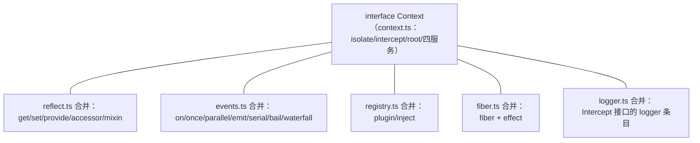
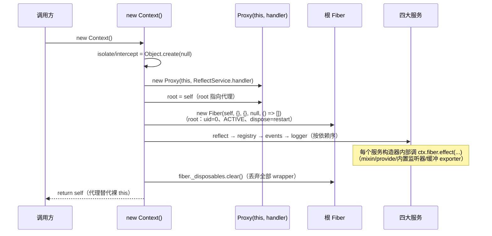
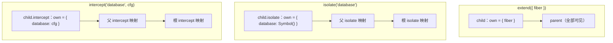

# 02 · `index.ts` + `context.ts` 精读 —— 上下文（14 + 146 行）

| | |
|---|---|
| 职责 | 桶文件；`Context` 接口（全框架声明合并的枢纽）与根上下文类 |
| 依赖 | events / logger / reflect / registry / fiber / utils |
| 前置阅读 | [01-utils.md](01-utils.md)（Tracker、symbols、getTraceable） |
| 本册 TS 知识点 | 声明合并与模块扩充、`unique symbol` 接口键、多态 `this`、静态初始化块、构造器返回覆盖、`Symbol.toPrimitive` |

## 1. `index.ts`：桶文件（14 行）

```ts
/** Core context type and root context implementation. */
export * from './context.ts'
/** Event bus, dispatch modes, and event augmentation types. */
export * from './events.ts'
/** Plugin fiber lifecycle, effects, and config validation helpers. */
export * from './fiber.ts'
/** Logger facade, logger service, message, exporter, and formatting types. */
export * from './logger.ts'
/** Plugin registry, dependency injection, and plugin entrypoint types. */
export * from './registry.ts'
/** Base service class and service lifecycle symbols. */
export * from './service.ts'
/** Shared internal helpers used by context, services, and plugin fibers. */
export * from './utils.ts'
```

- 每行 `export *` 只转出模块**自身的导出**，不转出其 import——所以 `ReflectService`、`Property`、`Impl` 等 `reflect.ts` 的名字**不在公共 API 面**。这是刻意封装：反射层是实现细节，外部只看到 `ctx.reflect` 的属性类型（context.ts 引用了它们做类型，但引用≠再导出）。
- 模块说明符带 `.ts` 后缀，与本仓库"ESM everywhere、相对导入用 `.ts`"一致。
- 注意 `reflect.ts` 缺席清单——但它通过 `declare module './context.ts'` 间接影响公共类型（`ctx.get/provide/...` 的类型声明写在 reflect.ts 里）。

## 2. `Context` 接口：声明合并的汇聚点（context.ts L16–33）

```ts
export interface Context {
  [symbols.isolate]: Dict<symbol>
  [symbols.intercept]: Dict
  root: this
  baseUrl?: string
  events: EventsService
  logger: LoggerService
  reflect: ReflectService
  registry: RegistryService
}
```

- **`[symbols.isolate]: Dict<symbol>`**：symbol 作为接口键（TS 4.4+ 的 computed property in interface，要求键是 `unique symbol`）。隔离映射：服务名 → 作用域 label。服务查找先经此表换算作用域键，再进 reflect 的 store。
- **`[symbols.intercept]: Dict`**：拦截配置映射，服务名 → 配置片段（合并进消费方解析到的服务配置，见 [08-service.md](08-service.md) §4）。
- **`root: this`**：多态 this 类型——在 `Context` 里指 `Context`，在合并出的子接口里指子类型。
- **`baseUrl?: string`**：可选属性（loader 设置相对导入基址时存在）。
- 四个核心服务属性。注意 `fiber`、`effect`、`on/emit/...`、`get/provide/...`、`plugin/inject` 都**不在这里**——由 fiber/events/reflect/registry 各自 `declare module './context.ts'` **合并**进来。这是 Cordis 的核心组织手法：**能力归属定义它的模块，接口只是汇聚点**。各模块合并的成员一览：



## 3. `Context` 类（L42–88）

### 3.1 静态符号键

```ts
export class Context {
  static readonly effect: unique symbol = symbols.effect
  static readonly filter: unique symbol = symbols.filter
  static readonly isolate: unique symbol = symbols.isolate
  static readonly intercept: unique symbol = symbols.intercept
```

- `static readonly ... : unique symbol`：`unique symbol` 类型只能赋给 `const`/`readonly` 的 `Symbol()`/`Symbol.for()` 结果。取 `utils.symbols` 的值，使 `Context.effect`（静态路径）与 `symbols.effect`（表路径）指向同一 symbol 且**类型同一**。

### 3.2 `Context.is`：跨 realm 品牌识别

```ts
  static is(value: any): value is Context {
    return !!value?.[Context.is as any]
  }

  static {
    Context.is[Symbol.toPrimitive] = () => Symbol.for('cordis.is')
    Context.prototype[Context.is as any] = true
  }
```

全文件最"黑魔法"的一段，逐层拆：

1. **`Context.is` 是静态方法（函数）**。`value[Context.is]` 用函数作属性键时，JS 先把键 **ToPrimitive 强制转换**（属性键只能是 string/symbol）。
2. static 块第一行给 `Context.is` 挂 `[Symbol.toPrimitive]` 返回 `Symbol.for('cordis.is')`。于是 `value[Context.is]` 实际查 `value[Symbol.for('cordis.is')]`。
3. 第二行 `Context.prototype[Context.is as any] = true` 同样被转换——在原型上写 `prototype[Symbol.for('cordis.is')] = true`，即**品牌标记**。所有 Context 实例（及代理：代理 get 陷阱对 symbol 键走 `isSpecialProperty` 透传原型链）都能读到 `true`。
4. `static is(value)` 因此是品牌检查：`!!value?.[key]`（可选链防 null/undefined）。
5. 为什么不用 `instanceof`？(a) 跨 realm：`Symbol.for` 全局注册表保证不同 realm/不同 cordis 拷贝的键相同；(b) 代理与重组原型链后 `instanceof` 不可靠（对比 [08-service.md](08-service.md) 的 `Symbol.hasInstance` 方案——那是"允许子类"的场景，这里是"只要品牌"）。

### 3.3 构造器：组装根上下文（L71–84）



逐行：

```ts
    this[symbols.isolate] = Object.create(null)
    this[symbols.intercept] = Object.create(null)
```
- `Object.create(null)` 建**无原型**对象：没有 `Object.prototype` 污染（`toString`/`constructor` 等名字不会误命中），`in` 探测只有显式写入才为真。Cordis 所有"纯字典"都这么建。

```ts
    const self = new Proxy<this>(this, ReflectService.handler)
```
- 用 `ReflectService.handler`（[03-reflect.md](03-reflect.md)）把**裸 this** 包成代理。泛型 `new Proxy<this>` 让代理静态类型仍是 `this`——外部无感。此后 ctx 的一切普通属性读写都过陷阱。

```ts
    this.root = self
    this.baseUrl = undefined
```
- `root` 指**代理**（后续经 root 的访问也要走解析）。`baseUrl = undefined` 显式占位："已知未设置"而非"不存在"。赋值发生在裸 this 上，代理 target 就是裸对象，因此代理能读到。

```ts
    this.fiber = new Fiber(self, {}, Object.create(null), null, () => [])
    this.reflect = new ReflectService(self)
    this.registry = new RegistryService(self)
    this.events = new EventsService(self)
    this.logger = new LoggerService(self)
```
- **创建顺序即依赖顺序**：先建根 fiber（`runtime = null`、空配置、空 inject、无外层栈；uid=0、ACTIVE、`ctx` 就是传入代理自身）；再依次建 reflect（构造器注册 4 组 mixin）、registry、events（构造器注册 2 个内置监听器）、logger（注册缓冲 exporter）——它们内部全部经 `ctx.fiber.effect` 登记，wrapper 进根 fiber 的 `_disposables`。

```ts
    this.fiber._disposables.clear()
    return self
  }
```
- `_disposables.clear()` 把这些 wrapper **全部丢弃**（`clear()` 返回的就是 wrapper 即销毁器本身，弃置后永不执行）。语义：核心服务与根同生共死，不存在"根被卸载拆掉 events"的路径——副作用是这些 effect 从可清理清单移除，但服务实例仍在 ctx 上、监听器仍在 `_hooks` 里，只是**永不过期**。
- `return self`：**构造器返回代理覆盖 this**（JS 允许构造器返回对象替代默认产物）。`new Context()` 的结果永远是代理，裸对象只作 target 存在。

### 3.4 自定义 inspect（L86–88）

```ts
  [Symbol.for('nodejs.util.inspect.custom')]() {
    return `Context <${this.fiber.name}>`
  }
```
- `console.log(ctx)` 显示 `Context <插件名>`。`fiber.name` 沿祖先链找最近的具名 runtime（[06-fiber.md](06-fiber.md) §3.3）。代理 get 陷阱对该 symbol 键走特殊属性透传，能找到此方法。

## 4. 派生三兄弟：`extend` / `isolate` / `intercept`（L99–146）

### 4.1 `extend(meta)`：原型继承式派生

```ts
  extend(meta = {}): this {
    const shadow = Reflect.getOwnPropertyDescriptor(this, symbols.shadow)?.value
    const self = Object.create(getTraceable(this, this))
    for (const prop of Reflect.ownKeys(meta)) {
      Object.defineProperty(self, prop, Reflect.getOwnPropertyDescriptor(meta, prop)!)
    }
    if (!shadow) return self
    return Object.assign(Object.create(self), { [symbols.shadow]: shadow })
  }
```

- 默认参数 `meta = {}`：不传也能造纯继承子 ctx。
- 第一行取**自身**的 shadow（`getOwnPropertyDescriptor` 只查自身）。第二行：`getTraceable(this, this)` 若 this 带 shadow 返回其**原型**（剥壳），`Object.create(原型)` 得到子对象——**父不被突变**，子经原型链看到一切。
- `Reflect.ownKeys(meta)` 的**每个自有键（含 symbol）按原始描述符**搬到子对象。不用 `Object.assign`：`assign` 只复制**可枚举**属性且丢失 getter/setter/不可写特性。
- 有 shadow 时**再包一层**：以 self 为原型造新对象写回 shadow。第 2 行剥壳是为了 meta 覆盖生效在"干净"链上；返回值必须仍带 shadow（追踪链路里派生的子 ctx 要能回溯 origin）。最终结构：`child(own: shadow) → self(meta 覆盖) → 剥壳后的 this → …`。

### 4.2 `isolate(name, label?)`：隔离服务作用域

```ts
  isolate(name: string, label?: symbol) {
    const shadow = Object.create(this[symbols.isolate])
    shadow[name] = label ?? Symbol(name)
    return this.extend({ [symbols.isolate]: shadow })
  }
```

- `Object.create(this[symbols.isolate])`：以父映射为**原型**造新映射——祖先条目经 `in` 仍可见，只覆盖 `name` 一项。
- `??`：不传 label 生成**全新** `Symbol(name)`（每个 symbol 唯一 → 独立作用域）；显式传同一 label 则两次 `isolate` **加入同一作用域**。
- 效果：子 ctx 上 `name` 的作用域键变了，reflect 的 store 按 label 分桶——可以在不影响父作用域的情况下提供/消费另一份 `name` 实现。

### 4.3 `intercept(name, config)`：声明拦截配置

```ts
  intercept<K extends InjectKey>(name: K, config: Context[K] extends { [symbols.config]: infer T } ? T : never): this
  intercept(name: string, config: any): this
  intercept(name: string, config: any) {
    const intercept = Object.create(this[symbols.intercept])
    intercept[name] = config
    return this.extend({ [symbols.intercept]: intercept })
  }
```

- **重载对**：泛型签名面向有类型的服务名——`InjectKey`（[05-registry.md](05-registry.md) §2.2）筛出带 `[symbols.config]` 幻影属性的键；条件类型从幻影类型参数**推断出拦截配置类型**，写错 config 形状编译期报错。第二个签名兜底任意字符串。
- 实现与 isolate 同构：原型链式覆盖一条 `name → config` 再 `extend`。此后子树下启动的插件，其对 `name` 服务的配置解析会合并进这段 config（沿链收集，**祖先条目先生效**，见 [08-service.md](08-service.md) §4）。

三者的原型链效果一图对比：



## 5. TypeScript 进阶知识点

### 5.1 声明合并与模块扩充：Cordis 的组织基石

```ts
// 任意模块里：
declare module './context.ts' {
  export interface Context {
    myMethod(): void      // 并入 context.ts 的同名接口
  }
}
```
- **同名接口自动合并**（成员叠加；同名不同类型则报错）。`declare module '路径'` 是**模块扩充**：往别的模块的导出上追加声明。
- 效果：`ctx.on/emit/plugin/fiber/effect/get/...` 分散在各自模块声明、又在 `Context` 上类型齐全。运行时由 reflect 的 mixin 转发落地——**类型与机制同构**。
- 同族技巧：`class Foo` + `namespace Foo` 同名合并（静态与类型挂载，见 [06-fiber.md](06-fiber.md) 的 `CordisError`）；`interface Logger extends A {}` 多次声明合并成交叉（见 [09-logger.md](09-logger.md)）。

### 5.2 `unique symbol` 作为接口键

```ts
declare const sym: unique symbol
interface I { [sym]: number }   // symbol 键必须是 unique symbol
```
普通 `symbol` 类型不能做接口计算键（同类型 symbol 值有无数个，键不唯一）；`unique symbol` 把"这一个 symbol 值"钉成唯一类型。`Context[symbols.isolate]` 由此成为可类型检查的接口成员。

### 5.3 多态 this 类型：`root: this`

```ts
interface Shape { self(): this }        // 返回"当前实现类型"
class Circle implements Shape { self(): this { return this } }
```
`this` 类型在接口/类里指"实现者的类型"，链式 API 与 `root: this`（任何 ctx 的 root 都是"同类型"）都靠它。对比 `root: Context`：合并出子接口后返回值会被"降级"。

### 5.4 静态初始化块（ES2022）

```ts
class C {
  static x: number
  static { C.x = compute() }   // 类求值时执行一次，可访问私有静态
}
```
比"类外补语句"更内聚；`Context.is` 的品牌标记就装在这里（品牌逻辑与品牌定义同处）。

### 5.5 构造器返回对象覆盖 this

```ts
class P {
  constructor() { return { replaced: true } }   // new P() 拿到的是返回值
}
```
JS 构造器返回对象时**替代默认产物**。Cordis 用它让 `new Context()`、`new LoggerService()` 返回代理/替身——裸实例只作 target 存在。TS 不检查返回值类型是否兼容 `this`，需自行保证。

### 5.6 `Symbol.toPrimitive`：自定义强制转换

```ts
const key = { [Symbol.toPrimitive]: (hint) => 'k' }
obj[key]   // 等价 obj['k']：属性键先被 ToPrimitive
```
属性键强制转换协议。`Context.is` 用它把"方法本身作键"变成"固定全局 symbol 作键"，实现无 `instanceof` 的品牌检查。

## 6. 自测

1. 为什么 `root = self`（代理）而不是裸 `this`？
2. 构造器最后 `fiber._disposables.clear()` 丢弃了什么？为什么安全？
3. `extend` 为什么要"剥壳 → 覆盖 → 再包 shadow"三步？
4. 两次 `ctx.isolate('db')` 与两次 `ctx.isolate('db', L)` 的差别？
5. `Context.is` 的品牌为什么跨 realm 有效？
