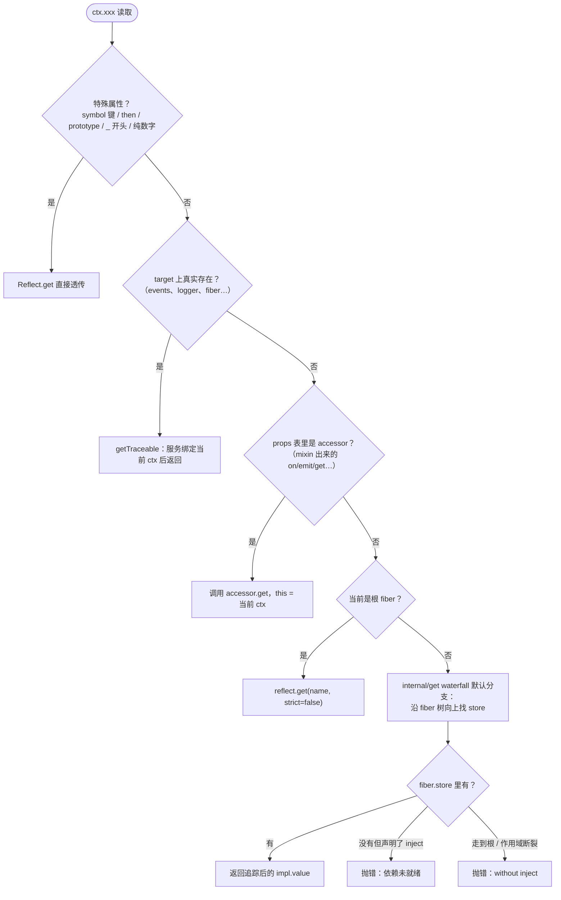
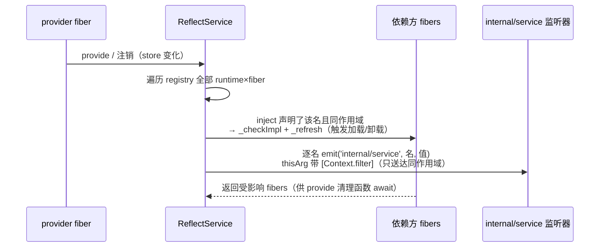

# 03 · `reflect.ts` 精读 —— 反射层与服务解析（418 行）

| | |
|---|---|
| 职责 | `ctx` 代理的 get/set/has 陷阱、服务注册表（provide/set/accessor/mixin/notify） |
| 依赖 | context / fiber / utils |
| 前置阅读 | [02-context.md](02-context.md)（代理与组装）、[01-utils.md](01-utils.md) §3（traceable） |
| 本册 TS 知识点 | Proxy 陷阱不变量、判别联合 + namespace、`Omit/Pick`、`keyof any`、thenable 危险、生成器 effect |

本文件是"`ctx` 的一切魔法"的中枢：**Context 代理三陷阱**（§2）、**注册表**（§3）、**mixin/accessor**（§4）、**追踪工具**（§5），并收编两条核心链路（§6）。

先用 10 行玩具感受"陷阱"（= Proxy handler 的拦截方法）：handler 里的函数会在对应操作发生时被调用——

```ts
const p = new Proxy({ name: '小明' }, {
  get(target, prop) {
    console.log(`有人读了 ${String(prop)}`)
    return target[prop]   // 也可以不透传——返回什么都由这个函数决定
  },
})

p.name   // 控制台：有人读了 name；表达式值 '小明'
```

Cordis 的 `ctx` 是这个玩具的工业版（target = 裸 Context，handler = `ReflectService.handler`）：

```ts
ctx.events        // → 调用 get(target, 'events', ctx)
ctx.foo = 1       // → 调用 set(target, 'foo', 1, ctx)
'events' in ctx   // → 调用 has(target, 'events')
```

## 1. Context 声明合并：五个方法（L7–71）

```ts
declare module './context.ts' {
  export interface Context {
    get<K extends string & keyof this>(name: K, strict?: boolean): undefined | this[K]
    get(name: string, strict?: boolean): any
    set<K extends string & keyof this>(name: K, value: undefined | this[K]): void
    set(name: string, value: any): void
    provide<K extends string & keyof this>(name: K, value: undefined | this[K]): () => void
    provide(name: string, value?: any): () => void
    accessor(name: string, options: Omit<Property.Accessor, 'type'>): void
    mixin<K extends string & keyof this>(name: K, mixins: (keyof this & keyof this[K])[] | Dict<string>): void
    mixin<T extends {}>(source: T, mixins: (keyof this & keyof this[K])[] | Dict<string>): void
  }
}
```

- 泛型签名的三层精确：`K extends string & keyof this`（键限定为当前 Context 的字符串属性，`& string` 排除 symbol/number 键）；`undefined | this[K]`（读结果=该属性的类型，未提供时可为 undefined——`ctx.get('events')` 与 `ctx.events` 类型一致）；`Omit<Property.Accessor, 'type'>`（去掉判别字段，调用方只传 get/set）。

## 2. `ReflectService.handler`：三陷阱（L135–207）

### 2.1 辅助：`enhanceError` 与保留属性（L73–91）

```ts
function enhanceError(error: Error) {
  const lines = error.stack!.split('\n')
  lines.splice(0, 2, `Error: ${error.message}`)
  error.stack = lines.join('\n')
  return error
}

const RESERVED_WORDS = ['prototype', 'then']

function isSpecialProperty(prop: string | symbol): prop is symbol {
  return typeof prop === 'symbol'
    || RESERVED_WORDS.includes(prop)
    || parseInt(prop).toString() === prop
    || prop.startsWith('_')
}
```

- `enhanceError`：陷阱里构造的占位 Error 堆栈头两行是构造现场，替换成单行 `Error: <message>`——用户看到的堆栈第一行是语义化消息、第二行直接是**用户代码**的访问点。
- **特殊属性**判定（不走服务解析、直接透传）：symbol 键（内部协议/inspect/iterator）；`prototype`/`then`（`then` 若被代理接管，ctx 会被当 thenable 到处 `await`——灾难性后果）；纯数字字符串（`parseInt(p).toString() === p` 精确判定 "0"、"1"...）；`_` 前缀（约定内部属性）。

### 2.2 `get` 陷阱：服务解析入口



源码逐段：

```ts
get: (target, prop, ctx: Context) => {
  if (isSpecialProperty(prop)) {
    return Reflect.get(target, prop, ctx)
  }
```
- 参数命名：第三参 `ctx` 即陷阱的 receiver——**发起访问的上下文**。`target` 是裸 context（可能是某个子 ctx）。二者可能不同层：服务解析以 receiver 的隔离作用域为准。

```ts
  if (Reflect.has(target, prop)) {
    return getTraceable(ctx, Reflect.get(target, prop, ctx))
  }
```
- target（含原型链）上**真实存在**的属性直接取值，但过 `getTraceable`：值若是带 tracker 的服务（events/logger/registry），返回**绑定当前 ctx 的追踪代理**——单例服务在每个 ctx 里呈现不同的 `this.ctx`。

```ts
  const error = new Error(`cannot get property "${prop}" without inject`)

  try {
    const def = target.reflect.props[prop]
    if (def?.type === 'accessor') {
      return def.get.call(ctx, ctx[symbols.receiver], error)
    }

    if (!ctx.fiber.runtime) return ctx.reflect.get(prop, false)

    return ctx.events.waterfall('internal/get', ctx, prop, error, () => {
      const key = target[symbols.isolate][prop]
      let fiber = (ctx[symbols.shadow] as Context ?? ctx).fiber
      while (true) {
        const impl = fiber.store?.[prop]
        if (impl) return getTraceable(ctx, impl.value)
        if (prop in fiber.inject) {
          error.message = `cannot get required service "${prop}" in inactive context`
          throw error
        }
        if (!fiber.runtime) throw error
        if (fiber.parent[symbols.isolate][prop] !== key) throw error
        fiber = fiber.parent.fiber
      }
    })
  } catch (e: any) {
    throw e === error ? enhanceError(e) : e
  }
},
```
- 先造占位错误（消息先行，供各失败路径抛出/增强）。
- **accessor 分支**：mixin 造出的计算属性（`on`、`emit`、`get`...）调用其 `get`，this 绑定为发起方 ctx，receiver 从 `ctx[symbols.receiver]` 取（traceable 命名空间转发时塞入，普通访问为 undefined）。
- **根 fiber 快捷路径**：根上读未知属性 = 非严格服务查询（`strict=false`，不要求提供方 ACTIVE）。
- **服务解析主体**经 `internal/get` waterfall（外部可拦截/替换服务读取；默认行为是最内层 `next`）：
  1. `key = target[symbols.isolate][prop]`：换算 `prop` 的隔离键。
  2. 起点：ctx 带影子取影子的 fiber（影子 ctx 上读服务要落回原处），否则当前 fiber。
  3. **沿 fiber 树向上**循环：`fiber.store?.[prop]` 命中返回追踪后的 `impl.value`（`?.` 使 PENDING 纤维——store 未建——自然跳过）；`prop in fiber.inject` 且不在 store = **依赖未就绪**，改写错误消息后抛（比"没有此属性"精确）；`!fiber.runtime` 走到根仍未命中，抛最初错误；父作用域隔离键不同（被 `isolate()` 切断）抛错；否则上溯一层。
- catch：`e === error`（**引用相等**——抛的正是占位错误）就 `enhanceError` 重写堆栈头；其他错误原样上抛。

### 2.3 `set` 陷阱与 `has` 陷阱

```ts
set: (target, prop, value, ctx: Context) => {
  if (isSpecialProperty(prop)) {
    return Reflect.set(target, prop, value, ctx)
  }

  const error = new Error(`cannot set property "${prop}" without provide`)
  const def = target.reflect.props[prop]
  if (!def) {
    if (!ctx.fiber.runtime) return Reflect.set(target, prop, value, ctx)
    throw enhanceError(error)
  }

  try {
    if (def.type === 'accessor') {
      if (!def.set) return false
      return def.set.call(ctx, value, ctx[symbols.receiver], error)
    }

    return ctx.events.waterfall('internal/set', ctx, prop, value, error, () => {
      return ctx.reflect.set(prop, value, error)
    })
  } catch (e: any) {
    throw e === error ? enhanceError(e) : e
  }
},

has: (target, prop) => {
  if (isSpecialProperty(prop)) {
    return Reflect.has(target, prop)
  }
  if (Reflect.has(target, prop)) return true
  return !!target.reflect.props[prop]
},
```
- **set 比读严格**：未在 `props` 表声明的名字——根上下文允许当普通属性写（loader 挂 baseUrl 等），其余一律抛"without provide"（防误写覆盖服务）。accessor：无 setter 返回 `false`（严格模式下 Proxy set 返回 false → TypeError）；service：走 `internal/set` waterfall → `reflect.set`（**所有权校验**）。
- **has**：`prop in ctx` = 真实属性或已声明 props。注意检查的是**声明面**而非运行时值——"服务已提供但未在本 ctx 声明"不算。

## 3. 注册表：`get`/`set`/`provide`/`notify`（L209–343）

### 3.1 数据结构

```ts
export class ReflectService {
  static handler: ProxyHandler<Context> = { ... }

  public store: Dict<Impl, symbol> = Object.create(null)
  public props: Dict<Property> = Object.create(null)

  constructor(public ctx: Context) {
    defineProperty(this, symbols.tracker, {
      property: 'ctx',
      noShadow: true,
    })

    this.mixin('reflect', ['get', 'set', 'provide', 'accessor', 'mixin'])
    this.mixin('fiber', ['runtime', 'effect'])
    this.mixin('registry', ['inject', 'plugin'])
    this.mixin('events', ['on', 'once', 'parallel', 'emit', 'serial', 'bail', 'waterfall'])
  }
```

- `store: Dict<Impl, symbol>`：`Dict<T, K>` 的第二参数改键类型——**以隔离 label（symbol）为键**的实现桶。`props`：属性名 → 声明（service/accessor）。
- 构造器挂 tracker（`noShadow: true`——身份敏感）后注册四组 mixin：`ctx.on → events.on`、`ctx.plugin → registry.plugin`、`ctx.effect → fiber.effect` 等。这些 effect 挂在根 fiber 上，随后被根构造器的 `_disposables.clear()` 固化为永久（[02-context.md](02-context.md) §3.3）。

`Impl` 记录（L116–125）：

```ts
export interface Impl {
  name: string
  fiber: Fiber
  value?: any
  check?: () => boolean
}
```
- 谁提供（`fiber`，拥有生命周期）、值（`value`）、可用性谓词（`check`，依赖方加载前询问）。

### 3.2 `get` / `_getImpl`：带状态检查的读取（L233–252）

```ts
get(name: string, strict = true) {
  return getTraceable(this.ctx, this._getImpl(name, strict)?.value)
}

_getImpl(name: string, strict = true) {
  const key = this.ctx[symbols.isolate][name]
  const impl = key && this.store[key]
  if (!impl) return
  if (strict && impl.fiber.state !== FiberState.ACTIVE) return
  return impl
}
```
- `get` 是公共 API：值过 `getTraceable` 返回追踪代理；`?.` 使未提供时返回 undefined。
- `_getImpl` 内部版：换算隔离键（`key && ...` 同时防御"名字从未登记 label"）；`strict`（默认真）要求**提供方 fiber 处于 ACTIVE**——正在卸载/加载的服务对依赖方不可见。

### 3.3 `set`：覆写 + 所有权（L254–275）

```ts
set(name: string, value: any, error?: Error) {
  const key = this.ctx[symbols.isolate][name]
  const impl = this.store[key]
  if (!impl) {
    throw new Error(`cannot set property "${name}" without provide`)
  }
  if (impl.fiber !== this.ctx.fiber) {
    throw new Error(`cannot set property "${name}" in multiple fibers`)
  }
  impl.value = value
  return true
}
```
- 两条硬约束：必须**已 provide**（新增走 `provide`）；必须是**本 fiber 提供的**（防跨插件偷改）。覆写不触发重载/通知——纯换 value，读取方下次取新值。

### 3.4 `provide`：注册即 effect（L277–312）

```ts
provide(name: string, value?: any, check?: () => boolean) {
  return this.ctx.fiber.effect(() => {
    if (!this.props[name]) {
      this.props[name] ??= { type: 'service' }
    } else if (this.props[name].type !== 'service') {
      throw new Error(`property "${name}" is already declared as ${this.props[name].type}`)
    }
    this.props[name] = { type: 'service' }

    this.ctx.root[symbols.isolate][name] ??= Symbol(name)
    const key = this.ctx[symbols.isolate][name]
    const impl: Impl = { name, value, fiber: this.ctx.fiber, check }
    if (this.store[key]) {
      throw new Error(`service "${name}" has been registered at <${this.store[key].fiber.name}>`)
    }
    this.store[key] = impl
    this.ctx.fiber.store![name] = impl

    if (this.ctx.fiber.state === FiberState.ACTIVE) {
      this.notify([name])
    }
    return async () => {
      delete this.store[key]
      const fibers = this.notify([name])
      await Promise.allSettled(fibers.map(fiber => fiber.await()))
      // ensure self access before dependencies cleanup
      delete this.ctx.fiber.store![name]
    }
  }, `ctx.provide(${JSON.stringify(name)})`)
}
```
- 整个注册是一个 **fiber effect**：body 做登记、返回的清理函数在 fiber 卸载时撤销——**服务生命周期与提供者 fiber 绑定**。
- props 声明维护：不存在补 `{ type: 'service' }`（`??=` 幂等）；存在但类型不是 service（是 accessor）抛冲突；随后无条件重置（丢弃陈旧字段）。
- **懒建默认作用域**：根 isolate 表没有该名的 label 就建一个；再取**当前 ctx** 的 label（链上有 `isolate(name)` 则是隔离 label）作桶键。
- 冲突检测：同桶已有实现 → 抛错点名占用者（`fiber.name`）。**同名共存必须先 isolate**。
- 写桶表 + 写**本 fiber 的 store 快照**（依赖解析的快照来源，§2.2 循环第 3 步）——提供者自己永远读得到自己的服务。`!` 断言：effect 主体在 `_reload` 建立快照之后才执行（[06-fiber.md](06-fiber.md) §5.2）。
- **ACTIVE 时立即广播**；加载期 provide（LOADING）则等状态机推进到 ACTIVE 时由 `_updateState` 统一 notify。
- **清理函数三步**：摘桶表条目（服务立即"消失"）→ `notify` 唤醒依赖方（因依赖缺失进入卸载）→ `allSettled` **等待每个依赖方完整走完卸载**（防止释放资源时还有人用）→ 最后删自己 store 快照条目（注释点明顺序："确保依赖方清理期间仍可自访问"）。

### 3.5 `notify`：变更涟漪（L314–343）



```ts
notify(names: string[], filter = (ctx: Context, name: string) => ctx[symbols.isolate][name] === this.ctx[symbols.isolate][name]) {
  const fibers: Fiber[] = []
  for (const runtime of this.ctx.registry.values()) {
    for (const fiber of runtime.fibers) {
      let hasUpdate = false
      for (const name of names) {
        if (!(name in fiber.inject)) continue
        if (!filter(fiber.ctx, name)) continue
        hasUpdate = true
        fiber._checkImpl(name)
      }
      if (!hasUpdate) continue
      fiber._refresh()
      fibers.push(fiber)
    }
  }
  for (const name of names) {
    const self: Context = Object.create(this.ctx)
    self[symbols.filter] = (target: Context) => filter(target, name)
    this.ctx.events.emit(self, 'internal/service', name, this._getImpl(name, false)?.value)
  }
  return fibers
}
```
- 默认 filter：**同隔离作用域**才通知。三层遍历（runtime × fiber × 变更名）：只处理 `inject` 声明了该名且过滤器放行的 fiber——`_checkImpl` 重估依赖可用性（写 `_store`）、`_refresh` 重算 epoch 触发加载/卸载（[06-fiber.md](06-fiber.md) §5.3）。受影响 fiber 收集返回（provide 清理函数据此等待）。
- 事件面广播：对每个名字造**以发起方 ctx 为原型的临时 thisArg**，挂 `[Context.filter]` 谓词再 emit——`dispatch`（[04-events.md](04-events.md) §2.4）拿谓词过滤监听器，只有同作用域、非 global 的监听器收到。`_getImpl(name, false)` 非严格取值（provider 卸载中，事件仍带旧值供观察者读取）。

## 4. `accessor` 与 `mixin`（L345–396）

```ts
accessor(name: string, options: Omit<Property.Accessor, 'type'>) {
  return this.ctx.fiber.effect(() => {
    if (name in this.props) {
      throw new Error(`property "${name}" is already declared as ${this.props[name].type}`)
    }
    this.props[name] = { type: 'accessor', ...options }
    return () => delete this.props[name]
  }, `ctx.accessor(${JSON.stringify(name)})`)
}
```
- 简化的 provide：只登记 props 表（get/set 钩子），不进 store。同名冲突（无论哪种类型）即抛。清理删声明。

```ts
mixin(source: any, mixins: string[] | Dict<string>) {
  const self = this
  return this.ctx.fiber.effect(function* () {
    const entries = Array.isArray(mixins) ? mixins.map(key => [key, key]) : Object.entries(mixins)
    const getTarget = (ctx: Context, error: Error) => {
      // TODO enhance error message
      return ctx[source]
    }
    for (const [key, value] of entries) {
      yield self.accessor(value, {
        get(receiver, error) {
          const service = getTarget(this, error)
          if (isNullable(service)) return service
          const mixin = receiver ? withProps(receiver, service) : service
          const value = Reflect.get(service, key, mixin)
          if (typeof value !== 'function') return value
          return value.bind(mixin ?? service)
        },
        set(value, receiver, error) {
          const service = getTarget(this, error)
          const mixin = receiver ? withProps(receiver, service) : service
          return Reflect.set(service, key, value, mixin)
        },
      })
    }
  }, `ctx.mixin(${JSON.stringify(source)})`)
}
```
- **生成器 effect**：body 是 `function*`，每个 `yield` 产出一个 disposer（accessor 的返回值），`_execute` 逐个收集（[07-effect.md](07-effect.md) §2）。一个 mixin = N 个 accessor + 一个总 effect。
- 入参归一：数组 `[a, b]` → `[[a,a],[b,b]]`；`Dict<string>` 映射 `{源键: ctx键}` 用 `Object.entries`——支持改名混入。
- `getTarget(ctx)`：从 ctx 上读 `source`——**每次取值时现取**，mixin 始终转发当前生效的服务实例。
- getter：`this` 是发起访问的 ctx（accessor 的 this 约定）；`receiver` 存在（traceable 命名空间路径）时 `withProps` 把 receiver 叠在服务上作 `mixin`；`Reflect.get(service, key, mixin)` 取值；**函数则 `bind(mixin ?? service)`**——方法体内的 `this` 是"叠加了调用方上下文的服务"。效果：`ctx.on('x', fn)` 里 `this.ctx` 是**调用方的 ctx**（追踪机制最后一环），事件监听登记到正确的 fiber。非函数（属性值）直接返回。
- setter 对称：经 mixin 接收者写（setter 里 `this.ctx` 同样被换）。

## 5. `trace` / `bind`（L398–417）

```ts
trace<T>(value: T) {
  return getTraceable(this.ctx, value)
}

bind<T extends Function>(callback: T) {
  return new Proxy(callback, {
    apply: (target, thisArg, args) => {
      return Reflect.apply(target, this.trace(thisArg), args.map(arg => this.trace(arg)))
    },
    construct: (target, args, newTarget) => {
      return Reflect.construct(target, args.map(arg => this.trace(arg)), newTarget)
    },
  })
}
```
- `trace`：公开的"把值绑到当前 ctx"。`events.on` 用它包装监听器（[04-events.md](04-events.md) §3.3）。
- `bind`：函数级代理——调用时把 **this 与每个实参**都过 `trace`（参数若是从别的 ctx 拿来的服务，进来即被重绑）；`construct` 陷阱处理 `new` 调用（newTarget 透传保持 class 语义）。

## 6. 收编链路 B/C：服务读取与注册涟漪

**B. `ctx.database` 全链路**（即 §2.2 决策图的文字版）：

```
ctx.database
 → 陷阱 get：特殊属性? → 真实属性? → accessor? → 根 fiber?
 → waterfall('internal/get') 默认分支：
      fiber = (shadow ?? ctx).fiber
      循环：fiber.store?.[name] 命中 → 返回追踪后的 impl.value
            声明了 inject 但不在 store → 抛 "inactive context"
            到根 / 作用域键断裂 → 抛 "without inject"
```

**C. 服务注册/注销涟漪**（§3.4/3.5 的时序版）：provider 调 `ctx.provide` → store/props 登记 → ACTIVE 时 `notify` → 遍历所有注入该名的同作用域 fiber，`_checkImpl + _refresh` → 依赖方自动加载/卸载；注销时先摘 store → notify → `allSettled` 等依赖方卸载完 → 才删自身快照。

## 7. TypeScript 进阶知识点

### 7.1 Proxy 陷阱的不变量（invariants）

```ts
const p = new Proxy({ x: 1 }, {
  get: (t, k) => 42,           // 任意返回值都合法
  set: () => false,            // 拒绝写入
})
p.x            // 42
p.y = 2        // TypeError（严格模式）
```
get/has 陷阱可以任意"撒谎"；**set/deleteProperty 等修改型陷阱返回 false 会抛 TypeError**（严格模式）；`defineProperty` 等还有"不可配置属性不得伪装"的不变量。Cordis 借 set 返回 false 把"禁写 ctx"变成异常；`get` 可以返回任意值正是服务解析的合法性来源。

### 7.2 判别联合 + namespace 组织形状

```ts
export type Property = Property.Service | Property.Accessor

export namespace Property {
  export interface Service { type: 'service' }
  export interface Accessor {
    type: 'accessor'
    get: (...) => any
    set?: (...) => boolean
  }
}
```
- `type` 字面量判别 + `switch/if (def.type === 'accessor')` 即可窄化出 `get/set`。`namespace` 把相关类型挂在主名下（`Plugin`、`Inject` 同款）——比平铺 `PropertyService/PropertyAccessor` 更聚拢，且 namespace 还能装常量与函数（`Inject.resolve`、`CordisError.Code`）。

### 7.3 `Omit` / `Pick`：从既有形状裁剪

```ts
accessor(name: string, options: Omit<Property.Accessor, 'type'>)
// = { get, set? }——调用方不传判别字段
```
`Omit<T, K>` = `Pick<T, Exclude<keyof T, K>>`。"复用类型但少几个字段"的标准姿势，避免再造平行接口。

### 7.4 `keyof any`

```ts
_hooks: Record<keyof any, Hook[]>
```
`keyof any = string | number | symbol`——**任意合法属性键**。事件名既可能是字符串也可能是 symbol，用它比 `Record<string, ...>` 精确。

### 7.5 thenable 危险：为什么 `then` 是保留属性

```ts
const p = new Proxy({}, { has: () => true })
await Promise.resolve(p)   // has('then') 为 true → 走 thenable 路径
```
任何"看起来有 `then`"的对象都会被 Promise 机制特殊对待。ctx 若放行 `then` 属性，`await ctx` 就会意外触发——`isSpecialProperty` 把 `then`/`prototype` 挡在服务解析之外是防御底线。

## 8. 自测

1. get 陷阱的循环里，`prop in fiber.inject` 抛的错和 `!fiber.runtime` 抛的错分别对应什么用户场景？
2. `provide` 的清理函数为什么要 `await Promise.allSettled(...)` 之后才删自己的 store 快照？
3. `notify` 造的临时 thisArg 起什么作用？`dispatch` 怎么消费它？
4. mixin 的 getter 里 `bind(mixin ?? service)` 的 `mixin` 是什么？没有它会发生什么？
5. 为什么 `_getImpl` 的 `strict` 检查 provider 的 state 而不是只查存在性？
