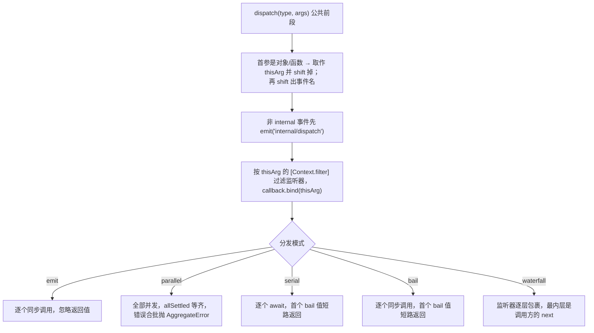
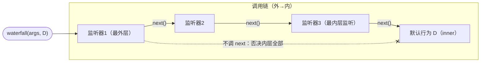

# 04 · `events.ts` 精读 —— 事件总线（352 行）

| | |
|---|---|
| 职责 | 五种分发模式、dispatch 公共协议、监听器注册与 fiber 归属、内置 internal/* 事件 |
| 依赖 | context / fiber / utils |
| 前置阅读 | [03-reflect.md](03-reflect.md)（mixin 把 on/emit 挂上 ctx）、[01-utils.md](01-utils.md)（traceable/bind） |
| 本册 TS 知识点 | 条件类型与 `infer`、手写 `Parameters/ReturnType/ThisType`、重载签名、`NoInfer`、元组 rest 展开、`AggregateError`/`allSettled` |

## 1. 基础类型（L13–32）

### 1.1 `isBailed`：bail 值的精确定义

```ts
export function isBailed(value: any) {
  return value !== null && value !== false && value !== undefined
}
```
- 监听器返回"有意义的结果"即拦截后续分发。**显式排除三种假值**而非 `!!value`：`0`、`''`、`NaN` **算 bail 值**（Truthy 判定会漏掉合法返回值 0）。cordis 语义：只有 null/false/undefined 表示"未处理"。

### 1.2 三个条件类型工具（L18–22）

```ts
export type Parameters<F> = F extends (...args: infer P) => any ? P : never
export type ReturnType<F> = F extends (...args: any) => infer R ? R : never
export type ThisType<F> = F extends (this: infer T, ...args: any) => any ? T : never
```
- 本文件**私有版本**，覆盖 lib 的同名全局工具以支持 `this` 推断。`infer P` 在 extends 分支里声明推断变量：`F` 匹配"函数"时提取参数元组/返回类型/this 类型，否则 `never`。
- 有了它们，`ctx.on` 的签名可以直接从 `Events[K]`（事件签名）导出参数/返回类型，无需为每个事件手写。这是"类型从单一事实源派生"的范式。

```ts
export type DispatchMode = 'emit' | 'parallel' | 'serial' | 'bail' | 'waterfall'
```
- 字符串字面量联合。

## 2. `EventsService`

### 2.1 Context 声明合并：六个分发 + 两个注册（L34–109）

```ts
declare module './context.ts' {
  export interface Context {
    parallel<K extends keyof Events>(name: K, ...args: Parameters<Events[K]>): Promise<void>
    parallel<K extends keyof Events>(thisArg: NoInfer<ThisType<Events[K]>>, name: K, ...args: Parameters<Events[K]>): Promise<void>
    emit<K extends keyof Events>(name: K, ...args: Parameters<Events[K]>): void
    ... // emit/serial/bail/waterfall 同构双签名
    serial<K extends keyof Events>(name: K, ...args: Parameters<Events[K]>): Promisify<ReturnType<Events[K]>>
    bail<K extends keyof Events>(name: K, ...args: Parameters<Events[K]>): ReturnType<Events[K]>
    waterfall<K extends keyof Events>(name: K, ...args: Parameters<Events[K]>): ReturnType<Events[K]>
    on<K extends keyof Events>(name: K, listener: Events[K], options?: boolean | EventOptions): () => boolean
    once<K extends keyof Events>(name: K, listener: Events[K], options?: boolean | EventOptions): () => boolean
  }
}
```

要点逐条：

- **每方法两个重载**：普通形式与**首参 thisArg** 形式（"以指定上下文为 this 分发"——`internal/service` 的过滤场景，[03-reflect.md](03-reflect.md) §3.5）。
- `K extends keyof Events` + `...args: Parameters<Events[K]>`：事件名约束在 `Events` 接口（§4）上，参数元组**精确展开**——传错参数直接编译报错。
- `NoInfer<ThisType<Events[K]>>`：`NoInfer`（TS 4.7+）阻止 thisArg 参与泛型推断，防止调用处把 thisArg 的类型"反推"污染 K。
- 返回类型随模式：`parallel → Promise<void>`（聚合错误经异常抛）；`emit → void`；`serial → Promisify<...>`（监听器可能异步，统一包 Promise）；`bail/waterfall → 同步返回值`。
- `on/once` 返回 `() => boolean` 销毁器，返回"是否真的移除了"。

```ts
export interface EventOptions {
  prepend?: boolean
  global?: boolean
}

export interface Hook extends EventOptions {
  ctx: Context
  callback: (...args: any[]) => any
}
```
- `prepend`：插到现有监听器**之前**。`global`：无视上下文过滤器。`Hook` = 选项 + 归属 ctx + 回调——`ctx` 字段是过滤与 fiber 归属的依据。

### 2.2 构造器：两个内置监听器（L131–163）

```ts
export class EventsService {
  _hooks: Record<keyof any, Hook[]> = {}

  constructor(private ctx: Context) {
    defineProperty(this, symbols.tracker, {
      property: 'ctx',
      noShadow: true,
    })

    this.on('internal/listener', function (this: Context, name, listener, options: EventOptions) {
      if (name === 'internal/update' && !options.global) {
        const hooks = this.fiber._hooks['internal/update'] ??= new DisposableList()
        const method = options.prepend ? 'unshift' : 'push'
        return hooks[method](listener)
      }
    })

    this.on('internal/update', function (config, noSave, next) {
      const cbs = [...this._hooks['internal/update'] || []]
      const _next = () => {
        const cb = cbs.shift() ?? next
        return cb.call(this, config, noSave, _next)
      }
      return _next()
    }, { global: true, prepend: true })
  }
```

- `_hooks`：事件名（string 或 symbol）→ Hook 数组。
- **监听器一：拦截自己的注册流程**。`ctx.on('internal/update', ...)` 若非 global，不进全局 `_hooks`，而是登记到**注册者 fiber 的 `_hooks['internal/update']`**（DisposableList）——更新钩子随 fiber 卸载自动消失。返回的 remover 是**函数（truthy）**，于是在 `on()` 里命中 bail 拦截分支（§3.3），替换默认注册。
- **监听器二：`internal/update` waterfall 基座**（`prepend: true` 插最前 + `global: true` 免过滤）：把分散在各 fiber 的更新钩子**串进默认链**。分发时先拷贝快照（`[...]` 防链上增删干扰），`shift() ?? next` 逐个调用，钩子耗尽落到外层 `next`（fiber.update 的默认重启行为）。注意 `this._hooks` 是**被更新 fiber** 的字段（this 是 waterfall 的 thisArg）。
- 两条合起来构成"fiber 级更新钩子"：`on('internal/update')` 的监听器既参与瀑布链、又随自身 fiber 卸载。
- `function (this: Context, ...)`：需要动态 this（注册者/被更新者），必须 function 而非箭头。

### 2.3 `dispatch`：公共前段（L165–181）

```ts
dispatch(type: string, args: any[]) {
  const thisArg = typeof args[0] === 'object' || typeof args[0] === 'function' ? args.shift() : null
  const name: string = args.shift()
  if (!name.startsWith('internal/')) {
    this.emit('internal/dispatch', type, name, args, thisArg)
  }
  const filter = thisArg?.[Context.filter]
  return (this._hooks[name] || [])
    .filter(hook => hook.global || !filter || filter.call(thisArg, hook.ctx))
    .map(hook => hook.callback.bind(thisArg))
}
```

- **参数约定**：`args` 是变长池——首参若是对象/函数则**视为 thisArg 并 shift 掉**，随后 shift 出事件名，剩余才是监听器参数（带 thisArg 的调用形式是框架保留用法，用户参数首参不能随便是对象）。
- `internal/dispatch` 诊断事件：仅对**非 internal** 事件递归通知（防 internal 再触发 dispatch 造成风暴/递归）。
- 过滤：thisArg 带 `[Context.filter]` 谓词（notify 造的）时逐 hook 检查归属 ctx；`hook.global` 或无过滤器放行。
- 返回 `callback.bind(thisArg)` 数组——各模式只管"怎么调这些已绑定的回调"。

五种模式的分叉：



### 2.4 五种模式实现（L183–252）

```ts
async parallel(...args: any[]) {
  const results = await Promise.allSettled(this.dispatch('emit', args).map(async cb => cb(...args)))
  const errors = results.filter((result): result is PromiseRejectedResult => result.status === 'rejected')
  if (errors.length) throw new AggregateError(errors.map(error => error.reason))
}

emit(...args: any[]) {
  this.dispatch('emit', args).map(cb => cb(...args))
}

async serial(...args: any[]) {
  for (const cb of this.dispatch('serial', args)) {
    const result = await cb(...args)
    if (isBailed(result)) return result
  }
}

bail(...args: any[]) {
  for (const cb of this.dispatch('bail', args)) {
    const result = cb(...args)
    if (isBailed(result)) return result
  }
}

waterfall(...args: any[]) {
  const cbs = this.dispatch('waterfall', args)
  const inner = args.pop()
  const next = () => {
    const cb = cbs.shift() ?? inner
    return cb(...args)
  }
  args.push(next)
  return next()
}
```
- **parallel**：`map` 立即调用（async 包装保证 rejection 进 allSettled 而非中途炸出）；`allSettled` 等全部落定（不因首个失败取消其余）；rejection 全收集合成 `AggregateError` 抛出——一个不吞。类型谓词窄化 `PromiseRejectedResult` 后取 `reason`。
- **emit**：同步发射，不 await 返回的 promise（async 监听器的 promise 悬空，错误将成为 unhandled rejection，除非监听器自己兜底）；返回值全部忽略。
- **serial**：逐个等待，任一返回 bail 值立即短路。"先 await 再判断"——第一个返回 undefined 也要等它完成才调第二个。
- **bail**：serial 的同步版。注意 `isBailed` 只看 null/false/undefined——监听器返回**任何其他值（包括 Promise 对象）都会短路**，因此 bail 监听器不应返回 promise。
- **waterfall**（洋葱模型的反向）：末参是**最内层 `next`**（调用方的默认行为）。`next` 从 `cbs` 头部取监听器调用（`shift() ?? inner`），把剩余链作为新 `next` **追加到 args 尾部**传给它。注册顺序 = 包裹层级：最先注册的最外层，最后落到 `inner`。监听器**不调用 `next()` 即否决**内层链（含默认行为）——cordis 的"拦截即不转发"语义（本仓库 AGENTS.md 的 waterfall 规则即源于此）。

waterfall 的包裹结构（注册顺序 L1 → L3，默认行为 D）：



### 2.5 `register` / `unregister`（L254–286）

```ts
register(label: string, hooks: Hook[], callback: any, options: EventOptions): () => void {
  const method = options.prepend ? 'unshift' : 'push'
  return this.ctx.fiber.effect(() => {
    hooks[method]({ ctx: this.ctx, callback, ...options })
    return () => this.unregister(hooks, callback)
  }, label)
}

unregister(hooks: Hook[], callback: any) {
  const index = hooks.findIndex(hook => hook.callback === callback)
  if (index >= 0) {
    hooks.splice(index, 1)
    return true
  }
}
```
- **监听器注册也是 effect**：Hook 记录（含归属 ctx）插入数组（头/尾由 prepend 决定——`method` 变量把布尔映射成方法名），清理函数摘除。
- `unregister` 按**回调引用**查找（findIndex + splice）；未找到隐式返回 undefined（销毁器 `() => boolean` 契约下即 false——重复调用安全）。

### 2.6 `on` / `once`（L288–318）

```ts
on(name: string | symbol, listener: (...args: any) => any, options?: boolean | EventOptions) {
  if (typeof options !== 'object') {
    options = { prepend: options }
  }

  // handle special events
  this.ctx.fiber.assertActive()
  listener = this.ctx.reflect.bind(listener)
  const result = this.bail(this.ctx, 'internal/listener', name, listener, options)
  if (result) return result

  const hooks = this._hooks[name] ||= []
  const label = `ctx.on(${typeof name === 'string' ? JSON.stringify(name) : name.toString()})`
  return this.register(label, hooks, listener, options)
}
```
- 逐行：
  1. **选项归一**：布尔 `ctx.on(name, fn, true)` = prepend；`undefined` 也归一为 `{ prepend: undefined }`。
  2. `assertActive()`：fiber 已销毁抛 `CordisError('INACTIVE_EFFECT')`——死 ctx 上不能注册。
  3. `reflect.bind(listener)`：包成追踪代理（[03-reflect.md](03-reflect.md) §5）——监听器里的 this 与服务参数都会重绑到当前 ctx。
  4. **bail 分发 `internal/listener`**：给框架"接管注册"的机会。构造器的监听器一对 `internal/update` 返回 remover 函数（truthy）→ `if (result) return result` 直接换掉默认注册。
  5. 惰性建数组（`||=`）、生成诊断标签（字符串名 `JSON.stringify` 加引号、symbol 名 `toString`）、走 `register`。

```ts
once(name: string, listener: (...args: any) => any, options?: boolean | EventOptions) {
  const dispose = this.on(name, function (...args: any[]) {
    dispose()
    return listener.apply(this, args)
  }, options)
  return dispose
}
```
- **once 用 on 实现**：包装函数先 `dispose()`（TDZ 安全：`dispose` 是 const，包装函数被调用时已赋值）再转发 `listener.apply(this, args)`（保持 this 与返回值）。返回同一个 `dispose`——once 后手动再调无害。

## 3. `Events`：内置事件接口（L329–352）

```ts
export interface Events {
  'internal/plugin'(fiber: Fiber): void
  'internal/status'(fiber: Fiber, oldValue: FiberState): void
  'internal/config'(this: Fiber, config: any, next: () => any): any
  'internal/service'(this: Context, name: string, value: any): void
  'internal/update'(this: Fiber, config: any, noSave: boolean, next: () => void | Promise<void>): void | Promise<void>
  'internal/get'(ctx: Context, name: string, error: Error, next: () => any): any
  'internal/set'(ctx: Context, name: string, value: any, error: Error, next: () => boolean): boolean
  'internal/listener'(this: Context, name: string, listener: any, prepend: boolean): void
  'internal/dispatch'(mode: DispatchMode, name: string, args: any[], thisArg: any): void
}
```
- 每个成员是**调用签名型属性**，可直接作 `ctx.on` 的 listener 类型；`this` 参数标注各事件的 thisArg 约定。
- 语义速查：`internal/plugin`（fiber 创建/销毁）、`internal/status`（状态迁移，oldValue 携旧态）、`internal/config`（**waterfall**，激活前可改写配置）、`internal/service`（服务变更广播，带过滤 thisArg）、`internal/update`（**waterfall**，更新前的否决/替换点，HMR 挂这里）、`internal/get/set`（**waterfall**，服务读写拦截）、`internal/listener`（**bail**，注册拦截）、`internal/dispatch`（分发前诊断）。
- 用户/插件经 `declare module './events.ts' { interface Events { ... } }` 合并自己的事件，即获得全类型安全的 `ctx.on/emit`。

## 4. TypeScript 进阶知识点

### 4.1 条件类型与 `infer`：从函数类型中"挖"出部件

```ts
type F = (this: Ctx, a: string, b: number) => boolean
type A = F extends (...args: infer P) => any ? P : never   // [a: string, b: number]
type R = F extends (...args: any) => infer R ? R : never    // boolean
type T = F extends (this: infer T, ...args: any) => any ? T : never  // Ctx
```
`infer X` 在模式匹配处声明占位，匹配成功则绑定。注意第三条：要推断 `this` 必须把 `this` 写进模式——lib 内建 `Parameters/R` 不含 this，这正是 cordis 手写三件套的原因。

### 4.2 泛型事件签名的"单一事实源"

```ts
on<K extends keyof Events>(name: K, listener: Events[K], ...): () => boolean
```
`Events[K]` 是**索引访问类型**——事件签名只维护在 `Events` 接口一处，`on/emit/serial/...` 全部派生。给 Events 加一个成员，六个方法签名同时获得该事件的类型。对比"为每个方法维护一套映射"：消除漂移。

### 4.3 重载签名与实现签名

```ts
parallel<K extends keyof Events>(name: K, ...args: Parameters<Events[K]>): Promise<void>        // 重载 1（对外）
parallel<K extends keyof Events>(thisArg: X, name: K, ...args: Parameters<Events[K]>): Promise<void>  // 重载 2（对外）
parallel(...args: any[]) { ... }   // 实现签名（不对外，宽松即可）
```
调用方看到的是重载列表；实现签名必须兼容全部重载（这里用 `...args: any[]` 吸收）。重载顺序影响推断优先级：无 thisArg 的常用形式放前面。

### 4.4 `NoInfer`：钉住不该被推断的参数

```ts
// 无 NoInfer：K 可能被 thisArg 的类型"带偏"
parallel<K extends keyof Events>(thisArg: ThisType<Events[K]>, name: K, ...)
```
`NoInfer<T>` 让该位置**退出**推断候选，只作检查——泛型 K 只由 `name` 决定，thisArg 类型必须匹配已定的 K。

### 4.5 元组展开为 rest 参数

```ts
emit<K extends keyof Events>(name: K, ...args: Parameters<Events[K]>): void
```
rest 参数的类型是元组时，调用处的实参**逐个对应元组成员**——长度与类型都受检。反向（把 rest 收进元组）也成立：`(...args: any[]) => args` 的 `args` 是 `any[]`，标注元组则得到定长元组。

### 4.6 `Promise.allSettled` + `AggregateError`

```ts
const results = await Promise.allSettled(ps)      // [{status:'fulfilled', value}|{status:'rejected', reason}]
throw new AggregateError([e1, e2])                // errors 聚合错误（ES2021）
```
`all` 是 fail-fast 且会留下未处理 rejection；`allSettled` 等全落定、永不 reject。Cordis 的 parallel 因此能"全部跑完 + 一个不吞"。`AggregateError.errors` 保留全部原始错误。

## 5. 自测

1. `ctx.on('internal/update', fn)` 与 `ctx.on('internal/update', fn, { global: true })` 分别登记到哪里？后者为什么需要 global？
2. `dispatch` 为什么在 shift thisArg 时用"是对象或函数"判定？这给用户带来什么限制？
3. waterfall 中"不调 next 即否决"是如何由 `cbs.shift() ?? inner` 与 `args.push(next)` 两行实现的？
4. 为什么 `Parameters/ReturnType` 要自定义而不用 lib 的？
5. bail 模式下监听器返回 Promise 会发生什么？
