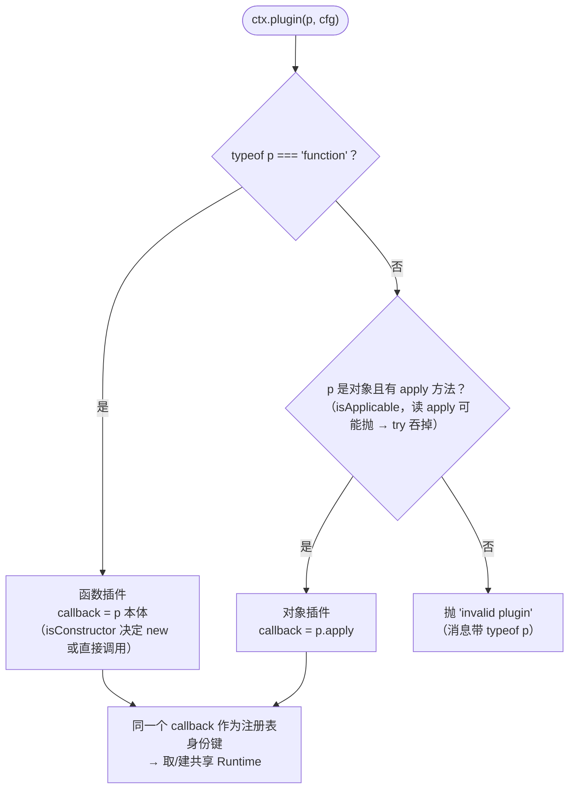
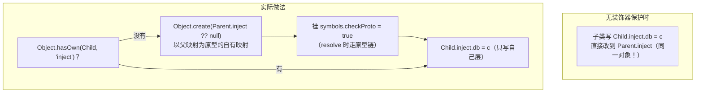
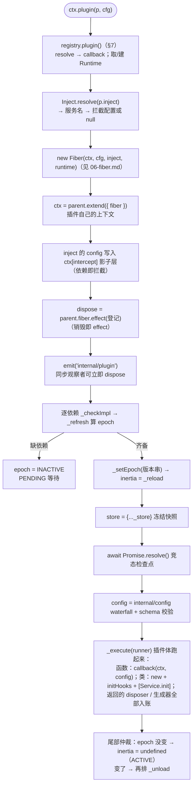

# 05 · `registry.ts` 精读 —— 插件注册表（337 行）

| | |
|---|---|
| 职责 | 插件三形态归一化、`@Inject` 装饰器、Plugin 类型族与配置类型演算、`ctx.plugin()/ctx.inject()` |
| 依赖 | context / fiber / utils |
| 前置阅读 | [02-context.md](02-context.md)（intercept）、[06-fiber.md](06-fiber.md)（Fiber 构造，可后读） |
| 本册 TS 知识点 | stage-3 装饰器、键重映射 `as` 子句、`as const` 码表、调用/构造签名混排、可选元组、`globalThis` 消歧 |

## 1. 形态判定（L8–10）

```ts
function isApplicable(object: Plugin) {
  return object && typeof object === 'object' && typeof object.apply === 'function'
}
```
- "对象插件"判定：非空对象且带可调用的 `apply`。函数插件不需要判定（`typeof === 'function'`）。三种插件形态的判定与归一：



## 2. 依赖声明：`Inject` / `InjectKey`（L19–24）

```ts
export type Inject<M = Dict> = (keyof M)[] | { [K in keyof M]?: M[K] }

export type InjectKey = keyof {
  [K in keyof Context & string as Context[K] extends { [symbols.config]: any } ? K : never]: any
}
```
- **数组形态**（`['database']`，无拦截配置）或**对象映射**（`{ database: {...} }`，服务名 → 可选拦截配置）。后者即"依赖即拦截"的类型面（fiber 构造器会把对象形态的 config 写进 intercept 影子层，[06-fiber.md](06-fiber.md) §3.2）。
- `InjectKey` 用**键重映射**筛出"类型上带 `[symbols.config]` 幻影属性"的键（`as` 子句把不匹配的键映射为 never，从键集中消失）。产出的 `InjectKey` = 所有声明了拦截配置类型的服务名，供 `ctx.intercept` / `@Inject` 的强类型签名使用（配合 `Context[K] extends { [symbols.config]: infer T } ? T : never` 抽出配置类型 `T`，见 [08-service.md](08-service.md) §5.6）。

## 3. `@Inject` 装饰器（L37–60）

```ts
export function Inject<K extends InjectKey>(name: K, config?: Context[K] extends { [symbols.config]: infer T } ? T : never) {
  return function (value: any, decorator: ClassDecoratorContext<any> | ClassMethodDecoratorContext<any>) {
    if (decorator.kind === 'class') {
      if (!Object.hasOwn(value, 'inject')) {
        defineProperty(value, 'inject', Object.create(Object.getPrototypeOf(value).inject ?? null))
        defineProperty(value.inject, symbols.checkProto, true)
      }
      value.inject[name] = config
    } else if (decorator.kind === 'method') {
      const inject = (value[symbols.metadata] ??= {}).inject ??= Object.create(null)
      inject[name] = config
      decorator.addInitializer(function () {
        const property = this[symbols.tracker]?.property
        ;(this[symbols.initHooks] ??= []).push(() => {
          (this.ctx as Context).inject(inject, (ctx) => {
            return value.call(property ? withProps(this, { [property]: ctx }) : this)
          })
        })
      })
    } else {
      throw new Error('@Inject() can only be used on class or class methods')
    }
  }
}
```

- **TC39 stage-3 / TS 5.0 装饰器**：`Inject(name, config)` 返回 `(value, context) => void` 装饰器函数；`context.kind` 判别装饰目标（class/method/field/...，其余抛错）。

**类装饰分支**——给类静态挂 `inject` 映射，关键在**继承处理**：


- 子类直接写 `value.inject` 会污染父类（同一对象）；先 `Object.create(父.inject ?? null)` 造**以父映射为原型**的自有映射（写子不碰父、读子可见父项），挂 `checkProto` 标记（§4 的 resolve 靠它识别"这条链要走原型"）。`defineProperty` 保持不可枚举。

**方法装饰分支**——"此方法延迟到依赖可用时自动调用"：
- 依赖记到 `value[symbols.metadata].inject`（方法元数据容器，`??=` 两级惰性初始化）。
- `decorator.addInitializer` 注册**构造后初始化钩子**（装饰器 API 标准机制，`new` 实例化时逐个执行）：往实例的 `symbols.initHooks` 数组 push 函数——该数组由 fiber 的类插件启动流程消费（`for (const hook of instance?.[symbols.initHooks] ?? []) hook()`，[06-fiber.md](06-fiber.md) §3.2）。
- 钩子体：`this.ctx.inject(inject, callback)`——等声明的服务可用后调用被装饰方法。`property` 取自实例 tracker（服务实例的 `'ctx'` 属性名）；回调里 `withProps(this, { [property]: ctx })` 把实例的 ctx **叠加替换**为注入作用域的子 ctx 再调用——方法体内的 `this.ctx` 是"依赖就绪的那个子上下文"。非服务实例（无 tracker）直接以原 this 调用。

## 4. `Inject.resolve`：归一化（L63–89）

```ts
export namespace Inject {
  export function resolve(inject: Inject | null | undefined, result: Dict = Object.create(null)) {
    if (!inject) return result
    if (Array.isArray(inject)) {
      for (const name of inject) {
        result[name] = null
      }
    } else if (Reflect.has(inject, symbols.checkProto)) {
      Object.assign(result, resolve(Object.getPrototypeOf(inject)))
      for (const name of Object.keys(inject)) {
        result[name] = inject[name] ?? null
      }
    } else {
      for (const name of Object.keys(inject)) {
        result[name] = inject[name] ?? null
      }
    }
    return result
  }
}
```
- 三种输入归一为**纯平面对象**（`name → config 或 null`），输出 `Object.create(null)` 无原型载体。
- 数组：每项置 `null`。对象：`?? null` 把 undefined 显式化。
- **checkProto 分支**（装饰器造的继承链映射）：先**递归解析父层**再覆盖自有键——子类依赖覆盖父类同名项，最终展平单层。`result` 默认参数允许调用方传入已有映射做合并。

## 5. `Plugin` 类型族（L92–146）

```ts
export type Plugin<T = any> =
  | Plugin.Function<T>
  | Plugin.Constructor<T>
  | Plugin.Object<T>
```

```ts
export namespace Plugin {
  export interface Base<T = any> {
    name?: string
    Config?: StandardSchemaV1<any, T>
    inject?: Inject
    provide?: string | string[]
    intercept?: Dict<boolean>
  }

  export interface Transform<S, T> {
    schema?: true
    Config: (config: S) => T
  }

  export interface Function<T = any> extends Base<T> {
    (ctx: Context, config: T): any
  }
  export interface Constructor<T = any> extends Base<T> {
    new (ctx: Context, config: T): any
  }
  export interface Object<T = any> extends Base<T> {
    apply(ctx: Context, config: T): any
  }

  export interface Runtime {
    name?: string
    fibers: DisposableList<Fiber>
    callback: globalThis.Function
    Config?: StandardSchemaV1
  }
}
```
- `Base` 共享元数据：`name`（诊断显示名）、`Config`（**Standard Schema v1** 校验器——跨库统一 schema 协议（zod/valibot...），`~standard.validate()` 是约定入口）、`inject`（依赖声明）、`provide`（声明的服务名，Service 基类与 loader 读它）、`intercept`（声明的拦截配置消费，cordis.yml 加载器核对用）。
- `Transform`：**配置变换器**形态（`schema: true` 标记），`Config` 是纯函数而非校验器，把"面向用户的配置 S"换算成"运行时配置 T"。
- 三形态接口：**调用签名 / 构造签名 / apply 方法** 与 `Base` 属性混排——TS 允许接口同时有调用签名和普通属性，函数上挂静态字段即满足（`Plugin.Function`）。
- `Runtime`：注册表记录，一个 callback 对应一条，全部 `ctx.plugin()` 实例共享。`fibers`：该插件全部活 fiber（DisposableList 按值 O(1) 摘除）。`callback` 是归一后的可执行入口，同时是注册表 Map 的**身份键**；类型写 `globalThis.Function` 是为了与 namespace 内的 `Plugin.Object` 等类型名消歧（见 §7.6）。

## 6. 配置参数的类型演算（L148–162）

```ts
type Spread<T> = undefined extends T ? [config?: T] : [config: T]

type GetPluginParameters<P> =
  | P extends (ctx: Context, ...args: infer R) => any
  ? R
  : P extends new (ctx: Context, ...args: infer R) => any
  ? R
  : P extends { apply(ctx: Context, ...args: infer R): any }
  ? R
  : never

type GetPluginConfig<P> =
  | P extends Plugin.Transform<infer S, any>
  ? S
  : GetPluginParameters<P>[0]
```
- **`Spread`**：`undefined extends T`（T 可为 undefined）→ config **可选**，否则**必选**——"无配置插件"能省第二参、"有配置插件"漏传编译报错。
- **`GetPluginParameters`**：按三形态链式条件类型逐个尝试（函数 → 构造器 → apply），提取 ctx 之后的参数元组。
- **`GetPluginConfig`**：Transform 形态取用户面 S；否则取参数元组第一项（`[0]` 索引访问）。最终拼出：

```ts
declare module './context.ts' {
  export interface Context {
    inject(deps: Inject, callback: Plugin.Function<void>): Fiber & PromiseLike<Fiber>
    plugin<P extends Plugin>(plugin: P, ...args: Spread<GetPluginConfig<P>>): Fiber & PromiseLike<Fiber>
  }
}
```
- 返回 `Fiber & PromiseLike<Fiber>`：**既是 fiber（`.await()/.dispose()`），又能直接 `await`**——await 语义由 §8 运行时挂 `then` 实现，类型上以交叉声明。

## 7. `RegistryService`（L195–336）

```ts
export class RegistryService {
  private _counter = 0
  private _internal = new Map<Function, Plugin.Runtime>()

  constructor(public ctx: Context) {
    defineProperty(this, symbols.tracker, {
      property: 'ctx',
      noShadow: true,
    })
  }

  get counter() {
    return ++this._counter
  }

  get size() {
    return this._internal.size
  }
```
- `_internal`：**插件回调函数 → Runtime** 映射。以回调为身份：同一函数多次 `ctx.plugin` 共享 runtime；对象插件用其 `apply` 方法作键。
- `counter`：fiber uid 发号器（**读取即自增**——getter 里 `++`，副作用 getter，专用于发号）。

```ts
  resolve(plugin: Plugin): Function | undefined {
    // plugin.apply may throw
    try {
      if (typeof plugin === 'function') return plugin
      if (isApplicable(plugin)) return plugin.apply
    } catch {}
  }
```
- try 的必要性：`plugin.apply` 可能是 **getter**，读取即可抛（畸形插件）；catch 吞掉返回 undefined（`plugin()` 据此报 invalid plugin）。空 catch 块上方注释即说明吞的是什么。

`get/has/delete` 与 Map 外观方法（`keys/values/entries/forEach`）是对 `_internal` 的转发；`delete` 先删记录再逐 fiber `dispose()`（触发完整卸载），返回被删 runtime：

```ts
  delete(plugin: Plugin) {
    const key = this.resolve(plugin)
    const runtime = key && this._internal.get(key)
    if (!runtime) return
    this._internal.delete(key)
    for (const fiber of runtime.fibers) {
      fiber.dispose()
    }
    return runtime
  }
```

`inject` 快捷方式——把 `(deps, callback)` 包成对象插件：

```ts
  inject(inject: Inject, callback: Plugin.Function<void>) {
    return this.plugin({ inject, apply: callback, name: callback.name })
  }
```
- `name: callback.name`：具名函数成为诊断名（匿名函数 name 为空串，falsy）。回调随依赖变化**反复重载**（Fiber 状态机驱动）。

## 8. `plugin()`：装载入口（L316–336）——收编链路 A



```ts
  plugin(plugin: Plugin, config?: any, getOuterStack = buildOuterStack()) {
    // check if it's a valid plugin
    const callback = this.resolve(plugin)
    if (!callback) throw new Error('invalid plugin, expect function or object with an "apply" method, received ' + typeof plugin)
    this.ctx.fiber.assertActive()

    let runtime = this._internal.get(callback)
    if (!runtime) {
      let name = plugin.name
      if (name === 'apply') name = undefined
      runtime = { name, callback, fibers: new DisposableList(), Config: plugin.Config }
      this._internal.set(callback, runtime)
    }

    const fiber = new Fiber(this.ctx, config, Inject.resolve(plugin.inject), runtime, getOuterStack)
    const wrapped = Object.create(fiber) as Fiber & PromiseLike<Fiber>
    wrapped.then = (onFulfilled, onRejected) => {
      return fiber.await().then(onFulfilled, onRejected)
    }
    return wrapped
  }
}
```
- 校验：不支持的形态抛带类型名的错误；**调用方 fiber 必须存活**。`getOuterStack` 默认参数**此刻**捕获调用栈——将来插件启动出错时把堆栈拼回"谁在这里 ctx.plugin"。
- Runtime 复用或新建。名字处理的小坑：`plugin.name` 未定义时 `resolve` 返回的 `plugin.apply` 函数名是 `'apply'`——把 `'apply'` 归为"无名"（否则诊断里到处 `<apply>`）。`runtime.Config` 从**首次**注册的 plugin 形状取。
- 建 fiber：父上下文是 `this.ctx`（**调用方 ctx**，不是 root——插件的作用域/拦截链继承自装载点）、原始 config、归一化 inject、runtime、外层栈捕获器。
- **包装返回值**：`Object.create(fiber)` 造以 fiber 为原型的壳，只挂 `then`——`await ctx.plugin(...)` 等价 `fiber.await()`（等待装载落定；启动失败 reject 出错误）。壳避免 fiber 本体被 Promise 化（本体无 then，不会到处被 await 触发意外等待）。

## 9. TypeScript 进阶知识点

### 9.1 stage-3 装饰器 API

```ts
type ClassDecoratorContext = { kind: 'class'; addInitializer(fn: () => void): void; ... }
type ClassMethodDecoratorContext = { kind: 'method'; addInitializer(fn: () => void): void; ... }

@Inject('database')
class MyPlugin { ... }
```
与旧版（TS 4 `experimentalDecorators`）的差别：装饰器是**返回函数的函数**，第二个参数是 `context` 对象（kind/name/metadata/addInitializer），**不再有描述符参数**。`addInitializer` 注册"实例化后执行"的钩子——`@Inject` 方法装饰靠它把注入挂到每个实例。

### 9.2 键重映射：`as` 子句过滤键

```ts
type Keys<T> = {
  [K in keyof T as T[K] extends string ? K : never]: any
}
```
`[K in keyof T as ...]` 遍历键并按条件**重命名/剔除**（映射为 never 即剔除）。`InjectKey` 用它筛出"带幻影 config 属性"的服务键——纯类型层的服务目录。

### 9.3 `as const` + `keyof typeof` 的码表模式

```ts
export const Code = { INACTIVE_EFFECT: 'cannot ...' } as const   // 值锁定
export type Code = keyof typeof Code                              // 'INACTIVE_EFFECT'
```
一处对象字面量同时产出：运行时码表（[06-fiber.md](06-fiber.md) §2.2）与类型联合。新增错误码只改表——单一事实源。

### 9.4 调用签名 / 构造签名 / 属性混排

```ts
interface Function<T> extends Base<T> {
  (ctx: Context, config: T): any      // 调用签名
}
interface Constructor<T> extends Base<T> {
  new (ctx: Context, config: T): any  // 构造签名
}
```
接口可同时持有签名与普通属性。`Plugin.Function` 因此描述"可调用且带 name/Config/inject 静态字段的函数"——class 声明（构造签名 + 静态字段）天然满足。

### 9.5 可选元组参数

```ts
type Spread<T> = undefined extends T ? [config?: T] : [config: T]
```
`undefined extends T` 检测"T 的域里包含 undefined"（含全 optional 的对象类型）。用它生成"可选/必选"的元组形参——比 `config?: T | undefined` 更精确（undefined 分支下调用方传 undefined 显式合法）。

### 9.6 `globalThis.Function` 消歧

```ts
callback: globalThis.Function
```
namespace 内声明过 `interface Object<T>` 等名字，`Function` 若被同名类型遮蔽会产生歧义；`globalThis.` 前缀显式取**全局**的 `Function` 类型。这是深层 namespace 的常见防御。

## 10. 自测

1. 同一个插件函数 `ctx.plugin` 三次，创建几个 Runtime、几个 Fiber？`registry.delete(plugin)` 会发生什么？
2. `@Inject` 类装饰为什么必须 `Object.create(父.inject)` 而不能直接写？`checkProto` 在哪一步被消费？
3. `plugin.name === 'apply'` 为什么要归为无名？
4. 返回的 `wrapped` 为什么用 `Object.create(fiber)` 而不是直接给 fiber 挂 then？
5. `Spread<T>` 为什么能在"无 Config 的插件"上让第二参可选？
