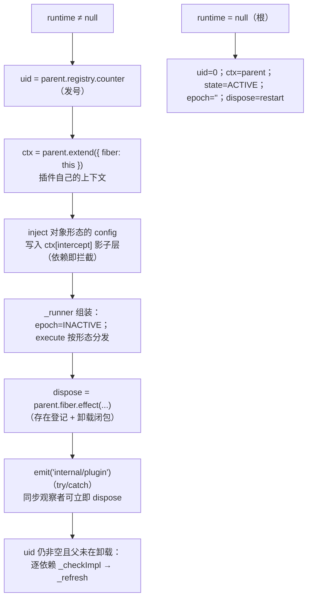
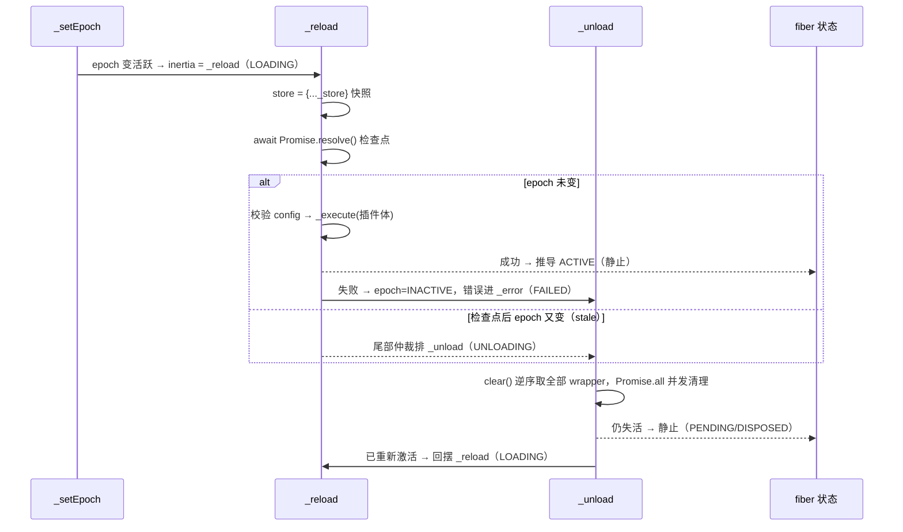
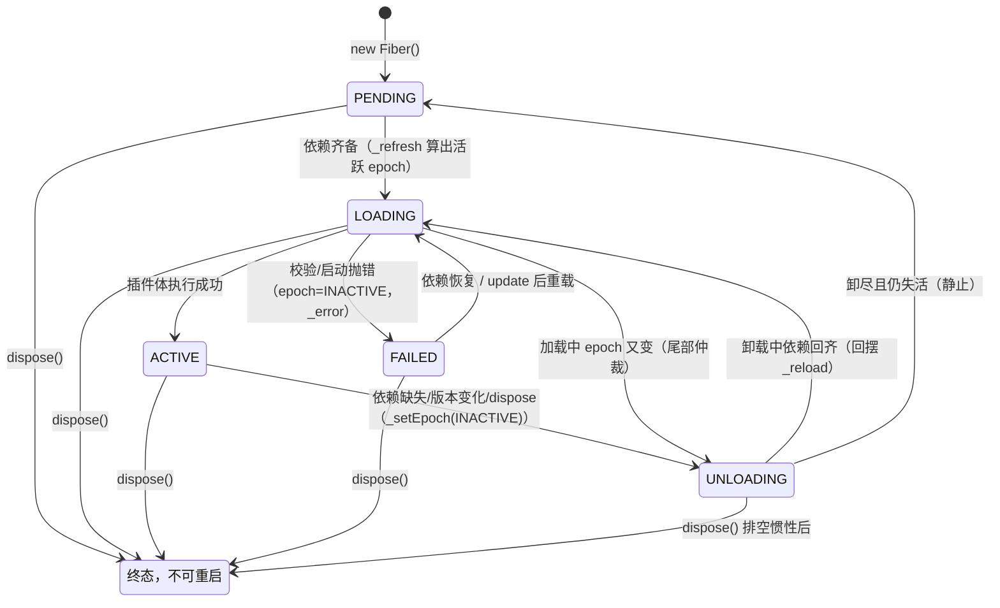

# 06 · `fiber.ts` 精读（上）—— 生命周期状态机（约 400 行段）

| | |
|---|---|
| 职责 | FiberState 状态机、epoch 版本号、构造器与 dispose 链、reload/unload 回摆、update/restart |
| 依赖 | context / registry(类型) / utils |
| 前置阅读 | [03-reflect.md](03-reflect.md)（store/notify）、[05-registry.md](05-registry.md) §8（plugin() 如何建 Fiber） |
| 下册 | [07-effect.md](07-effect.md)（effect 类型系统、`_execute` 解释器、`effect()` 全景） |
| 本册 TS 知识点 | `const enum`、symbol 品牌、class+namespace 同名合并、thenable 鸭子类型、`Iterable` 三参泛型、WeakMap 语义 |

## 1. Context 声明合并（L9–14）

```ts
declare module './context.ts' {
  export interface Context extends Pick<Fiber, 'effect'> {
    fiber: Fiber
  }
}
```
- **接口继承 + 工具类型**：把 `Fiber` 类上的 `effect` 方法"摘"进 Context（`ctx.effect(...)` 等价 `ctx.fiber.effect(...)`，reflect 的 mixin 在运行时转发）。加上 `fiber` 属性本身。

## 2. 配置校验与错误类型（L16–62）

```ts
const kValidationError = Symbol.for('ValidationError')

export class ValidationError extends TypeError {
  name = 'ValidationError'

  constructor(issues: readonly StandardSchemaV1.Issue[]) {
    super(`invalid config:\n` + issues.map(issue => {
      if (issue.path) {
        return `  - ${issue.message} (at ${issue.path.join('.')})`
      } else {
        return `  - ${issue.message}`
      }
    }).join('\n'))
  }
}

Object.defineProperty(ValidationError.prototype, kValidationError, {
  value: true,
})
```
- 继承 `TypeError`（配置错本质是"喂错了值"）；实例字段 `name` 覆盖原型的 `name`。
- 构造器把 standard-schema 的 issues 格式化成多行消息（每条缩进两格，带路径的追加 `(at a.b.c)`——`path` 是 `(string|symbol|number)[]`）。
- 原型挂 `kValidationError = true` **品牌标记**（不可枚举、只读）：外部用 `error[kValidationError]` 识别校验错误而不依赖 instanceof（跨拷贝安全，`Symbol.for` 全局注册）。

```ts
export function resolveConfig(runtime: Plugin.Runtime, config: any) {
  if (!runtime.Config) return config
  // TODO: async validation
  const result = runtime.Config['~standard'].validate(config)
  if ('then' in result) {
    throw new TypeError('Async config validation is not supported')
  }
  if (result.issues) {
    throw new ValidationError(result.issues)
  } else {
    return result.value
  }
}
```
- Standard Schema v1 协议：校验器挂 `Config['~standard']`，`validate()` 返回 `{ value }`（成功）或 `{ issues }`（失败）。协议允许异步（Promise），但 fiber 启动是同步管线，此处显式拒绝（`'then' in result` 鸭子判定）。
- 无 schema 透传原 config；有 issues 抛 ValidationError；否则返回**规范化后的** `result.value`（schema 可做默认值填充/强制转换）——这就是 `_config`（原始）与 `config`（校验后）的差别。

## 3. `FiberState` / `CordisError` / INACTIVE（L147–176）

```ts
export const enum FiberState {
  PENDING,
  LOADING,
  ACTIVE,
  FAILED,
  DISPOSED,
  UNLOADING,
}
```
- **const enum**：成员编译期内联，无运行时对象、零开销。六状态：PENDING(0) 等依赖、LOADING(1) 插件体执行中、ACTIVE(2) 提供&运行、FAILED(3) 失败、DISPOSED(4) 已销毁不可重启、UNLOADING(5) 清理中。主链 PENDING→LOADING→ACTIVE，FAILED/DISPOSED/UNLOADING 是旁路。

```ts
export class CordisError extends Error {
  constructor(public code: CordisError.Code, message?: string) {
    super(message ?? CordisError.Code[code])
  }
}

export namespace CordisError {
  export type Code = keyof typeof Code

  export const Code = {
    INACTIVE_EFFECT: 'cannot create effect on inactive context',
  } as const
}
```
- **带稳定错误码的错误**：`code` 参数属性是机器可读键；message 缺省取码表人话。class+namespace 同名合并承载码表（`as const` 锁字面量、`keyof typeof` 导出联合）。目前唯一码 `INACTIVE_EFFECT`：在已销毁/卸载中的 fiber 上注册 effect 时抛。

```ts
const INACTIVE = '__INACTIVE__'
```
- epoch 的**失活哨兵值**：`_runner.epoch` 平时是依赖版本串（如 `':3:5'`），失活时置此常量（§5.3）。

## 4. `Fiber` 类：字段（L184–235）

```ts
export class Fiber {
  public uid: number | null
  public readonly ctx: Context
  public config: any
  public _config: any
  public state = FiberState.PENDING
  public readonly dispose: () => Promise<void>
  public store: Dict<Impl> | undefined
  public inertia: Promise<void> | undefined

  public readonly _hooks: Dict<DisposableList<Function>> = Object.create(null)
  public readonly _disposables = new DisposableList<Disposable>()

  protected context: Context

  private _error: any
  private _runner: EffectRunner<string>
  private _store: Dict<Impl> = Object.create(null)
```

字段分四组：

- **公开状态**：`uid`（注册表发号；**null 即已销毁**——assertActive 的判据）；`ctx`（本 fiber 的插件上下文 `parent.extend({ fiber: this })`）；`config`（校验后配置）；`_config`（原始配置，每次激活前重新解析——`internal/config` waterfall 可能改写）；`state`（初始 PENDING）；`dispose`（构造器赋值的只读方法：卸载并等待落定）；`store`（**加载期间的依赖+自有服务快照**，未加载时 undefined——代理 get 陷阱用 `?.` 探测）；`inertia`（**在途的加载/卸载转换**，undefined=静止）。
- **清理容器**：`_hooks`（事件名 → DisposableList；目前仅 `internal/update` 纤维级钩子用，[04-events.md](04-events.md) §2.2）；`_disposables`（全部 effect wrapper 的登记处，卸载时整体清空）。
- **protected `context`**：源码注释"与 `this.ctx` 同值，但类型更具体"——同引用双名，供内部以更精确类型使用。
- **私有**：`_error`（最近一次启动错误，`await()` 重抛）；`_runner`（epoch + execute + collect，见 [07-effect.md](07-effect.md)）；`_store`（**依赖解析的真相源**——`_checkImpl` 随时增删）。

> **`store` vs `_store` 是关键设计**：`_store` 永远反映"当前依赖可用性"；`store` 只在加载开始时**冻结快照**，插件运行期读到的服务集合稳定一致。

## 5. 构造器（L237–341）

### 5.1 公共前段

```ts
  constructor(
    public parent: Context,
    config: any,
    public inject: Dict<any>,
    public runtime: Plugin.Runtime | null,
    getOuterStack: () => string[],
  ) {
    this._config = config
    const collect = (dispose: Disposable) => {
      this._disposables.push(dispose)
    }
```
- 参数属性直接声明 `parent`/`inject`/`runtime`。`collect` 是 runner 的收集器：清理函数进 fiber 级 `_disposables`（remover 丢弃——由 fiber 卸载统一执行）。

### 5.2 插件 fiber 分支



```ts
    if (runtime) {
      this.uid = parent.registry.counter
      this.ctx = this.context = parent.extend({ fiber: this })
```
- 取号（counter 读取即自增）；派生**本插件的上下文**——此后 `ctx.fiber` 指向本 fiber，`ctx.effect/on/provide` 全部归属本 fiber。

```ts
      const injectEntries = Object.entries(this.inject)
      if (injectEntries.length) {
        this.ctx[Context.intercept] = Object.create(parent[Context.intercept])
        for (const [name, config] of injectEntries) {
          if (isNullable(config)) continue
          this.ctx[Context.intercept][name] = config
        }
      }
```
- **依赖声明同时是拦截配置**：inject 对象形态里每个非 null config 写成本 ctx 的 intercept 覆盖层（以父 intercept 为原型的影子映射）。"我注入 database 并给出 `{ pool: 2 }`"="在我这个插件里，database 服务解析配置时合并 pool:2"（[08-service.md](08-service.md) §4 的机制被此处激活）。数组形态（config 全 null）不建层。内层 `config` 遮蔽外层参数名。

```ts
      this._runner = {
        epoch: INACTIVE,
        getOuterStack,
        execute: function () {
          if (isConstructor(runtime.callback)) {
            // eslint-disable-next-line new-cap
            const instance = new runtime.callback(this.ctx, this.config)
            for (const hook of instance?.[symbols.initHooks] ?? []) {
              hook()
            }
            return instance?.[symbols.init]?.()
          } else {
            return runtime.callback(this.ctx, this.config)
          }
        },
        collect,
      }
```
- runner 初始 `epoch = INACTIVE`（PENDING，未激活）。`execute` 用 **function（非箭头）**——`this` 由 `_execute` 的 `execute.call(this)` 绑定为 fiber：
  - **类插件**：`new callback(ctx, config)`；随后执行 `@Inject` 方法装饰器攒下的 `initHooks`（[05-registry.md](05-registry.md) §3——方法级注入在实例化后立即挂接）；最后 `instance[symbols.init]?.()`（Service 基类的"构造后初始化"入口，[08-service.md](08-service.md)）。
  - **函数/对象插件**：直接调用（对象插件的 callback 就是解出的 apply 方法）。
  - 返回值交给 `_execute` 按 Effect 形态解析——**插件体本身就是一个 effect**（返回清理函数/生成器都合法，[07-effect.md](07-effect.md) §2）。

**dispose = 一个 effect**（完整卸载闭包，逐行拆）：

```ts
      this.dispose = parent.fiber.effect(() => {
        const remove = runtime.fibers.push(this)
        return async () => {
          this.uid = null
          emitPluginDisposed(this.context, this)
          if (this.ctx.registry.has(runtime.callback)) {
            remove()
            if (!runtime.fibers.length) {
              this.ctx.registry.delete(runtime.callback)
            }
          }
          this._setEpoch(INACTIVE)
          if (!this.inertia) {
            this._updateState(() => {
              this.inertia = this._unload()
              return FiberState.UNLOADING
            })
          }
          while (this.inertia) {
            await this.inertia
          }
        }
      }, 'ctx.plugin()')
```
1. **存在登记**：把自己推进 `runtime.fibers`（拿 remover）。fiber 的存在是父 fiber 上的 effect，**销毁即 effect 清理**。
2. `uid = null`——**先标死**：此后任何 `assertActive` 拒绝；并发保护第一道闸。
3. `emitPluginDisposed`：通知 `internal/plugin` 观察者（**防御式发射**：dispatch 与每个回调各自 try/catch、异步错误兜底记日志，绝不让观察者打断卸载——[07-effect.md](07-effect.md) §1.3）。
4. 从 runtime 摘除；**最后一个** fiber 则连 runtime 记录删除（注册表不留空壳）。`registry.has` 先检查——delete 内部会再逐 fiber dispose，条件保证不递归。
5. `_setEpoch(INACTIVE)`：触发卸载管线（LOADING/ACTIVE 会启动 `_unload`）。
6. **PENDING 特例**：从未激活的 fiber（epoch 本来就是 INACTIVE，`_setEpoch` 无转换可驱动）也可能持有 effect（`internal/plugin` 观察者在 PENDING 期注册的资源）。`if (!this.inertia)` 手动启动一次 `_unload` 清空它们。
7. `while (this.inertia) await this.inertia`：**排空惯性链**——卸载中依赖若又变化，`_unload` 结尾可能再排 `_reload`，循环等彻底静止（dispose 的 promise 才落定）。

```ts
      try {
        // Publish only after the parent owns a fully assigned disposer. A
        // synchronous observer may dispose either this fiber or its parent.
        this.context.emit('internal/plugin', this)
      } catch (error) {
        // Publication failed synchronously. The disposer removes the child
        // from both the parent and runtime before control escapes.
        void Promise.resolve(this.dispose()).catch(reason => this.ctx.logger.error(reason))
        throw error
      }

      // Keep the initial notification's historical PENDING view. The loader
      // may also extend `inject` in that notification, so resolve dependencies
      // only after publication. A reentrant parent unload makes the child
      // disposer responsible for draining any PENDING effects instead.
      if (this.uid !== null && parent.fiber.state !== FiberState.UNLOADING) {
        for (const name of Object.keys(this.inject)) {
          this._checkImpl(name)
        }
        this._refresh()
      }
    }
```
- **先发布、后接线**（顺序刻意，注释原文说明）：`internal/plugin` 的同步观察者可能当场 dispose 本 fiber 或父 fiber——所以 dispose 必须已完全就位。发布本身同步抛错：异步触发完整清理（`void` + catch 兜底），原错误上抛给 `ctx.plugin()` 调用方。
- 发布后（未被销毁、父未在卸载）才**接线依赖**：逐项 `_checkImpl` → `_refresh` 算 epoch。放发布之后的原因：观察者可能在事件里扩展 `inject`；父的卸载会经子 disposer 自行排空 PENDING 期 effect。

### 5.3 根 fiber 分支与 `name`

```ts
    } else {
      this.uid = 0
      this.ctx = this.context = parent
      this.state = FiberState.ACTIVE
      this.store = Object.create(null)
      this._runner = {
        epoch: '',
        getOuterStack,
        execute: () => {},
        collect,
      }
      this.dispose = () => this.restart()
    }
  }

  get name() {
    let fiber: Fiber = this
    do {
      if (fiber.runtime?.name) return fiber.runtime.name
      fiber = fiber.parent.fiber
    } while (fiber !== fiber.parent.fiber)
    return 'root'
  }

  assertActive() {
    if (this.uid !== null) return
    throw new CordisError('INACTIVE_EFFECT')
  }
```
- 根：uid 固定 0；ctx 即根代理自身；**天生 ACTIVE**；store 空对象（代理 `?.` 不炸）；`epoch = ''`（空串 ≠ INACTIVE，永为"激活态"）；execute 空函数；`dispose = restart`——根不可销毁，"销毁"退化为重启（实际从不发生）。
- `name`：沿 `parent.fiber` 上溯（do-while 至根——条件 `fiber !== fiber.parent.fiber` 在根自指终止），返回最近的**具名 runtime** 名，无名则 `'root'`（匿名插件向上"借用"祖先名）。
- `assertActive`：uid 是唯一真相（DISPOSED 状态也由 uid=null 推导）。

## 6. 状态机：`_getState` / `_updateState`（L563–590）

```ts
  private _getState() {
    if (this.uid === null) return FiberState.DISPOSED
    if (this._error) return FiberState.FAILED
    if (this._runner.epoch !== INACTIVE) return FiberState.ACTIVE
    return FiberState.PENDING
  }
```
- **状态是推导值**，优先级：已销毁 > 有错误 > epoch 活跃 > 等待。LOADING/UNLOADING 是**瞬态**，只由转换函数显式设置，推导永不产出。

```ts
  private _updateState(callback: () => void | FiberState) {
    const oldState = this.state
    this.state = callback() ?? this._getState()
    if (oldState === this.state) return
    // FIXME internal/fiber-info
    this.context.emit('internal/status', this, oldState)

    // only notify changes between ACTIVE and NON-ACTIVE states
    if (oldState !== FiberState.ACTIVE && this.state !== FiberState.ACTIVE) return
    for (const key of Reflect.ownKeys(this.ctx.reflect.store)) {
      const impl = this.ctx.reflect.store[key as symbol]
      if (impl.fiber !== this) continue
      this.ctx.reflect.notify([impl.name])
    }
  }
```
- 状态机中枢：callback 可**显式给瞬态**（返回 LOADING/UNLOADING）；否则 `?? _getState()` 推导。变了才广播 `internal/status`。
- **ACTIVE 边界规则**：只有"跨过 ACTIVE 线"的迁移才通知服务层——本 fiber 是 provider 的每个服务（遍历 reflect.store 找 `impl.fiber === this`）逐个 `notify`，唤醒依赖方加载/卸载。非 ACTIVE↔非 ACTIVE 的迁移（PENDING↔LOADING、FAILED↔PENDING）不惊动依赖方。
- `Reflect.ownKeys(store)` 枚举 symbol 键（store 以隔离键为键）；`as symbol` 断言窄化索引。

## 7. 依赖解析与代数（L592–632）

```ts
  _checkImpl(name: string) {
    const impl = this.ctx.reflect._getImpl(name, true)
    if (!impl) return delete this._store[name]
    try {
      if (impl.check && !impl.check.call(getTraceable(this.ctx, impl.value))) {
        return delete this._store[name]
      }
    } catch (error) {
      impl.fiber.ctx.logger.error(error)
      return delete this._store[name]
    }
    this._store[name] = impl
  }
```
- 单依赖重估：strict 查询（provider 必须 ACTIVE）；查无 → 从 `_store` 删除（**delete 表达式返回 true**——提前返回兼做布尔）。有 `check` 谓词则**以追踪化后的服务值为 this** 调用（谓词里 this 上的方法也正确重绑 ctx），不过/抛错（记到 **provider 的** logger——check 是 provider 的代码）都视为不可用；全过记入 `_store`。

```ts
  _refresh() {
    let epoch: string | boolean = false
    epoch = ''
    for (const name of Object.keys(this.inject)) {
      const impl = this._store[name]
      if (!impl) {
        epoch = INACTIVE
        break
      }
      epoch += ':' + impl.fiber.uid
    }
    this._setEpoch(epoch)
  }
```
- **代数计算**：遍历声明的依赖，任一缺失 → epoch = INACTIVE；否则拼 `':uid1:uid2...'` **版本串**。uid 是注册表单调发号，**同一服务重启会换新 fiber/新 uid**——"依赖的版本变了"必然反映为 epoch 变化。头两行 `let epoch: string | boolean = false; epoch = ''` 是为类型标注服务的写法。根 fiber inject 为空 → epoch 恒 `''`。

```ts
  private _setEpoch(epoch: string) {
    const oldEpoch = this._runner.epoch
    if (epoch === oldEpoch) return
    this._runner.epoch = epoch
    if (this.inertia) return
    this._updateState(() => {
      if (epoch !== INACTIVE && oldEpoch === INACTIVE) {
        this.inertia = this._reload()
        return FiberState.LOADING
      } else {
        this.inertia = this._unload()
        return FiberState.UNLOADING
      }
    })
  }
```
- **代数驱动的转换**：epoch 不变（依赖版本没变）→ 什么都不做；变了 → 写入新值。**已有转换在途**（inertia 非空）→ 只更新 epoch，让在途转换的尾部 `_updateState` 自行决定下一步；否则启动新转换：`INACTIVE → 非INACTIVE`（依赖齐了/换新了）→ `_reload` + LOADING；其余（激活→失活、活跃版本切换）→ `_unload` + UNLOADING。
- "活跃版本切换"（依赖的 database 换了新 fiber）走 unload→reload 全循环——插件整体重启，**绝不会拿到新旧混合的依赖集合**。

## 8. 双向转换：`_resolveConfig` / `_reload` / `_unload`（L634–712）

```ts
  private _resolveConfig(config: any) {
    config = this.context.waterfall(this, 'internal/config', config, () => config)
    return this.runtime ? resolveConfig(this.runtime, config) : config
  }
```
- 先过 `internal/config` waterfall（thisArg = fiber 自身；外部/HMR 可改写 config），再走 schema 校验。根 fiber 不校验。



```ts
  private async _reload() {
    this.store = { ...this._store }
    const oldEpoch = this._runner.epoch
    try {
      await Promise.resolve()
      // A disposer queued before this checkpoint may already have invalidated
      // the load. Do not run plugin code for a stale epoch; the state update
      // below will drain any effects collected while the fiber was PENDING.
      if (this._runner.epoch === oldEpoch) {
        this.config = this._resolveConfig(this._config)
        await this._execute(this._runner)
        this._error = undefined
      }
    } catch (reason) {
      // impl guarantees that the error is non-null (?)
      this.ctx.logger.error(reason)
      this._error = reason
      this._runner.epoch = INACTIVE
    }
    this._updateState(() => {
      if (this._runner.epoch === oldEpoch) {
        this.inertia = undefined
      } else {
        this.inertia = this._unload()
        return FiberState.UNLOADING
      }
    })
  }
```
- 加载流程：
  1. **快照**：`store = { ..._store }`——冻结当前依赖解析结果给插件运行期。
  2. 记 oldEpoch；`await Promise.resolve()` **检查点**——让微任务队列里排在前面的销毁器（fiber 刚建就立即 dispose 的竞态）先跑；检查点后 **epoch 仍一致**才继续（过期加载跳过）。
  3. 解析配置（waterfall + 校验，可能抛）→ 执行插件体 `_execute(runner)`（插件体是 effect：返回的清理函数/生成器产物全部入账，[07-effect.md](07-effect.md) §2）→ 清 `_error`。
  4. **catch**：记日志、存 `_error`、epoch 打回 INACTIVE——加载失败自动失活（推导为 FAILED）。
  5. **尾部仲裁**：epoch 未再变 → 惯性清零（静止，推导 ACTIVE）；**又变了**（加载期间依赖变动/被 dispose）→ 排 `_unload`——加载完成的服务接着被正确拆掉。

```ts
  private async _unload() {
    await Promise.all(this._disposables.clear().map(async (dispose) => {
      try {
        await composeError(async (info) => {
          await Promise.resolve()
          info.error = new Error()
          await runDisposable(dispose)
        }, this._runner.getOuterStack)
      } catch (reason) {
        this.ctx.logger.error(reason)
      }
    }))
    this.store = undefined
    this._updateState(() => {
      if (this._runner.epoch === INACTIVE) {
        this.inertia = undefined
      } else {
        this.inertia = this._reload()
        return FiberState.LOADING
      }
    })
  }
```
- 卸载流程：
  1. `_disposables.clear()` **取走全部 wrapper（逆序）**，`Promise.all` **并发**执行（互不依赖的清理不必串行——与单 effect 内部的逆序串行是不同层级）。每个 wrapper 包 `composeError`（长堆栈拼接）+ `await Promise.resolve()` 检查点 + 错误锚点；单个失败记日志**不影响其他清理**。
  2. `runDisposable`（[07-effect.md](07-effect.md) §1.4）：执行 wrapper 并 join 其在途清理（异步 teardown 也被等待）。
  3. 快照作废 `store = undefined`（代理 `?.` 探测到未加载）。
  4. 尾部仲裁与 `_reload` 对称：仍失活 → 静止；**已重新激活**（卸载期间依赖回来了）→ 排 `_reload`——卸载→加载的**回摆**。

## 9. 对外 API：`await` / `restart` / `update`（L714–754）

```ts
  async await() {
    while (this.inertia) {
      await this.inertia
    }
    if (this._error) throw this._error
    return this
  }

  async restart() {
    this.assertActive()
    this._setEpoch(INACTIVE)
    this._refresh()
    await this.await()
  }

  update(config: any, noSave = false) {
    this.assertActive()
    this._config = config
    if (this.state !== FiberState.ACTIVE) {
      // Config resolution may access injected services, so defer it until the
      // fiber can activate.
      this._error = undefined
      this._setEpoch(INACTIVE)
      this._refresh()
      return
    }
    config = this._resolveConfig(config)
    return this.context.waterfall(this, 'internal/update', config, noSave, () => {
      this.config = config
      this._error = undefined
      return this.restart()
    })
  }
```
- **await**：排空惯性链（卸载可能回摆加载，循环到 undefined）；有错**重抛**（`await ctx.plugin(...)` 的 reject 来源）；无错返回自身（可链式）。
- **restart** = 强制失活（`_setEpoch(INACTIVE)` 触发 `_unload`）→ 立即 `_refresh()`（依赖在则算出活跃 epoch——但 inertia 在途，`_setEpoch` 只改值）→ 在途卸载的尾部仲裁发现 epoch 已非 INACTIVE → 排 `_reload` → await 排空。净效果：完整卸载+加载一轮。
- **update** 三分支：存活检查；**非 ACTIVE**（PENDING/FAILED）只存 `_config`、清错、重算 epoch——配置解析推迟到激活时（注释：解析可能要访问注入的服务，非激活态拿不到）；**ACTIVE** 则**立刻**解析新配置（校验错误当场抛给调用方），然后 `internal/update` waterfall（`noSave` 提示持久化钩子"不要写回存储"——磁盘加载后的回放更新）。默认 next：提交 `this.config`、清错、`restart()`。**监听器不调 next 即否决更新**（HMR 的 hook 点）；返回 waterfall 结果。
- `update` 与 `restart` 分工：update 走钩子+校验，restart 是纯重启。

## 10. 状态机总图



补充：根 fiber 构造即 ACTIVE（epoch 恒空串、永不失活），不参与循环；PENDING/FAILED/DISPOSED 均为推导值（uid/_error/epoch），LOADING/UNLOADING 是转换函数显式设置的瞬态。

## 11. TypeScript 进阶知识点

### 11.1 `const enum`：零成本枚举

```ts
export const enum FiberState { PENDING, LOADING, ... }
// 使用处直接内联为 0/1/2...
fiber.state === FiberState.ACTIVE   // → fiber.state === 2
```
普通 enum 生成运行时对象；const enum **编译期消解**。代价：跨包导出的 const enum 在 `isolatedModules` 下受限——cordis 单包内使用无碍，下游引用需 `preserveConstEnums` 或普通 enum。

### 11.2 symbol 品牌标记

```ts
Object.defineProperty(ValidationError.prototype, kValidationError, { value: true })
// 识别：error[kValidationError] === true（不依赖 instanceof，跨拷贝安全）
```
比 `instanceof` 稳（多份 cordis 拷贝/不同 realm 的 Symbol.for 键相同）。与 [02-context.md](02-context.md) 的 `Context.is` 品牌同族；仓库里的 `Branded<B>`（dsh-brand）是同一思想在类型层的版本。

### 11.3 class + namespace 同名合并

```ts
export class CordisError extends Error { ... }
export namespace CordisError {
  export type Code = keyof typeof Code
  export const Code = { ... } as const
}
```
运行时 namespace 里的 `const` 成为挂在类上的静态成员；类型上 namespace 与类声明合并——`CordisError.Code` 既是值（构造器属性）又是类型。

### 11.4 thenable 鸭子类型

```ts
if ('then' in result) { throw new TypeError('Async config validation is not supported') }
```
"有 then 属性"即被当 Promise 对待。这里**反向利用**：检测出异步结果并拒绝。判定比 `instanceof Promise` 宽（兼容 thenable），也比 `typeof result.then === 'function'` 简化（`'then' in` 已足够此场景）。

### 11.5 `Iterable<T, TReturn, TNext>` 三参泛型

```ts
type SyncEffect<T> = Disposable<T> | Iterable<Disposable<T>, void, void>
```
内建 `Iterable` 的完整签名：yield 类型、return 类型、next 参数类型。生成器 `function* () { yield d }` 的类型是 `Generator<D, void, unknown>`——`Iterable<D, void, void>` 是"最简单可用"的约束面（[07-effect.md](07-effect.md) §2 详述）。

### 11.6 WeakMap 承载"可选关联"

```ts
const effectInertia = new WeakMap<Disposable, () => void | Promise<void>>()
```
"销毁器 → 在途清理任务"的关联只对**活着的**销毁器有意义；WeakMap 键被 GC 后条目自动消失——不需要手动清理的旁路注册表（[07-effect.md](07-effect.md) §1.4 消费它）。

## 12. 自测

1. `_getState` 为什么永远不返回 LOADING/UNLOADING？这两个值从哪来？
2. `dispose` 闭包里为什么先 `uid = null` 再通知观察者？`while (this.inertia)` 在等什么？
3. 依赖的 database 服务重启（新 fiber 新 uid），消费方插件经历哪些状态？为什么不能"原地换依赖"？
4. `_reload` 的 `await Promise.resolve()` 检查点防的是什么竞态？
5. `update` 在非 ACTIVE 状态为什么不立即校验配置？
