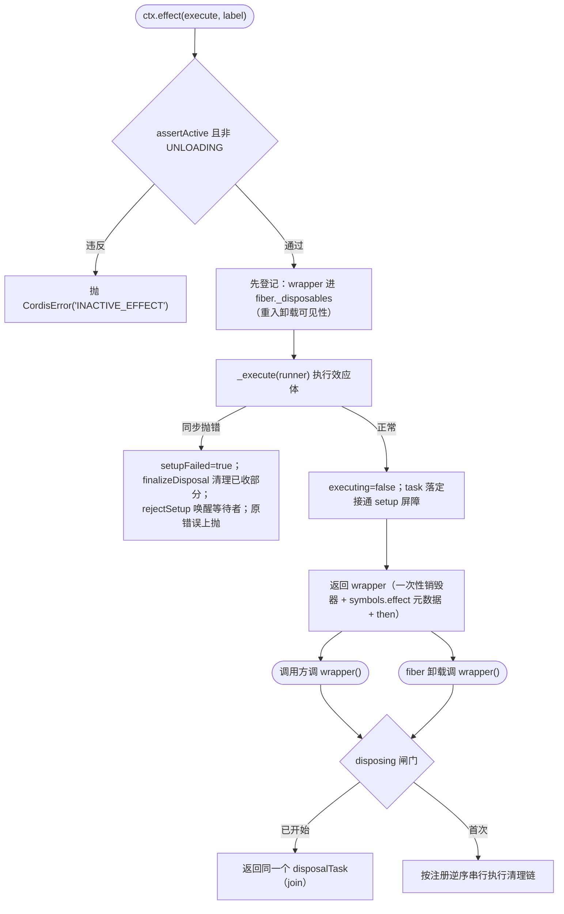
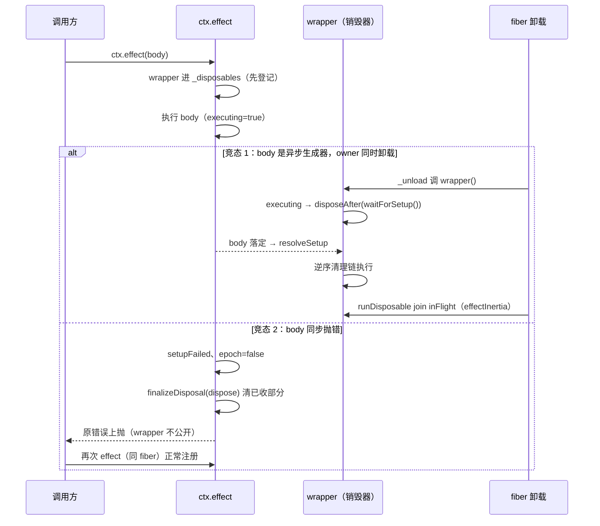

# 07 · `fiber.ts` 精读（下）—— effect 机制全景（约 350 行段）

| | |
|---|---|
| 职责 | Effect 类型系统、`_execute` 效应解释器、`effect()` 的并发安全闭环、诊断树 |
| 依赖 | 承接 [06-fiber.md](06-fiber.md)（fiber 字段与 `_disposables`） |
| 前置阅读 | [06-fiber.md](06-fiber.md) §5–§8 |
| 本册 TS 知识点 | 可调用 + thenable 交叉接口、联合形状建模、`void` vs `undefined`、definite assignment、async IIFE、闭包状态机 |

## 1. 类型系统与模块级辅助（L64–137）

### 1.1 `AsyncDisposable`：既能调用又能 await

```ts
interface AsyncDisposable<T extends Awaitable<void> = Awaitable<void>> extends PromiseLike<() => T> {
  (): T
}
```
- **调用签名 `(): T` + `PromiseLike<() => T>`** 的交叉——`ctx.effect()` 的返回值：直接调用（dispose），或 `await`（等清理完成后拿到 dispose 函数）。`Awaitable<T>`（cosmokit）= `[T] extends [Promise<unknown>] ? T : T | Promise<T>`。

### 1.2 `Disposable` / `Effect`：效应体的四种合法形状

```ts
export type Disposable<T = any> = () => T

export type Effect<T = any> =
  | SyncEffect<T>
  | AsyncEffect<T>

type SyncEffect<T = any> =
  | Disposable<T>
  | Iterable<Disposable<T>, void, void>

type AsyncEffect<T = any> =
  | Promise<Disposable<T>>
  | AsyncIterable<Disposable<T>, void, void>
```
- effect 体可返回：**单个清理函数 / 同步可迭代（生成器逐个 yield）/ 清理函数的 Promise / 异步可迭代**。
- `Iterable<T, TReturn, TNext>` 三参泛型限定为最简的 `void, void`（[06-fiber.md](06-fiber.md) §11.5）。
- 生成器形态的意义：effect 执行可**分批产出**清理函数（mixin 的 `function*` 每个 yield 一个 accessor 销毁器），`_execute` 边收边登记；异步迭代还能在 epoch 变化时**中途止损**。

```ts
export interface EffectMeta {
  label: string
  children: EffectMeta[]
}
```
- 诊断树节点：effect 标签 + 执行期间嵌套注册的子 effect 元数据（`ctx.fiber.getEffects()` 展示）。

```ts
interface EffectRunner<T> {
  epoch: T
  execute: () => any
  collect: (dispose: Disposable) => void
  getOuterStack: () => string[]
}
```
- 内部执行器协议：`epoch`（**代数标记**——fiber 的依赖版本串或 effect 的存活布尔）；`execute`（插件体/效应体）；`collect`（清理函数去向）；`getOuterStack`（外层栈拼接）。

### 1.3 `effectInertia` 与 `runDisposable`：join 他人已开始的清理

```ts
// Public effect disposers remain single-shot, but structural owners and outer
// effects must still be able to join a cleanup that another caller started.
const effectInertia = new WeakMap<Disposable, () => void | Promise<void>>()

function runDisposable(dispose: Disposable) {
  const result = dispose()
  return effectInertia.get(dispose)?.() ?? result
}
```
- 背景注释点明张力：effect 的公开销毁器是**一次性**的，但结构化拥有者（fiber 卸载）或外层 effect 需要**加入**别人已启动的清理。`effectInertia`（"惯性"表）登记销毁器 → 在途清理任务；`runDisposable` 执行销毁器后，若带惯性则改返回惯性任务——等待方据此 join 而非重复触发。WeakMap：销毁器被 GC 后条目自动消失。

### 1.4 `emitPluginDisposed`：防御式事件发射

```ts
/** Notify plugin teardown without allowing one observer to break ownership cleanup. */
function emitPluginDisposed(context: Context, fiber: Fiber) {
  const args: any[] = ['internal/plugin', fiber]
  let callbacks: Function[]
  try {
    callbacks = context.events.dispatch('emit', args)
  } catch (error) {
    context.logger.error(error)
    return
  }
  for (const callback of callbacks) {
    try {
      const returned = callback(...args)
      void Promise.resolve(returned).catch(error => context.logger.error(error))
    } catch (error) {
      context.logger.error(error)
    }
  }
}
```
- fiber 已在销毁中，观察者的错误**绝不能**打断卸载：解析监听器（dispatch 本身可能抛——`Context.filter` 谓词坏掉等）→ catch 记日志返回；逐回调 try/catch，同步错误记日志继续，异步错误 `Promise.resolve(returned).catch(...)` 兜底（`void` 显式表态"有意不 await"）。这是 docs/defensive-patterns.md 所述模式的范本。

## 2. `_execute`：效应解释器（L343–392）

```ts
  private _execute<T>(runner: EffectRunner<T>) {
    const oldEpoch = runner.epoch
    return composeError((info) => {
      const safeCollect = (dispose: void | Disposable) => {
        if (typeof dispose === 'function') {
          runner.collect(dispose)
        } else if (!isNullable(dispose)) {
          throw new TypeError('Invalid effect')
        }
      }
      const effect: Effect = runner.execute.call(this)
      if (typeof effect === 'function') {
        return runner.collect(effect)
      } else if (isNullable(effect)) {
        // return
      } else if (!isObject(effect)) {
        throw new TypeError('Invalid effect')
      } else if ('then' in effect) {
        return effect.then(safeCollect)
      } else if (Symbol.iterator in effect) {
        info.error = new Error()
        const iter = effect[Symbol.iterator]()
        while (true) {
          const result = iter.next()
          safeCollect(result.value)
          if (result.done) return
        }
      } else if (Symbol.asyncIterator in effect) {
        const iter = effect[Symbol.asyncIterator]()
        return (async () => {
          // force async stack trace
          await Promise.resolve()
          info.error = new Error()
          while (true) {
            if (runner.epoch !== oldEpoch) return
            const result = await iter.next()
            safeCollect(result.value)
            if (result.done) return
          }
        })()
      } else {
        throw new TypeError('Invalid effect')
      }
    }, runner.getOuterStack)
  }
```

- `composeError` 包裹（[01-utils.md](01-utils.md) §4）：内部抛错拼接外层栈。`oldEpoch` 先存——异步迭代要用它检测"这轮执行是否已过期"。
- `safeCollect`：**类型收窄式收集**——函数收集；null/undefined 合法（yield/return 无值，忽略）；其他任何值抛 TypeError。参数类型 `void | Disposable` 精确描述两种合法入参（`void` 表示"调用方不打算传值"）。
- 执行 `runner.execute.call(this)`（this = fiber），按**返回形态分发**（对应 §1.2 的类型系统）：
  1. **函数** → 单个清理函数，直接收集。
  2. **null/undefined** → 纯副作用无清理（空注释标注意图）。
  3. **非对象**（数字/字符串等）→ TypeError。
  4. **`'then' in effect`** → Promise：`then(safeCollect)`——resolve 出的清理函数被收集。
  5. **`Symbol.iterator in effect`** → 同步生成器：拉平迭代，每个 yield 值经 safeCollect，`done` 终止。`info.error = new Error()` 重新锚定堆栈（迭代中收集的清理函数将来抛错时对齐）。
  6. **`Symbol.asyncIterator in effect`** → 异步生成器：返回 async IIFE 的 promise（外层 composeError 的 then 分支接管 rejection）。两个细节：`await Promise.resolve()` **强制断开同步栈**（让 V8 生成异步堆栈锚点，注释 "force async stack trace"）；循环内**每轮检查 epoch**——依赖变化/失活后立即停止拉取（生成器还挂着未 yield 的清理函数，但 fiber 已在卸载，多余的清理无意义）。
  7. 兜底 TypeError。

## 3. `effect()`：通用效应注册（L394–561）

### 3.0 目标与总体结构

`ctx.effect(execute, label)` 要同时满足：立即执行效应体；清理函数**要么被公开销毁器触发、要么随 fiber 卸载执行**，两路并发安全；可重复调用（幂等）；可 join（等待他人开始的清理）；可 await（thenable）。



### 3.1 签名与守卫

```ts
  effect(execute: () => SyncEffect, label?: string): Disposable<Promise<void>>
  effect(execute: () => Effect, label?: string): AsyncDisposable<Promise<void>>
  effect(execute: () => Effect, label = 'anonymous'): any {
    this.assertActive()
    if (this.state === FiberState.UNLOADING) {
      throw new CordisError('INACTIVE_EFFECT')
    }
```
- 两个重载（同步效应的销毁器返回 `Disposable<Promise<void>>`；异步效应返回可 thenable 的 `AsyncDisposable`）；实现签名 `any`（动态形态由运行时决定，重载对调用方收口）。
- 双重存活检查：**已销毁**（uid null）或**正在卸载**（UNLOADING——清理途中再注册只会泄漏）都拒绝。

### 3.2 `dispose`：本 effect 的清理链

```ts
    const disposables: Disposable[] = []
    let disposing = false
    let disposalTask: void | Promise<void>
    const dispose = () => {
      if (disposing) return disposalTask
      disposing = true
      let task!: void | Promise<void>
      for (const disposable of disposables.splice(0).reverse()) {
        if (task) {
          task = task.then(() => runDisposable(disposable))
        } else {
          const result = runDisposable(disposable)
          if (isObject(result) && 'then' in result) {
            task = result as any
          }
        }
      }
      return disposalTask = task
    }
```
- `disposables`：本 effect 的清理函数池；`disposing` **一次性闸门**——重复调用返回同一任务（幂等 + 可 join）。
- `dispose()` 本体：`splice(0)` 取走全部（清空池）、`.reverse()` 按注册**逆序**（LIFO——依赖关系正确）；逐个执行并**串行链**：前一个是 promise 就 `task.then(() => 下一个)`（异步清理依次等待）；首个同步结果若是 thenable 就以此为链头。`task!` definite assignment（循环可能零次——无清理函数，任务为 undefined）。

### 3.3 runner 与诊断树

```ts
    const meta: EffectMeta = { label, children: [] }
    const runner: EffectRunner<boolean> = {
      execute,
      epoch: true,
      collect: (dispose) => {
        disposables.push(dispose)
        this._disposables.delete(dispose)
        if (dispose[symbols.effect]) {
          meta.children.push(dispose[symbols.effect])
        }
      },
      getOuterStack: buildOuterStack(),
    }
```
- 此处 runner 的 epoch 是 **boolean**（不是 fiber 的 string epoch）——effect 级"是否仍存活"开关。
- `collect`：清理函数**转移所有权**——推入本 effect 的池，同时从 fiber 级 `_disposables` 删除（[06-fiber.md](06-fiber.md) §5.1 的 collect 是"进 fiber 池"，这里收编为自己的）。若清理函数带 `[symbols.effect]` 元数据（是**嵌套 effect 的销毁器**），追加进 children——诊断树由此长出来。

### 3.4 setup 屏障与收尾通道

```ts
    let task: void | Promise<void>
    let executing = true
    let resolveSetup: (() => void) | undefined
    let rejectSetup: ((reason: unknown) => void) | undefined
    let setupBarrier: Promise<void> | undefined
    let setupFailed = false
    let inFlight: void | Promise<void>
    let removeWrapper = () => false

    const waitForSetup = () => {
      setupBarrier ??= new Promise<void>((resolve, reject) => {
        resolveSetup = resolve
        rejectSetup = reject
      })
      return setupBarrier
    }

    const disposeAfter = (setup: PromiseLike<void>) => {
      return Promise.resolve(setup).then(
        () => dispose(),
        async (reason) => {
          await dispose()
          throw reason
        },
      )
    }

    const finalizeDisposal = (callback: () => void | Promise<void>) => {
      let result: void | Promise<void>
      try {
        result = callback()
      } catch (error) {
        removeWrapper()
        throw error
      }
      if (isObject(result) && 'then' in result) {
        const pending = Promise.resolve(result).finally(() => {
          removeWrapper()
          if (inFlight === pending) inFlight = undefined
        })
        return inFlight = pending
      }
      removeWrapper()
      return result
    }
```
- 闭包状态组：`task`（效应体返回的任务）、`executing`（效应体是否仍在执行——含 await 中）、`setupBarrier`（**建立屏障**：效应体没跑完就有人调 dispose 时，等它落定才能清理）、`setupFailed`（同步失败标记）、`inFlight`（在途清理任务）、`removeWrapper`（从 fiber 池摘除自己的 remover，初值恒 false 的哑函数）。
- `waitForSetup`：惰性创建 deferred（executor 里存 resolve/reject 引用——经典 deferred 模式；`??=` 只建一次）。
- `disposeAfter`："setup 完成后无论成败都清理"——失败路径**先清理再重抛**（async 里 `await dispose(); throw reason` 保序）。
- `finalizeDisposal`：清理收尾统一通道——同步抛错先摘 wrapper 再抛（fiber 池不留死条目）；异步任务 `.finally` 摘 wrapper 并清 inFlight（`inFlight === pending` 判等防竞态——inFlight 可能已被更新的任务覆盖）；同步完成直接摘。`return inFlight = pending` 赋值表达式同时作返回值。

### 3.5 `wrapper`：公开销毁器

```ts
    const wrapper = defineProperty(() => {
      // A synchronous setup failure can race an owner unload that already
      // captured this wrapper but has not invoked it yet. The failed effect is
      // never returned publicly, so let that internal caller await rollback.
      if (!runner.epoch) return setupFailed ? inFlight : undefined
      runner.epoch = false
      return finalizeDisposal(() => {
        if (executing) return disposeAfter(waitForSetup())
        return task ? disposeAfter(task) : dispose()
      })
    }, symbols.effect, meta) as AsyncDisposable
    effectInertia.set(wrapper, () => inFlight)
```
- `defineProperty(fn, symbols.effect, meta)`：一次性函数 + 挂元数据（getEffects 靠它读诊断；嵌套注册时被父 effect 收编为 child）；断言成 AsyncDisposable（可调用可 await）。
- 逻辑：epoch 已 false（别人触发过清理）→ 返回在途任务（`setupFailed ? inFlight : undefined`——同步建立失败的场合返回 rollback 任务让内部调用方能等，正常已清理则 undefined）；否则翻闸门，`finalizeDisposal` 包裹：**效应体还在执行**（executing）→ 等 setup 屏障后清理；**有后台任务**（task，如异步迭代生成器）→ 等 task 后清理；否则直接 dispose。（头部注释：同步 setup 失败可能与"已捕获但尚未调用 wrapper"的拥有者卸载竞速——失败的 effect 不会公开返回，让内部调用方 await 回滚。）
- `effectInertia.set(wrapper, () => inFlight)`（§1.3）：外层拥有者经 `runDisposable` join 本 effect 的在途清理。

### 3.6 登记、执行与失败路径

```ts
    // Make the effect visible to a reentrant owner unload before execute()
    // runs any plugin code. Async teardown stays owner-visible until it
    // settles, allowing an outer effect to join cleanup another caller began.
    removeWrapper = this._disposables.push(wrapper)
    try {
      task = this._execute(runner)
    } catch (reason) {
      executing = false
      setupFailed = true
      runner.epoch = false
      let cleanup: void | Promise<void>
      try {
        cleanup = finalizeDisposal(dispose)
      } finally {
        rejectSetup?.(reason)
      }
      if (isObject(cleanup) && 'then' in cleanup) {
        cleanup.catch(error => this.ctx.logger.error(error))
      }
      throw reason
    }
    executing = false
    if (setupBarrier) {
      Promise.resolve(task).then(resolveSetup, rejectSetup)
    }

    // prevent unhandled rejection — both from `task` itself and from the
    // disposer chain if it fails to settle cleanly.
    task?.catch(() => {
      if (!runner.epoch) return dispose()
      return finalizeDisposal(dispose)
    }).catch((error) => this.ctx.logger.error(error))

    const disposeAsync = () => {
      if (!runner.epoch) return
      runner.epoch = false
      return finalizeDisposal(dispose)
    }
    wrapper.then = async (onFulfilled, onRejected) => {
      return Promise.resolve(task)
        .then(() => disposeAsync)
        .then(onFulfilled, onRejected)
    }
    return wrapper
  }
```
- **先登记后执行**（注释点明顺序意图）：wrapper 先进 fiber 级 `_disposables`——效应体若同步/异步地触发 fiber 卸载（重入），卸载流程能在池里看到本 wrapper 并等它。remover 赋给 removeWrapper（finalizeDisposal 用）。
- **同步抛错路径**：三态标记（executing=false、setupFailed=true、epoch=false）→ `finalizeDisposal(dispose)` 清理已收集部分（可能自身抛错——`finally` 里先 `rejectSetup?.(reason)` 唤醒等待者再上抛）→ 异步清理错误记日志 → **原错误上抛**给 `ctx.effect` 调用方。
- 正常：executing=false；setup 屏障已建（有人在等）则把 task 的落定接到屏障 resolve/reject。
- **防 unhandled rejection**：task（异步生成器效应）可能 reject；effect 还活着（epoch true）→ 效应体失败即**自动清理**；已死（epoch false）→ dispose（幂等，返回在途任务）。外层再 `.catch` 兜住清理链自身的错误记日志。`task?.catch`——task 可能 undefined（同步效应）。
- `wrapper.then`：手工 thenable——**await 销毁器 = 等效应体落定 + 清理完成**，resolve 值是 disposeAsync 的结果。`ctx.effect(...)` 的 AsyncDisposable 契约（§1.1）闭环。

### 3.7 `getEffects`（L563 前后）

```ts
  getEffects() {
    return [...this._disposables]
      .map<EffectMeta>(dispose => dispose[symbols.effect])
      .filter(Boolean)
  }
```
- 诊断快照：fiber 池里每个 wrapper 的 meta 树，过滤无 meta 的裸清理函数。`map<EffectMeta>` 显式泛型标注回调返回类型。

### 3.8 两个典型竞态的时序



> 小结：`effect()` = 一次性闸门（epoch）+ 注册逆序串行清理链（dispose）+ 建立屏障（防 setup 期间触发清理）+ fiber 池预登记（防重入卸载漏收）+ thenable 化（可 await）。五件事各由一组闭包状态承担——**闭包状态机**是这段代码的结构本质。

## 4. TypeScript 进阶知识点

### 4.1 可调用 + thenable 的交叉接口

```ts
interface AsyncDisposable extends PromiseLike<() => T> {
  (): T
}

const d: AsyncDisposable = effect(...)
d()          // 调用：dispose
await d      // 等清理完成，resolve 值是 dispose 函数
```
调用签名与 `PromiseLike` 交叉，得到"双形态对象"。运行时由 `wrapper.then = ...` 手工实现（不是真 Promise，不能 `.catch` 链外再接）。[05-registry.md](05-registry.md) §6 的 `Fiber & PromiseLike<Fiber>` 是同一手法。

### 4.2 用联合精确建模"多种合法返回形状"

```ts
type Effect<T> =
  | Disposable<T>                                    // 函数
  | Iterable<Disposable<T>, void, void>              // 同步生成器
  | Promise<Disposable<T>>                           // promise
  | AsyncIterable<Disposable<T>, void, void>         // 异步生成器
```
窄联合 + 运行时逐分支收窄（`typeof === 'function'`、`'then' in`、`Symbol.iterator in`）比 `any` 或宽 `object` 安全：`_execute` 的每个分支都对应类型的一个成员，TS 能检查 collect 的入参类型。

### 4.3 `void` vs `undefined`

```ts
const safeCollect = (dispose: void | Disposable) => { ... }
```
`void` 在**参数/返回位**表示"调用方不应依赖这个值"（回调约定）；`undefined` 是具体值。`void | Disposable` 精确表达"要么是清理函数、要么什么都没有"。返回位 `() => void` 还允许实现返回任意值（比 `undefined` 宽松）。

### 4.4 definite assignment `let task!: T`

```ts
let task!: void | Promise<void>
for (...) { task = ... }   // 循环可能零次
```
`let x!: T` 告诉 TS"先声明后赋值，别在每次使用点报 possibly-undefined"——与 non-null `!` 同族但作用于声明。适合"闭包/循环延迟赋值"的模式；零次循环时运行时仍是 undefined，需自己保证语义（此处 undefined 恰是合法任务值）。

### 4.5 async IIFE 与"强制异步锚点"

```ts
return (async () => {
  await Promise.resolve()   // 断开同步栈
  ...
})()
```
async IIFE 把"回调风格的延续"改写为 await 风格且不泄漏函数名；开头的 `await Promise.resolve()` 是刻意的**微任务断点**——V8 在异步函数恢复点才生成可拼接的堆栈帧（composeError 依赖它对齐锚点）。

### 4.6 闭包状态机

`effect()` 没有定义任何类或对象字段——`disposables/disposing/task/executing/setupBarrier/...` 全是**闭包变量**，行为由 `dispose/wrapper/waitForSetup/...` 一组闭包函数读写。适用特征：状态集小、生命周期与一次调用绑定、无需外部继承/扩展。对比类：少了 this 绑定问题，多了"状态只能被自己的闭包碰"的封装性。

## 5. 自测

1. `effect()` 为什么必须在 `_execute` **之前**把 wrapper 推进 `_disposables`？
2. `setupBarrier` 解决什么时序问题？没有它会发生什么？
3. 公开销毁器的一次性（`disposing`）与可 join（返回 `disposalTask`）如何共存？
4. `collect` 里 `this._disposables.delete(dispose)` 的"转移所有权"是什么意思？
5. 异步生成器效应的循环为什么每轮检查 `runner.epoch !== oldEpoch`？
