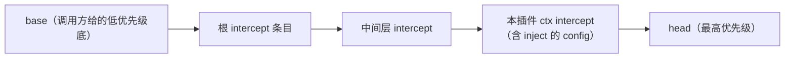

# 08 · `service.ts` 精读 —— Service 基类（115 行）

| | |
|---|---|
| 职责 | 命名服务的基类：构造即注册、可调用化、隔离过滤、拦截配置合并、代理安全的 instanceof |
| 依赖 | context / utils |
| 前置阅读 | [03-reflect.md](03-reflect.md) §3（provide）、[01-utils.md](01-utils.md) §3.6（createCallable） |
| 本册 TS 知识点 | 协变注解 `out T`、幻影类型参数、`declare` 字段、参数属性、`Symbol.hasInstance`、条件类型抽配置 |

## 1. 类声明与静态符号（L11–30）

```ts
export abstract class Service<out T = never> {
  static readonly init: unique symbol = symbols.init
  static readonly check: unique symbol = symbols.check
  static readonly config: unique symbol = symbols.config
  static readonly invoke: unique symbol = symbols.invoke
  static readonly extend: unique symbol = symbols.extend
  static readonly tracker: unique symbol = symbols.tracker
  static readonly resolveConfig: unique symbol = symbols.resolveConfig

  declare [symbols.config]: T

  public name!: string
```

- **`abstract class`**：只能被继承。
- 泛型 `Service<out T = never>`：**`out` 方差注解**（TS 4.7+）声明 T 仅出现在输出位置（协变）；T 是**幻影类型参数**——默认 `never`，运行时不存在，仅承载"该服务的拦截配置类型"供 `ctx.intercept`/`@Inject` 的条件类型抽取。`declare [symbols.config]: T`：**`declare` 字段**——类型系统看得见、编译后零代码（幻影属性的载体）。`Service<MyConfig>` 即声明拦截配置类型。
- 七个静态 symbol 键与 `utils.symbols` 对应（[01-utils.md](01-utils.md) §2.2）：`init`（类插件构造后初始化）、`check`（可用性谓词）、`config`（幻影标记）、`invoke`（可调用服务的调用体）、`extend`（派生实例工厂）、`tracker`（追踪元数据）、`resolveConfig`（配置解析）。
- `name!: string`：**definite assignment 断言**——构造器里会赋值（TS 分析不出来，因为赋值发生在 self 分支后）。

## 2. 构造器：注册 + 可调用化（L42–59）

```ts
  constructor(protected ctx: Context, name: string) {
    name ??= this.constructor['provide'] as string

    let self = this
    const tracker: Tracker = {
      associate: name,
      property: 'ctx',
    }
    if (self[symbols.invoke]) {
      self = createCallable(name, joinPrototype(Object.getPrototypeOf(this), Function.prototype), tracker)
    }
    self.ctx = ctx
    self.name = name
    defineProperty(self, symbols.tracker, tracker)

    self.ctx.reflect.provide(name, self, this[symbols.check])
    return self
  }
```

- `name ??= this.constructor['provide']`：**静态 provide 字段作默认服务名**（子类声明 `static provide = 'database'`，构造时可省 name 参数）。
- tracker：`associate: name`（激活 `"服务名.属性"` 命名空间转发，[01-utils.md](01-utils.md) §3.5 ④）+ `property: 'ctx'`。
- **可调用化**：子类定义了 `[symbols.invoke]`（如 `ctx.logger(name)` 的调用体）时，用 `createCallable` 造函数实例，原型链 = `joinPrototype(本类原型, Function.prototype)`——它可调用、且继承本类全部方法。**字段拷贝不在基类**：self 换了对象，子类字段要自己 `Object.assign`（LoggerService 虽不继承 Service，其构造器正是"替身 + 字段拷贝"的完整示例，[09-logger.md](09-logger.md) §4）。
- 给 self 赋 ctx/name、挂 tracker；`this[symbols.check]` 从**原实例**读（原型方法）——成为依赖方 `_checkImpl` 询问的谓词（[06-fiber.md](06-fiber.md) §7）。
- `self.ctx.reflect.provide(name, self, this[symbols.check])`：**注册即发生**——Service 子类构造完成那一刻，服务已在 ctx 上可见（不待 `[symbols.init]`）。清理函数被 fiber effect 收编（[03-reflect.md](03-reflect.md) §3.4）。
- `return self`：可调用分支下构造器返回替身（[02-context.md](02-context.md) §5.5）。

```ts
  protected [symbols.filter](ctx: Context) {
    return ctx[symbols.isolate][this.name] === this.ctx[symbols.isolate][this.name]
  }

  protected [symbols.extend](props?: any) {
    let self: any
    if (this[Service.invoke]) {
      self = createCallable(this.name, this, this[symbols.tracker])
    } else {
      self = Object.create(this)
    }
    return Object.assign(self, props)
  }
```
- `[symbols.filter]`：事件过滤谓词（`ctx[Context.filter]` 协议，[04-events.md](04-events.md) §2.3）——目标 ctx 与本服务**同隔离作用域**才收事件。服务实例可直接当 thisArg 传给 emit/parallel。
- `[symbols.extend]`：**派生实例**工厂——`Object.create(this)` 原型继承式克隆（保留字段读取）；可调用服务用 createCallable 重建（第二参直接传 this——proto 已含函数原型）；`Object.assign` 叠加 props。

## 3. 拦截配置合并：`[symbols.resolveConfig]`（L86–102）

```ts
  [symbols.resolveConfig](base?: T, head?: T): T {
    let intercept = this.ctx[Context.intercept]
    const configs: any[] = []
    while (this.name in intercept) {
      if (Object.hasOwn(intercept, this.name)) {
        configs.unshift(intercept[this.name])
      }
      intercept = Object.getPrototypeOf(intercept)
    }
    if (base) configs.unshift(base)
    if (head) configs.push(head)
    if (this['Config']?.merge) {
      return this['Config'].merge(...configs)
    } else {
      return Object.assign({}, ...configs)
    }
  }
```

- 服务配置的统一汇合点，逐行：
  1. 从当前 ctx 的 intercept 映射出发（原型链：根 → … → 本插件 ctx 各一层，由 `ctx.intercept()` 与 fiber 构造器的"依赖即拦截"共同建立）。
  2. `while (this.name in intercept)`：`in`（**含原型链**）判断"链上还有没有本服务的条目"，`Object.hasOwn`（**仅自身**）决定本层是否真有值——两层检查组合遍历整条链。`unshift` 把后访问到的（更靠根的）层放前面——**祖先条目先生效**。
  3. `base` 前插（最低优先级）、`head` 尾接（最高优先级）。
  4. 合并策略：子类若声明带 `merge` 方法的 `Config`（schema 自带 merge 语义）就调它（**展开传参**）；否则 `Object.assign({}, ...configs)`——后者覆盖前者，优先级 = 数组序 = 祖先拦截 > 子孙拦截 > base，head 最高。
- 这就是"插件在 cordis.yml 里给某服务写的 config"最终流进服务的机制：loader 调 `ctx.intercept(name, config)` 建/补链，服务在需要配置时调 `this[symbols.resolveConfig]()`。

优先级一图（自左向右越叠越高）：



## 4. 跨代理的 `instanceof`：`Symbol.hasInstance`（L104–114）

```ts
  static [Symbol.hasInstance](instance: any) {
    if (!instance) return false
    let constructor = instance.constructor
    while (constructor) {
      // constructor may be a proxy
      constructor = constructor.prototype?.constructor
      if (constructor === this) return true
      constructor &&= Object.getPrototypeOf(constructor)
    }
    return false
  }
}
```
- 重写 `instanceof` 的协议方法：可调用服务的原型链被 joinPrototype 重组、且服务可能被 traceable 代理包裹，默认 instanceof（沿 `instance.prototype` 比对）不可靠。这里改走 **`instance.constructor` → 沿"构造器的原型链"上溯**，每层先经 `constructor.prototype?.constructor` 规整（注释：constructor 可能是代理——proxy 上读 prototype 未必指回自身）。
- `constructor &&= ...`：逻辑赋值（falsy 时短路置 false 结束 while）。
- 效果：`someService instanceof MyService` 在代理/重组后依然正确。对比 [02-context.md](02-context.md) §3.2 的 `Context.is` 品牌方案——那里"只要品牌"（跨 realm），这里"允许子类/代理"（单 realm 的继承判定）。

## 5. TypeScript 进阶知识点

### 5.1 方差注解 `out T`

```ts
class Service<out T> { ... }
// Service<A> 可赋给 Service<B>（当 A extends B）——T 只被"读"不被"写"
```
TS 4.7 起 `in/out` 显式标注型参的方向。`out`（协变）声明"T 只出现在输出位置"，省去结构检查、报错更早更准。误标会被 variance 检查抓出来。

### 5.2 幻影类型参数 + `declare` 字段

```ts
class Service<out T = never> {
  declare [symbols.config]: T   // 编译后消失，仅类型载体
}

type InjectKey = keyof {
  [K in keyof Context & string as Context[K] extends { [symbols.config]: any } ? K : never]: any
}
```
`T` 不进任何运行时字段——它的唯一作用是**被条件类型提取**（`Context[K] extends { [symbols.config]: infer T } ? T : never`）。幻影类型是"零成本类型级元数据"：`Service<DbConfig>` 声明后，`ctx.intercept('database', cfg)` 的 cfg 类型自动受检。与仓库的 `Branded<B>`（dsh-brand）同一思想的泛型版。

### 5.3 参数属性：`constructor(protected ctx: Context)`

```ts
constructor(protected ctx: Context) {}
// 等价于：声明字段 ctx + 构造器里 this.ctx = ctx
```
访问修饰符前缀（public/protected/private/readonly）使参数自动成为字段。注意与"构造器返回替身"的组合：基类把 ctx 写到 `self`（替身）上——两处赋值不同对象，这正是可调用服务要自己搬字段的原因。

### 5.4 `Symbol.hasInstance`

```ts
class A { static [Symbol.hasInstance](x: any) { return !!x?.flag } }
new A() instanceof A    // 走自定义判定
```
`instanceof` 左操作数会调用**右侧构造器**的 `[Symbol.hasInstance]` 静态方法。默认实现沿原型链比对 `prototype`；重写后可支持代理、重组链、品牌等任意判定——与 `Symbol.toPrimitive` 同属"语言协议钩子"。

### 5.5 `as string` 收窄任意静态字段

```ts
name ??= this.constructor['provide'] as string
```
`this.constructor['provide']` 的类型是 `any`（索引访问宽化）；`as string` 把它钉回目标类型。与 non-null `!` 一样属于"逻辑上已知、类型看不见"处的局部断言。

## 6. 自测

1. `Service` 构造器里 `return self` 之后，调用方 `new MyService(ctx)` 拿到的是谁？原实例上的字段在哪？
2. `[symbols.resolveConfig]` 为什么用 `in` + `Object.hasOwn` 两层检查遍历？只用 `Object.keys` 会漏什么？
3. `check` 谓词从 `this[symbols.check]` 读——为什么从原实例而不是替身读？
4. 幻影参数 `T` 在运行时如何"消失"？它的消费者是谁？
