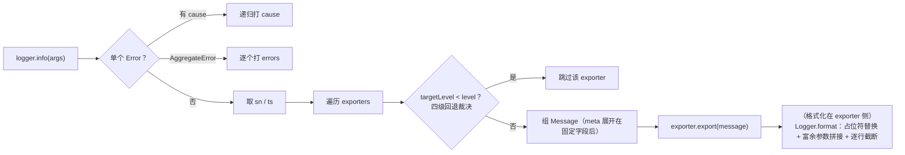

# 09 · `logger.ts` 精读 —— 日志服务（270 行）

| | |
|---|---|
| 职责 | Logger 门面（printf 格式化、级别裁决、名字配色）、可调用的 LoggerService、环形缓冲 |
| 依赖 | context / fiber / utils |
| 前置阅读 | [08-service.md](08-service.md)（对照：LoggerService 不走 Service 基类的手写版）、[01-utils.md](01-utils.md) §3.6 |
| 本册 TS 知识点 | `const enum` 内联、接口合并成交叉、`Record` 映射、`WeakRef`、static 块批量注册 |

## 1. 类型与常量（L13–80）

```ts
export type LoggerType = 'error' | 'info' | 'warn' | 'debug'
export type LoggerMethod = (format: any, ...param: any[]) => void
export type Formatter = (value: any, exporter: Exporter, message: Message) => any

export const enum LoggerLevel {
  ERROR = 0,
  INFO = 1,
  WARN = 2,
  DEBUG = 3,
}
```
- 方法签名是 **printf 风格**（首参格式串 + 变参）。const enum 数值**越大越啰嗦**（DEBUG=3 最详）——裁决方向 `targetLevel < level` 时跳过（§3）。

```ts
export interface Message {
  sn: number
  ts: number
  name: string
  type: LoggerType
  level: number
  args: any[]
  fiber?: WeakRef<Fiber>
}
```
- 结构化记录：全服务单调序号、时间戳、logger 名、方法/级别、原始参数、产出日志的 fiber 的**弱引用**（诊断"哪个插件打的日志"且不阻止 fiber 被回收）。

```ts
export interface Exporter {
  colors?: number | false
  maxLength?: number
  levels?: Record<string, number>
  formatters?: Record<string, Formatter>
  export(message: Message): void
}
```
- 导出器（sink）协议：颜色支持度（0 无 / 1 基本色 / 2 含修饰 / 3+ 256 色）、单行截断上限、按 logger 名的级别阈值表、自定义占位符格式化器、唯一必需方法 `export`。

```ts
export const defaultFormatters: Record<string, Formatter> = {
  s: (value) => String(value),
  d: (value) => Math.trunc(Number(value)),
  i: (value) => Math.trunc(Number(value)),
  f: (value) => Number(value),
  o: (value) => JSON.stringify(value),
  O: (value) => JSON.stringify(value),
  c: () => '',
  C: (value, exporter, message) => {
    return Logger.color(exporter, Logger.code(message.name, exporter.colors), value)
  },
}
```
- printf 占位符默认表：`%s %d %i %f %o %O`（对照 console 约定；o/O 直接 JSON 序列化）、`%c` 丢弃（无样式概念）、`%C` 特殊——用 logger 名的**哈希色**给参数着色（§2）。

```ts
export interface LoggerOptions {
  name: string
  meta?: Partial<Message>
  level?: number
}

export interface Logger extends LoggerOptions {}
export interface Logger extends Record<LoggerType, LoggerMethod> {}
```
- **两个同名接口声明自动合并**为 `LoggerOptions` 与四个方法的交叉——比直接写交叉类型更利于后续再合并扩展。

```ts
function isAggregateError(error: any): error is Error & { errors: Error[] } {
  return error instanceof Error && Array.isArray(error['errors'])
}
```
- 结构化判定 AggregateError（不依赖该类在所有运行时存在）：Error 且带 errors 数组；谓词收窄出 `errors` 字段。

## 2. `Logger` 门面：颜色与格式化（L83–163）

### 2.1 静态工具三件

```ts
  static color(exporter: Exporter, code: number, value: any, decoration = '') {
    if (!exporter.colors) return '' + value
    return `\u001b[3${code < 8 ? code : '8;5;' + code}${exporter.colors >= 2 ? decoration : ''}m${value}\u001b[0m`
  }
```
- ANSI 转义序列：`ESC[3<code>m` 前景色（code<8 是 3bit 基本色，否则 `8;5;<code>` 256 色）；`colors >= 2` 才附加 decoration（粗体等修饰）；结尾 `\u001b[0m` 复位。无颜色支持直接字符串化。

```ts
  static code(name: string, level?: false | number) {
    let hash = 0
    for (let i = 0; i < name.length; i++) {
      hash = ((hash << 3) - hash) + name.charCodeAt(i) + 13
      hash |= 0
    }
    const colors = !level ? [] : level >= 2 ? c256 : c16
    return colors[Math.abs(hash) % colors.length]
  }
```
- **名字 → 稳定颜色**：经典字符串哈希（`(hash << 3) - hash` 即 ×7；`+13` 混入；`|= 0` 截回 32 位整防浮点漂移）；按颜色支持度选调色板（level≥2 用 256 色 74 色板，否则 6 色板）；`Math.abs(hash) % length` 取模。同名 logger 跨进程/跨次运行颜色一致——终端里一眼区分子系统。

```ts
  static format(exporter: Exporter, message: Message): string {
    const args = message.args.slice()
    if (args[0] instanceof Error) {
      args[0] = args[0].stack || args[0].message
      args.unshift('%s')
    } else if (typeof args[0] !== 'string') {
      args.unshift('%o')
    }
```
- 预处理（`slice()` 拷贝防改原数组）：首参是 **Error** → 换成 stack（无 stack 退 message）并**补 `%s` 占位**；首参不是字符串（直接打对象）→ 补 `%o`。归一后 `args[0]` 必是格式串。

```ts
    let format: string = args.shift()
    format = format.replace(/%([a-zA-Z%])/g, (match, char) => {
      if (match === '%%') return '%'
      const formatter = exporter.formatters?.[char] ?? defaultFormatters[char]
      if (typeof formatter === 'function') {
        const value = args.shift()
        return formatter(value, exporter, message)
      }
      return match
    })

    const oFormatter = exporter.formatters?.o ?? defaultFormatters.o
    for (let arg of args) {
      if (typeof arg === 'object' && arg) {
        arg = oFormatter(arg, exporter, message)
      }
      format += ' ' + arg
    }

    const { maxLength = 10240 } = exporter
    return format.split(/\r?\n/g).map(line => {
      return line.slice(0, maxLength) + (line.length > maxLength ? '...' : '')
    }).join('\n')
  }
```
- 正则 `/ %([a-zA-Z%])/g`（实际为 `/%([a-zA-Z%])/g`）逐个匹配占位符：`%%` 转义为单个 `%`；查格式化器（**exporter 自定义优先于默认**）；有则**消耗一个后续参数**格式化；未知占位符原样保留。
- 占位符消耗剩下的**富余参数**：对象经 o 格式化器，逐个以空格拼接（与 console 行为一致）。
- **逐行截断**：解构带默认值（`maxLength = 10240`）；按行拆（容 CR LF）、超长截断加 `...`、重拼。

### 2.2 构造器与 `_method`

```ts
  constructor(options: LoggerOptions, private service: LoggerService) {
    Object.assign(this, options)
    this.error = this._method('error', LoggerLevel.ERROR)
    this.info = this._method('info', LoggerLevel.INFO)
    this.warn = this._method('warn', LoggerLevel.WARN)
    this.debug = this._method('debug', LoggerLevel.DEBUG)
  }

  private _method(type: LoggerType, level: number): LoggerMethod {
    return (...args: any[]) => {
      if (args.length === 1 && args[0] instanceof Error) {
        if (args[0].cause) {
          this[type](args[0].cause)
        } else if (isAggregateError(args[0])) {
          args[0].errors.forEach(error => this[type](error))
          return
        }
      }

      const sn = ++this.service._snMessage
      const ts = Date.now()
      for (const exporter of this.service.exporters.values()) {
        const targetLevel = exporter.levels?.[this.name] ?? exporter.levels?.default ?? this.level ?? LoggerLevel.INFO
        if (targetLevel < level) continue
        const message: Message = { sn, ts, type, level, name: this.name, ...this.meta, args }
        exporter.export(message)
      }
    }
  }
```
- 选项平铺到实例；四个方法各造一个闭包。闭包体：
  1. **Error 展开**：单独打一个 Error 时先递归打 `error.cause`（ES2022 错误链——根因先出）；AggregateError 逐个打 errors 后 return。
  2. 取全局序号/时间戳。
  3. 遍历全部 exporter，**级别裁决链**：`exporter.levels[logger名] ?? exporter.levels.default ?? 本 logger 的 level ?? INFO`——四级回退，任一环节给出且小于本条 level 即跳过。默认阈值 INFO 意味着 **DEBUG 默认不输出**。
  4. 组 Message（`...this.meta` 展开在固定字段**之后**——meta 可覆盖 fiber 等字段）交给 exporter。

```ts
export const c16 = [6, 2, 3, 4, 5, 1]
export const c256 = [20, 21, 26, 27, ...]   // 74 个精选 256 色索引
```
- 两个调色板：6 个高可读基本色 / 74 个精选 256 色索引（避开常见终端前景的混淆色）。

## 3. 服务级 Intercept 声明合并（L6–10）

```ts
declare module './context.ts' {
  interface Intercept {
    logger: LoggerService.Intercept
  }
}
```
- `Intercept` 接口合并进 logger 的拦截配置形状 `{ name?, level? }`——`ctx.intercept('logger', { level: 2 })` 因此有类型。这是"服务把自己的拦截配置类型注册进 Context"的标准姿势（`LoggerService.Intercept` 命名空间接口在 L176–181）。

## 4. `LoggerService`：可调用日志服务（L176–270）

### 4.1 形状与字段

```ts
export interface LoggerService extends Record<LoggerType, LoggerMethod> {
  (name?: string): Logger
}

export class LoggerService {
  bufferSize = 1000
  buffer: Message[] = []
  ctx!: Context

  _snMessage = 0
  _snExporter = 0
  exporters = new Map<number, Exporter>()
```
- 调用签名 + 四个方法：`ctx.logger('app')` 造具名 Logger；`ctx.logger.info(...)` 直接打（名字取当前 fiber）。环形缓冲（容量 1000）；exporter 按号登记（Map 保注册顺序，同号幂等删除）。

### 4.2 构造器：替身三步曲 + 内置缓冲 exporter

```ts
  constructor(ctx: Context) {
    const tracker: Tracker = {
      property: 'ctx',
      noShadow: true,
    }
    const self = createCallable('logger', joinPrototype(Object.getPrototypeOf(this), Function.prototype), tracker) as unknown as LoggerService
    Object.assign(self, this)
    self.ctx = ctx
    defineProperty(self, symbols.tracker, tracker)

    self.exporter({
      colors: 3,
      export: (message) => {
        self.buffer.push(message)
        if (self.buffer.length > self.bufferSize) {
          self.buffer = this.buffer.slice(-this.bufferSize)
        }
      },
    })

    return self
  }
```
- **可调用服务三步曲**（[08-service.md](08-service.md) §2 的本地版）：createCallable（名字 'logger'、原型 = 本类原型 + Function.prototype）；`Object.assign(self, this)` 把**已初始化的实例字段**搬到替身（bufferSize/buffer/_sn*/exporters）；挂 tracker 后 `return self` 替身出场。
- 内置 exporter：`colors: 3`（满色支持声明——但这个 sink 只进内存缓冲不落终端，真正的终端输出由外部 exporter 挂接）；buffer 超容 `slice(-bufferSize)` 裁剪（保留最新）。这个缓冲是"最近日志"的查询面（`ctx.logger.buffer`）。
- 一个细节：裁剪行读的是 `this.buffer`（原实例）而写回 `self.buffer`（替身），首次裁剪后两个引用即分离，第二次裁剪会从旧数组取值——vendored 原样保留的上游瑕疵，读者留意即可。
- 注意这里**不走 Service 基类也不经 reflect.provide**：根构造器直接 `this.logger = new LoggerService(self)` 挂为真实属性（Context 接口声明的 `logger`）；服务身份靠 tracker 追踪，`ctx.logger(name)` 的具名派生才经 `[symbols.invoke]`。

### 4.3 exporter 注册与配置解析

```ts
  exporter(exporter: Exporter) {
    return this.ctx.effect(() => {
      this.exporters.set(++this._snExporter, exporter)
      return () => this.exporters.delete(this._snExporter)
    }, 'ctx.logger.exporter()')
  }

  private _resolveConfig(): LoggerService.Intercept {
    let intercept = this.ctx[symbols.intercept]
    const configs: LoggerService.Intercept[] = []
    while ('logger' in intercept) {
      if (Object.hasOwn(intercept, 'logger')) {
        configs.unshift(intercept['logger'])
      }
      intercept = Object.getPrototypeOf(intercept)
    }
    return Object.assign({}, ...configs)
  }
```
- 注册 exporter 也是 effect：随 fiber 卸载自动摘除；返回销毁器；标签注明来源便于 getEffects 诊断。
- `_resolveConfig`：[08-service.md](08-service.md) §3 的本地简化版——沿 intercept 原型链收集 `logger` 条目（祖先优先），浅合并出 `{ name?, level? }`。

### 4.4 调用体与静态块

```ts
  [symbols.invoke](name?: string): Logger {
    const config = this._resolveConfig()
    const fiber = ((this.ctx as any)[symbols.shadow] ?? this.ctx).fiber
    name ??= config.name
    name ??= hyphenate(fiber.name)
    return new Logger({
      name,
      level: config.level,
      meta: { fiber: new WeakRef(fiber) },
    }, this)
  }

  static {
    for (const type of ['error', 'info', 'warn', 'debug'] as const) {
      ;(LoggerService.prototype as any)[type] = function (this: LoggerService, ...args: any[]) {
        return (this as any)()[type](...args)
      }
    }
  }
```
- **调用体**（`ctx.logger(name?)`）：解析拦截配置；取 fiber——若 ctx 带影子（被追踪转发时）取**影子链上的 origin fiber**（`noShadow: true` 的配套消费：日志名取"服务真正归属的 fiber"，不是碰巧调用它的）；名字三级回退：显式参数 → 拦截配置 name → **fiber 名的连字符化**（`hyphenate`：camelCase → kebab-case，如 `MyPlugin` → `my-plugin`）；造 Logger 门面，meta 带 fiber 弱引用。
- **静态块批量造方法**：原型上挂四个便捷方法——`ctx.logger.info(x)` ≡ `ctx.logger().info(x)`（先以当前 fiber 命名造门面再打）。`as const` 元组遍历保字面量类型；行首分号防御 ASI（上一行无分号时的续行歧义）。

日志流水线一图：



## 5. TypeScript 进阶知识点

### 5.1 `const enum` 的内联与限制

```ts
export const enum LoggerLevel { ERROR = 0, INFO = 1, ... }
if (targetLevel < LoggerLevel.DEBUG) ...   // → targetLevel < 3
```
编译期消解为零开销。与 [06-fiber.md](06-fiber.md) §11.1 同源；注意 `isolatedModules` 下导出受限——本包内使用无碍。

### 5.2 接口声明合并成交叉

```ts
export interface Logger extends LoggerOptions {}
export interface Logger extends Record<LoggerType, LoggerMethod> {}
```
两次声明合并 = `LoggerOptions & 四方法`。`Record<LoggerType, LoggerMethod>` 是**同态映射类型**（字面量联合 → 键），成员随 `LoggerType` 自动增减。

### 5.3 `WeakRef<T>`：观测而不续命

```ts
meta: { fiber: new WeakRef(fiber) }
// 读：meta.fiber.deref()   // 可能 undefined（fiber 已被回收）
```
`WeakRef` 持有对象的弱引用：不影响 GC，`deref()` 在对象回收后返回 undefined。Message 想记录"谁打的日志"，但不能因此阻止 fiber 被回收——典型"观测性数据"场景。约束：不能在创建后同步读（规范要求 `KeepDuringJob` 之外不可靠）。

### 5.4 static 块 + 遍历注册：批量方法生成

```ts
static {
  for (const type of ['error', 'info', 'warn', 'debug'] as const) {
    (LoggerService.prototype as any)[type] = function (this: LoggerService, ...) { ... }
  }
}
```
避免手写四个同构方法。`as const` 使遍历变量获得字面量类型；`prototype as any` 是"动态加成员"场景下 TS 无法表达的最小让步（写在 static 块里，影响面可见）。

### 5.5 命名空间合并接口：`LoggerService.Intercept`

```ts
export namespace LoggerService {
  export interface Intercept { name?: string; level?: number }
}
declare module './context.ts' {
  interface Intercept { logger: LoggerService.Intercept }
}
```
"服务配置类型挂在服务的命名空间下 + 注册进全局 Intercept 表"——两层声明合并配合出类型安全的 `ctx.intercept('logger', ...)`。

## 6. 自测

1. `ctx.logger.info(x)` 与 `ctx.logger('app').info(x)` 的名字分别从哪来？
2. `_method` 里 `...this.meta` 为什么展开在固定字段之后？
3. 级别裁决链的四级回退顺序是什么？为什么 DEBUG 默认看不见？
4. LoggerService 为什么不继承 Service、也不走 provide？
