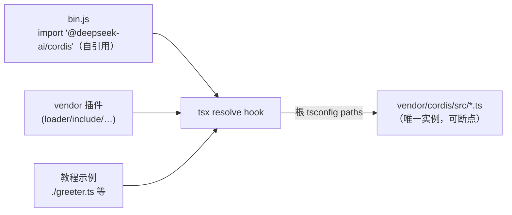

# 10 · 用官方示例调试 cordis 源码 —— 实测指南

| | |
|---|---|
| 素材 | `tmp/cordis-tutorial/`（docs/cordis-tutorial 的可运行工作副本） |
| 环境 | Node v24.9、仓库根 `tsconfig.json` 的 `paths`、tsx（根 devDependency）——以下命令全部实测通过 |
| 结论 | **断点直接打在 `vendor/cordis/src/*.ts` 上，示例一行不用改、无需任何构建** |

## 1. 为什么能直接调试源码：解析链路

教程示例与 `bin.js` 都以包名导入 cordis。实测（`import.meta.resolve`）：

```
node --import tsx（仓库内任意位置）
  '@deepseek-ai/cordis' → file:///…/vendor/cordis/src/index.ts   ✓ 源码
```

原因是**根 `tsconfig.json` → `tsconfig.base.json` 的 `paths` 把 vendored 包映射到源码**，而 `--import tsx` 让 tsx 接管解析（连 `bin.js` 的**包自引用**也被改写）。于是整个进程只有**一份 cordis，就是 `vendor/cordis/src` 的 TypeScript 源**：



两个实测注意点：

- **必须带 `--import tsx`**：裸 `node`（24.x 原生 type-stripping）下只有 `hello.ts` 这类**纯类型导入**示例能跑（`import type` 被擦除）；`greeter.ts` 等值导入会 `MODULE_NOT_FOUND`（tmp 下没有 node_modules 链接）。
- 无需 `pnpm build`：路径直接指向 `src`，不存在 lib/源码混跑的两份实例问题。

## 2. 运行命令

在 `tmp/cordis-tutorial/` 下（即 cmd.txt 记录的方式）：

```sh
node --import tsx ../../vendor/cordis/bin.js
```

- `bin.js`：创建根 Context → `baseUrl = cwd` → 装载 cordis-plugin-loader + include → 读 `./cordis.yml` 按序装载条目。
- 切换实验对象：注释/解注 `cordis.yml` 里的条目（文件里保留了全套教程示例与 hmr/logger-console/timer 插件的写法）。

## 3. 三种调试方法

### 3.1 VS Code 调试器（推荐）

`.vscode/launch.json`：

```jsonc
{
  "type": "node",
  "request": "launch",
  "name": "cordis tutorial (debug src)",
  "cwd": "${workspaceFolder}/tmp/cordis-tutorial",
  "runtimeArgs": ["--import", "tsx", "--inspect-brk", "../../vendor/cordis/bin.js"],
  "console": "integratedTerminal",
  "skipFiles": ["<node_internals>/**"]
}
```

断点直接打在 `vendor/cordis/src/*.ts`（磁盘上被执行的就是这些文件）。`--inspect-brk` 先停住再连调试器；不需要断点时可去掉。

### 3.2 Chrome DevTools

```sh
cd tmp/cordis-tutorial
node --import tsx --inspect-brk ../../vendor/cordis/bin.js
# 打开 chrome://inspect → Open dedicated DevTools for Node
```

Sources 面板直接出现 `vendor/cordis/src` 的 TS 源，可断点/单步/查看调用栈（实测 inspector 正常监听 9229）。

### 3.3 事件探针：不改内核源码观察生命周期（已内置）

`tmp/cordis-tutorial/debug-probe.ts`（本目录实测产物）：监听 `internal/plugin`、`internal/status`、`internal/dispatch` 打印内核行为。**放在 `cordis.yml` 的第一位**才能看到后续所有 fiber：

```yaml
- name: "./debug-probe.ts"
- name: "./greeter.ts"
- name: "./consumer.ts"
```

实测输出（对照 [06-fiber.md](06-fiber.md) §10 状态机逐行可解释）：

```text
[probe] 已挂载
[probe] fiber 4 (debug-probe): 1 -> 2        # 自身 LOADING→ACTIVE
[probe] dispatch waterfall loader/patch-context (2 args)
[probe] fiber 5 (consumer) 创建
[probe] fiber 6 (greeter) 创建
[probe] fiber 6 (greeter): 0 -> 1            # PENDING→LOADING
[probe] fiber 7 (GreeterService) 创建        # greeter 加载中 ctx.plugin(GreeterService)
[probe] fiber 6 (greeter): 1 -> 2            # ACTIVE
[probe] fiber 5 (consumer): 0 -> 1           # 依赖 greeter 就绪才激活（依赖驱动）
Hello, world!                                  # consumer.apply 运行
[probe] fiber 5 (consumer): 1 -> 2
```

## 4. 断点地图（示例 ↔ 内核位置 ↔ 文档）

| 想观察什么 | 断点位置 | 对应示例 | 详见 |
|---|---|---|---|
| 插件装载全链路 | `registry.ts` `plugin()` → `fiber.ts` 构造器 → `_reload` | 任意条目启用 | [05-registry.md](05-registry.md) §8 |
| 依赖驱动的激活 | `fiber.ts` `_checkImpl/_refresh/_setEpoch` | `consumer.ts`（注入 greeter） | [06-fiber.md](06-fiber.md) §7 |
| 状态迁移广播 | `fiber.ts` `_updateState` | debug-probe 的输出源头 | [06-fiber.md](06-fiber.md) §6 |
| effect 注册/清理 | `fiber.ts` `effect()` 的 `wrapper`/`dispose` | `lifecycle.ts` | [07-effect.md](07-effect.md) §3 |
| 服务注册/解析 | `reflect.ts` `provide` / `handler.get` | `greeter.ts`/`consumer.ts` | [03-reflect.md](03-reflect.md) |
| 事件分发/瀑布 | `events.ts` `dispatch`/`waterfall` | `waterfall-demo.ts`、debug-probe | [04-events.md](04-events.md) §2.4 |
| 配置校验 | `fiber.ts` `resolveConfig`/`ValidationError` | `config-demo.ts`（含非法配置分支） | [06-fiber.md](06-fiber.md) §2 |
| 错误处理与长堆栈 | `utils.ts` `composeError/handleError` | `error-demo.ts` | [01-utils.md](01-utils.md) §4 |

## 5. 补充技巧

- **热更新（改示例不重启）**：`cordis.yml` 启用 `@deepseek-ai/cordis-plugin-hmr`（`config: { root: ["."] }`，写法见文件内注释）——改**插件文件**自动重载对应 fiber。改 **vendor/cordis/src 内核**则直接重跑（启动毫秒级）。
- **terminal 输出插件**：`@deepseek-ai/cordis-plugin-logger-console` 把 logger 缓冲落到终端，配合 `ctx.logger` 观察插件名/级别裁决（[09-logger.md](09-logger.md)）。
- **`debugger;` 语句**：也可以直接在 `vendor/cordis/src` 目标行插入 `debugger;`（vendored 源是本地面板，调试完记得还原——vendor/ 是 pin 住的副本）。
- **调试 tsx 自身不生效时**：确认 VS Code 的 `autoAttachChildProcesses`/`--inspect-brk` 生效（子进程场景）；教程是单进程，无此问题。
