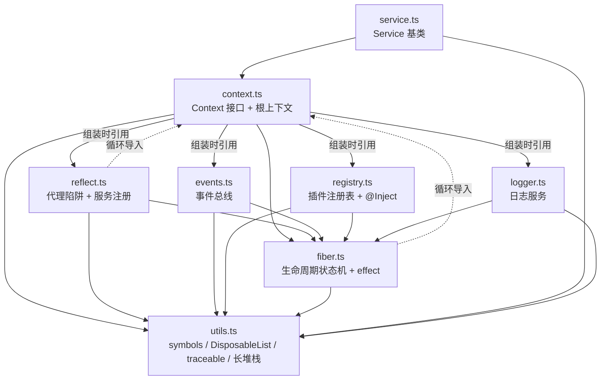

# Cordis 源码精读系列（`vendor/cordis/src`）

本目录是 `vendor/cordis/src` 全部 9 个 TypeScript 源文件的**分册精读**：逐段讲解代码逻辑，穿插 mermaid 图（流程图/时序图/状态图/调用关系图），并为每个文件配备它实际用到的 **TypeScript 进阶知识点**（含可运行的小示例）。承接并替代原单文件版 `09-cordis-source-walkthrough.md`。

> 源码基线：`vendor/cordis`（重新 scope 为 `@deepseek-ai/cordis` 的源码内嵌副本，见 [vendor/README.md](../../vendor/README.md)）。文中行号以当前 vendored 版本为准，升级后可能偏移，以引用的代码片段为准。
> 姊妹篇：[../07-plugin-mechanism.md](../07-plugin-mechanism.md)（机制层面）、[docs/cordis-primer.md](../../docs/cordis-primer.md)（权威入门）。

## 文档清单与阅读路线

| 册 | 文档 | 源文件 | 行数 | 核心内容 |
|---|---|---|---|---|
| 1 | [01-utils.md](01-utils.md) | `utils.ts` | 287 | symbols 常量表、DisposableList、traceable 代理族、异步长堆栈 |
| 2 | [02-context.md](02-context.md) | `index.ts` + `context.ts` | 14+146 | Context 接口（声明合并枢纽）、根上下文组装、extend/isolate/intercept |
| 3 | [03-reflect.md](03-reflect.md) | `reflect.ts` | 418 | Proxy 三陷阱、服务注册/解析、mixin/accessor、notify 涟漪 |
| 4 | [04-events.md](04-events.md) | `events.ts` | 352 | 五种分发模式、dispatch 协议、监听器注册与 fiber 归属 |
| 5 | [05-registry.md](05-registry.md) | `registry.ts` | 337 | 插件三形态、@Inject 装饰器、类型演算、ctx.plugin() 全链路 |
| 6 | [06-fiber.md](06-fiber.md) | `fiber.ts`（上） | ~400 | 状态机、epoch 版本号、构造器、reload/unload/update、卸载链路 |
| 7 | [07-effect.md](07-effect.md) | `fiber.ts`（下） | ~350 | effect 类型系统、_execute 解释器、effect() 并发安全全景 |
| 8 | [08-service.md](08-service.md) | `service.ts` | 115 | Service 基类、幻影类型参数、可调用化、拦截配置合并 |
| 9 | [09-logger.md](09-logger.md) | `logger.ts` | 270 | Logger 门面、级别裁决、printf 格式化、可调用日志服务 |
| 10 | [10-debugging.md](10-debugging.md) | （实操） | — | 用 tmp/cordis-tutorial 示例调试 vendor 源码：解析链路、VS Code/DevTools 配置、事件探针、断点地图 |

建议路线：**1 → 2 → 3** 打底（工具与上下文模型），**4 → 5**（事件与装载），**6 → 7**（生命周期核心，最难），**8 → 9**（服务编写范式收尾）。赶时间可先读 2、3、6。

## 全景

### 模块依赖与调用关系



- 实线 = 稳定单向依赖；虚线 = 刻意保留的循环导入（类型引用 + 构造期使用，ESM 下安全，详见 [02-context.md](02-context.md)）。
- `index.ts` 是桶文件，不被任何模块运行时依赖；`reflect.ts` 不进公共 API 面（见 [02-context.md](02-context.md) §1）。

### 运行时全景

```
new Context()
  └─ 根 fiber (runtime=null) + 四大核心服务
       reflect ── Context 代理的 get/set/has 陷阱 ── 服务解析 (isolate 作用域)
       events ── ctx.on/emit/... (mixin 到 ctx 上)
       registry ── ctx.plugin() ── new Fiber(parent, config, inject, runtime)
                     │
                     ├─ PENDING ──(依赖齐/失效)──→ LOADING ──→ ACTIVE
                     │     ↑                        │            │
                     │     └────── _refresh 状态机 ─┘            ↓
                     └──────── _unload / _reload 惯性循环 ←── UNLOADING
```

### 三大贯穿机制（读任何一册都先记住）

1. **Context 是代理**：`ctx` 上的属性读写先过 `ReflectService.handler` 的 get/set/has 陷阱（[03-reflect.md](03-reflect.md)）。
2. **注册皆 effect**：`ctx.on/provide/plugin/exporter` 全部经 `ctx.fiber.effect()` 登记，fiber 卸载即全量回收（[07-effect.md](07-effect.md)）。
3. **声明合并扩展 Context**：各模块用 `declare module './context.ts'` 向 `Context` 接口合并成员（[02-context.md](02-context.md)）。

## TypeScript 进阶知识点索引

| 主题 | 所在册 |
|---|---|
| 泛型约束（`extends WeakKey`）、类型谓词（`x is Y`）、non-null 断言、type-only import | 01 |
| 声明合并 / 模块扩充、`unique symbol` 接口键、多态 `this`、静态初始化块、构造器返回覆盖、`Symbol.toPrimitive` | 02 |
| Proxy 陷阱与不变量、判别联合 + namespace、`Omit/Pick`、`keyof any`、thenable 危险 | 03 |
| 条件类型与 `infer`、手写 `Parameters/ReturnType/ThisType`、重载签名、`NoInfer`、元组 rest 展开、`AggregateError` | 04 |
| stage-3 装饰器（`ClassDecoratorContext`/`addInitializer`）、键重映射 `as` 子句、`as const` 码表、调用/构造签名混排、`globalThis` | 05 |
| `const enum`、symbol 品牌、class+namespace 同名合并、thenable 鸭子类型、`Iterable/AsyncIterable` 三参泛型 | 06 |
| 可调用 + thenable 交叉接口（`AsyncDisposable`）、联合形状建模、闭包状态机、`void` vs `undefined`、definite assignment | 07 |
| 协变注解 `out T`、幻影类型参数、`declare` 字段、参数属性、`Symbol.hasInstance`、条件类型抽配置 | 08 |
| `const enum` 内联、接口合并成交叉、`Record` 映射、`WeakRef`、static 块批量注册 | 09 |

## 术语表

| 术语 | 含义 | 详见 |
|---|---|---|
| ctx | Cordis 上下文：一个 Proxy，属性读取即服务解析 | 02/03 |
| fiber | 一次 `ctx.plugin()` 的运行时实例（依赖/配置/生命周期） | 06 |
| effect | 带清理函数的注册单元；fiber 卸载时逆序执行清理 | 07 |
| epoch | fiber 的"代数"：依赖提供方 uid 拼成的版本串；变化触发重载 | 06 |
| inertia | 在途的加载/卸载转换（promise）；`while (inertia)` 排空回摆 | 06 |
| tracker | 服务上的追踪元数据（`property/associate/noShadow`） | 01 |
| shadow | 影子上下文标记：追踪转发时记住 origin ctx | 01 |
| isolate | 服务隔离作用域（名字 → symbol label） | 02/03 |
| intercept | 服务拦截配置（沿 ctx 原型链合并，祖先优先） | 02/08 |
| provide/inject | 服务注册 / 依赖声明（inject 的 config 兼作 intercept） | 03/05 |
| mixin | 把服务方法转发到 `ctx` 上的 accessor 机制 | 03 |
| waterfall | 事件分发模式：监听器逐层包裹，最内层是默认行为 | 04 |
| bail 值 | 非 `null/false/undefined` 的监听器返回值，触发短路 | 04 |
| dispose r | 清理函数（disposer）；公开形态一次性、可 join | 07 |
| DisposableList | 保序 + 按值 O(1) 删除的一次性集合 | 01 |
| callable service | 既能 `()` 调用又有服务方法的对象（`joinPrototype` 拼原型链） | 01/08/09 |
